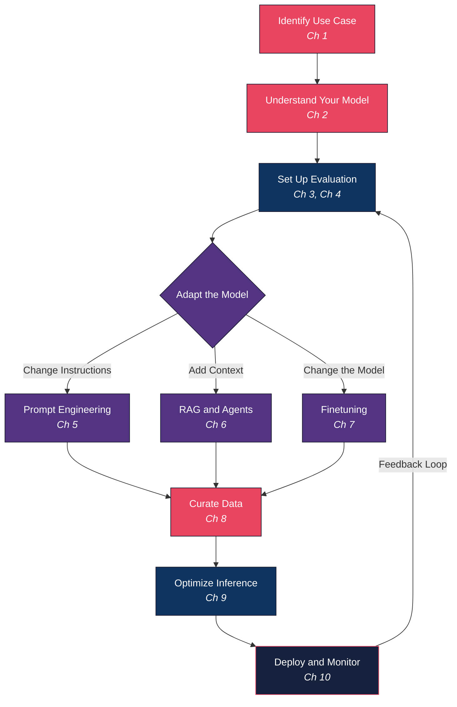
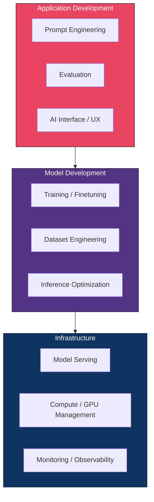

<div align="center">


# AI Engineering Playbook

**A comprehensive field guide to building production AI applications with foundation models**

Based on *AI Engineering. Building Applications with Foundation Models* by **Chip Huyen** (O'Reilly, 2025)


</div>

> [!NOTE]
> This playbook distills the entire book into structured, actionable chapters designed for Principal AI Engineers, technical leads and practitioners building real world AI systems. Every chapter contains architecture diagrams, extracted book figures, author insights, practitioner checklists and deep technical breakdowns.

> "Tools become outdated quickly, but fundamentals should last longer."
> Chip Huyen

## Why This Playbook Exists

Foundation models have transformed AI from an esoteric discipline into a powerful development tool that anyone can use. The barrier to entry for building AI products has dropped dramatically, but the barrier to building **production grade** AI products remains high. This playbook bridges that gap.

> [!IMPORTANT]
> This is not a tutorial. It is a **decision framework** for selecting the right models, techniques, data strategies and deployment patterns for your specific needs. It teaches you *how to think* about AI engineering, not just how to use a particular tool or API.

## Book at a Glance


## Chapter Index

| # | Chapter | Core Question It Answers | Figures |
|:-:|---------|--------------------------|:-------:|
| 01 | [**Introduction to Building AI Applications**](chapters/01-introduction.md) | What is AI engineering, why does it matter now and what can you build with it? | 16 |
| 02 | [**Understanding Foundation Models**](chapters/02-understanding-foundation-models.md) | How do foundation models work under the hood, and why do they behave the way they do? | 26 |
| 03 | [**Evaluation Methodology**](chapters/03-evaluation-methodology.md) | How do you measure whether a model is actually good at what you need it to do? | 10 |
| 04 | [**Evaluate AI Systems**](chapters/04-evaluate-ai-systems.md) | How do you build a reliable, systematic evaluation pipeline for your application? | 10 |
| 05 | [**Prompt Engineering**](chapters/05-prompt-engineering.md) | How do you craft instructions that consistently get the model to do what you want? | 16 |
| 06 | [**RAG and Agents**](chapters/06-rag-and-agents.md) | How do you give models access to external knowledge and the ability to take actions? | 16 |
| 07 | [**Finetuning**](chapters/07-finetuning.md) | When and how should you change the model itself to improve performance? | 20 |
| 08 | [**Dataset Engineering**](chapters/08-dataset-engineering.md) | How do you acquire, curate, synthesize and validate the data that powers your AI? | 7 |
| 09 | [**Inference Optimization**](chapters/09-inference-optimization.md) | How do you make model inference faster and cheaper without sacrificing quality? | 19 |
| 10 | [**Architecture and User Feedback**](chapters/10-ai-engineering-architecture-and-user-feedback.md) | How do you bring everything together into a production system that improves over time? | 21 |

## The AI Application Development Process

This playbook follows the typical process for developing an AI application. The diagram below shows how each chapter maps to the development lifecycle.



## Three Layers of the AI Stack

Every AI application, regardless of complexity, sits on top of three fundamental layers.



> [!TIP]
> When developing an AI application, you will likely start from the top layer (Application Development) and move down only as needed. Many successful applications never go beyond prompt engineering and evaluation. Only move to finetuning or infrastructure optimization when you have evidence that simpler approaches are insufficient.

## Who This Playbook Is For

This playbook is for you if you can relate to one of the following scenarios.

**You are building or optimizing an AI application.** Whether starting from scratch or looking to move beyond the demo phase into a production ready stage. You may also be facing issues like hallucinations, security, latency or costs and need targeted solutions.

**You want to streamline your team's AI development process.** Making it more systematic, faster and reliable.

**You want to understand how your organization can leverage foundation models** to improve the business's bottom line and how to build a team to do so.

**You are a tool developer** who wants to identify underserved areas in AI engineering to position your products in the ecosystem.

**You are a researcher** who wants to better understand AI use cases and production challenges.

## Quick Navigation by Topic

> [!TIP]
> Use these shortcuts if you already know what challenge you are facing.

| If You Need To... | Start Here |
|-------------------|------------|
| Understand what AI engineering is and plan your project | [Ch 1. Introduction](chapters/01-introduction.md) |
| Learn how transformers, attention and sampling work | [Ch 2. Foundation Models](chapters/02-understanding-foundation-models.md) |
| Set up metrics and benchmarks for model quality | [Ch 3. Evaluation Methodology](chapters/03-evaluation-methodology.md) |
| Build a systematic evaluation pipeline for your app | [Ch 4. Evaluate AI Systems](chapters/04-evaluate-ai-systems.md) |
| Write better prompts and defend against attacks | [Ch 5. Prompt Engineering](chapters/05-prompt-engineering.md) |
| Add external knowledge or build AI agents | [Ch 6. RAG and Agents](chapters/06-rag-and-agents.md) |
| Decide when and how to finetune a model | [Ch 7. Finetuning](chapters/07-finetuning.md) |
| Curate, synthesize or clean training data | [Ch 8. Dataset Engineering](chapters/08-dataset-engineering.md) |
| Make inference faster, cheaper or more efficient | [Ch 9. Inference Optimization](chapters/09-inference-optimization.md) |
| Design production architecture with feedback loops | [Ch 10. Architecture and Feedback](chapters/10-ai-engineering-architecture-and-user-feedback.md) |

## Key Themes Across the Book

| Theme | Where It Appears |
|-------|------------------|
| **Evaluation is the hardest problem** | Ch 3, Ch 4 and revisited in every subsequent chapter |
| **Start simple, add complexity only when needed** | Ch 5 (prompting before finetuning), Ch 6 (RAG before agents), Ch 7 (LoRA before full finetuning) |
| **Data quality matters more than data quantity** | Ch 2 (training data), Ch 7 (finetuning data), Ch 8 (dataset engineering) |
| **The last mile is the hardest** | Ch 1 (planning), Ch 10 (production feedback loops) |
| **Cost and latency are first class concerns** | Ch 4 (evaluation criteria), Ch 9 (inference optimization), Ch 10 (caching, routing) |
| **Buy vs Build is a recurring decision** | Ch 1 (planning), Ch 4 (model selection), Ch 7 (finetune vs API), Ch 9 (self host vs API) |

## How to Use This Playbook

**Read linearly** if you are new to AI engineering. The chapters build on each other and follow the natural development lifecycle.

**Jump to a specific chapter** if you are an experienced practitioner facing a specific challenge. Each chapter is designed to be self contained.

**Use the diagrams** as reference architectures for your team's design discussions and architecture reviews.

**Use the checklists** at the end of each chapter as quality gates before moving to the next phase of your project.

> [!WARNING]
> The AI field moves at an extraordinary pace. Models, tools and pricing change constantly. This playbook focuses on **fundamentals and decision frameworks** that outlast any specific tool. When a specific model or tool is mentioned, treat it as an illustrative example rather than a permanent recommendation.

## Repository Structure

```
ai-engineering-playbook/
├── README.md                          # This file. Start here.
├── chapters/
│   ├── 01-introduction.md             # AI engineering landscape and planning
│   ├── 02-understanding-foundation-models.md  # Transformers, training, sampling
│   ├── 03-evaluation-methodology.md   # Metrics, benchmarks, AI judges
│   ├── 04-evaluate-ai-systems.md      # Evaluation pipelines for applications
│   ├── 05-prompt-engineering.md       # Prompt design, optimization, defense
│   ├── 06-rag-and-agents.md           # Retrieval augmented generation, agents
│   ├── 07-finetuning.md              # LoRA, QLoRA, model merging
│   ├── 08-dataset-engineering.md      # Data curation, synthesis, quality
│   ├── 09-inference-optimization.md   # Quantization, batching, parallelism
│   └── 10-ai-engineering-architecture-and-user-feedback.md  # Production systems
└── assets/
    ├── cover/                         # Book cover image
    ├── ch01/ through ch10/            # Extracted figures per chapter
    └── (157 figures total)
```

## Source

<div align="center">

**AI Engineering. Building Applications with Foundation Models**
*Chip Huyen. O'Reilly Media, December 2024. First Edition.*
ISBN 978-1-098-16630-4

</div>

**About the Author.** Chip Huyen works at the intersection of AI, data and storytelling. Previously with Snorkel AI and NVIDIA, she founded an AI infrastructure startup (acquired) and taught machine learning systems design at Stanford. Her book *Designing Machine Learning Systems* (O'Reilly) has been translated into over 10 languages.

> [!IMPORTANT]
> This playbook is a study companion and reference guide. It does not replace the original book. For the complete text, examples and full context, please purchase the book from O'Reilly.
