# Chapter 2: Understanding Foundation Models

[Previous: Chapter 1 - Introduction](01-introduction.md) | [Next: Chapter 3 - Evaluation Methodology](03-evaluation-methodology.md)

## Table of Contents

- [Overview](#overview)
- [Foundation Model Development Pipeline](#foundation-model-development-pipeline)
- [Training Data](#training-data)
- [Modeling](#modeling)
- [Post-Training](#post-training)
- [Sampling](#sampling)
- [The Probabilistic Nature of AI](#the-probabilistic-nature-of-ai)
- [Chapter Summary](#chapter-summary)
- [Navigation](#navigation)

## Overview

Foundation models are the bedrock of modern AI engineering. Understanding how they are built, trained and configured is essential for anyone working with them in production. This chapter traces the full lifecycle of a foundation model, from the raw data it learns from, through the architectural choices that shape its capabilities, to the post-training techniques that align it with human preferences and finally to the sampling strategies that govern how it generates outputs.

> [!IMPORTANT]
> You do not need to build foundation models from scratch to be an effective AI engineer. However, understanding **how** they work will make you dramatically better at using them, debugging failures and designing robust systems.

> "Foundation models are usually trained using a large amount of data. They are aggregations of the opinions of the masses, containing within them, literally, a world of possibilities."

## Foundation Model Development Pipeline

The journey from raw data to a deployed, useful AI model follows a multi-stage pipeline. Each stage builds on the previous one, progressively refining the model's capabilities and alignment with human intent.

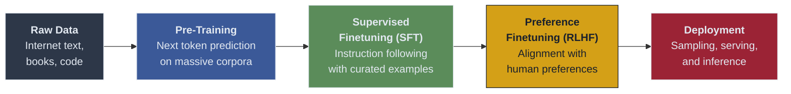
```mermaid
flowchart LR
    A["<b>Raw Data</b><br/>Internet text,<br/>books, code"] --> B["<b>Pre-Training</b><br/>Next token prediction<br/>on massive corpora"]
    B --> C["<b>Supervised<br/>Finetuning (SFT)</b><br/>Instruction following<br/>with curated examples"]
    C --> D["<b>Preference<br/>Finetuning (RLHF)</b><br/>Alignment with<br/>human preferences"]
    D --> E["<b>Deployment</b><br/>Sampling, serving,<br/>and inference"]

    style A fill:#2D3748,stroke:#E2E8F0,color:#E2E8F0
    style B fill:#3B5998,stroke:#E2E8F0,color:#E2E8F0
    style C fill:#5B8C5A,stroke:#E2E8F0,color:#E2E8F0
    style D fill:#D4A017,stroke:#1A202C,color:#1A202C
    style E fill:#9B2335,stroke:#E2E8F0,color:#E2E8F0
```

> [!NOTE]
> Not every model goes through all stages. Some models skip preference finetuning. Others skip SFT entirely and go straight from pre-training to deployment. The pipeline shown above represents the most common full workflow as of the time of writing.

## Training Data

### The Foundation Is Data

Everything begins with data. The quality, diversity and volume of training data fundamentally constrain what a model can learn. No amount of architectural cleverness or post-training refinement can compensate for gaps in the pre-training corpus.

> The model is only as good as its training data. Biases, gaps and errors in the training corpus are inherited by the model and often amplified during generation.

### Internet Data and Its Limitations

The vast majority of foundation model training data comes from the internet. Massive web crawls such as Common Crawl provide trillions of tokens of text, forming the backbone of datasets like C4, The Pile and RefinedWeb. However, internet data comes with significant limitations.

**Coverage bias.** The internet disproportionately represents English language content, certain demographics and particular viewpoints. Topics that are popular online receive heavy coverage while specialized professional knowledge, oral traditions and content from underrepresented communities remain sparse.

**Quality variance.** Internet data includes everything from peer-reviewed scientific papers to spam, misinformation and machine-generated filler content. Without careful filtering, a model trained on raw web data will learn to reproduce all of these patterns indiscriminately.

**Temporal cutoff.** Training data has a fixed collection date. The model has no knowledge of events, discoveries or cultural shifts that occurred after its data was gathered. This creates a fundamental knowledge boundary that no amount of training can overcome.

**Legal and ethical concerns.** Web-scraped data often includes copyrighted material, personally identifiable information and content created without the expectation that it would be used for AI training. These issues remain legally and ethically unresolved.

### Domain-Specific and Multilingual Data Challenges

Models intended for specialized domains face acute data scarcity problems. Medical, legal and scientific texts exist in far smaller quantities than general web content. Moreover, the data that does exist is often behind paywalls, subject to privacy regulations or in formats that are difficult to process.

Multilingual capabilities present a similar challenge. While English dominates internet content, many languages have limited digital presence. Low-resource languages may have only a few million tokens of available text, compared to the trillions of tokens available in English. This creates a stark capability gap across languages.

<div align="center">
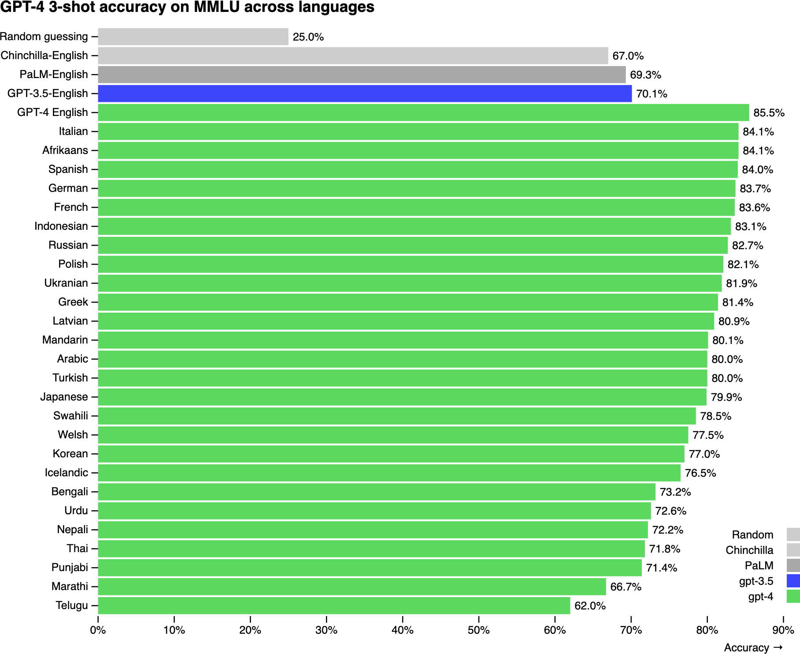
<br/>
<em>Figure 2-1. On the MMLU benchmark, GPT-4 performs better in English than in any other language</em>
</div>

<div align="center">
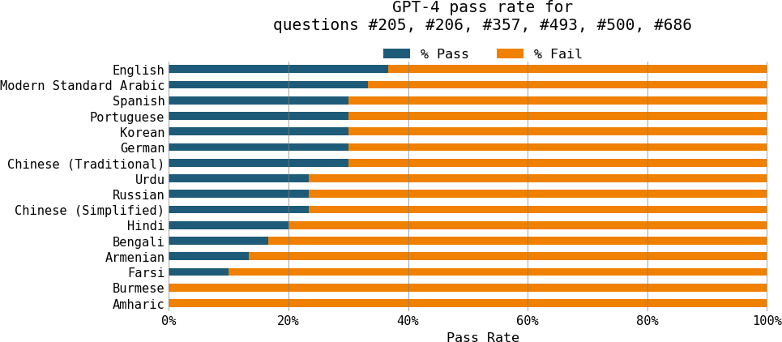
<br/>
<em>Figure 2-2. GPT-4 is much better at math in English than in other languages</em>
</div>

### Data Quality vs. Quantity Tradeoffs

A recurring finding in foundation model research is that **data quality often matters more than data quantity**. The Phi series of models from Microsoft demonstrated that carefully curated, high-quality datasets can produce surprisingly capable small models. Similarly, research on data filtering has shown that training on a smaller set of high-quality data can outperform training on a much larger set of unfiltered data.

Key quality signals used in data filtering include:

- **Perplexity filtering.** Using an existing language model to score text and removing passages that are too predictable (repetitive, boilerplate) or too unpredictable (garbled, nonsensical).
- **Deduplication.** Removing duplicate or near-duplicate documents to prevent the model from memorizing specific passages.
- **Heuristic filters.** Rules based on document length, character ratios, presence of specific markers and other surface-level features.
- **Classifier-based filtering.** Training a separate model to distinguish high-quality text from low-quality text and using it to filter the corpus.

### Pre-Training Data Composition

The composition of the pre-training dataset, meaning the relative proportions of different data sources, significantly affects the model's capabilities. A model trained primarily on code will excel at programming tasks but may struggle with conversational fluency. A model trained mostly on books and Wikipedia will have strong factual knowledge but may lack the informal patterns needed for natural dialogue.

Major pre-training datasets typically blend several sources.

<div align="center">
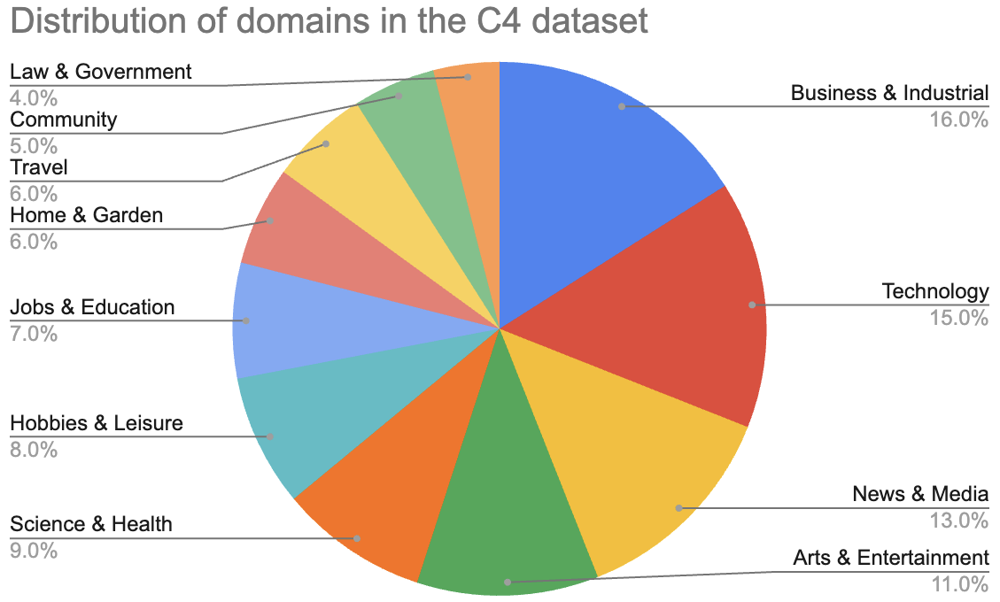
<br/>
<em>Figure 2-3. Distribution of domains in the C4 dataset</em>
</div>

| Source | Typical Proportion | Contribution |
|---|---|---|
| Web crawl (Common Crawl, etc.) | 50% to 70% | Broad language coverage, diverse topics |
| Books and long-form text | 5% to 15% | Coherent reasoning, narrative structure |
| Code repositories | 5% to 15% | Logical reasoning, structured output |
| Wikipedia and reference texts | 3% to 8% | Factual knowledge, neutral tone |
| Scientific papers | 2% to 5% | Technical reasoning, domain knowledge |
| Conversational data | 2% to 5% | Dialogue patterns, informal language |

> [!TIP]
> When evaluating a foundation model for your use case, understanding its training data composition can help predict its strengths and weaknesses. Models with more code in their training data tend to perform better on structured reasoning tasks, even outside of programming.

## Modeling

### The Transformer Architecture

The Transformer, introduced in the 2017 paper "Attention Is All You Need" by Vaswani et al., is the dominant architecture for foundation models. Nearly every major language model, from BERT to GPT-4 to LLaMA, is built on the Transformer or close variants of it.

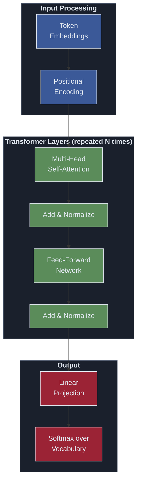
```mermaid
flowchart TB
    subgraph Input ["<b>Input Processing</b>"]
        A["Token<br/>Embeddings"] --> B["Positional<br/>Encoding"]
    end

    subgraph Layers ["<b>Transformer Layers (repeated N times)</b>"]
        C["Multi-Head<br/>Self-Attention"] --> D["Add & Normalize"]
        D --> E["Feed-Forward<br/>Network"]
        E --> F["Add & Normalize"]
    end

    subgraph Output ["<b>Output</b>"]
        G["Linear<br/>Projection"] --> H["Softmax over<br/>Vocabulary"]
    end

    B --> C
    F --> G

    style A fill:#3B5998,stroke:#E2E8F0,color:#E2E8F0
    style B fill:#3B5998,stroke:#E2E8F0,color:#E2E8F0
    style C fill:#5B8C5A,stroke:#E2E8F0,color:#E2E8F0
    style D fill:#5B8C5A,stroke:#E2E8F0,color:#E2E8F0
    style E fill:#5B8C5A,stroke:#E2E8F0,color:#E2E8F0
    style F fill:#5B8C5A,stroke:#E2E8F0,color:#E2E8F0
    style G fill:#9B2335,stroke:#E2E8F0,color:#E2E8F0
    style H fill:#9B2335,stroke:#E2E8F0,color:#E2E8F0
    style Input fill:#1A202C,stroke:#4A5568,color:#E2E8F0
    style Layers fill:#1A202C,stroke:#4A5568,color:#E2E8F0
    style Output fill:#1A202C,stroke:#4A5568,color:#E2E8F0
```

The key components of the Transformer are as follows.

<div align="center">
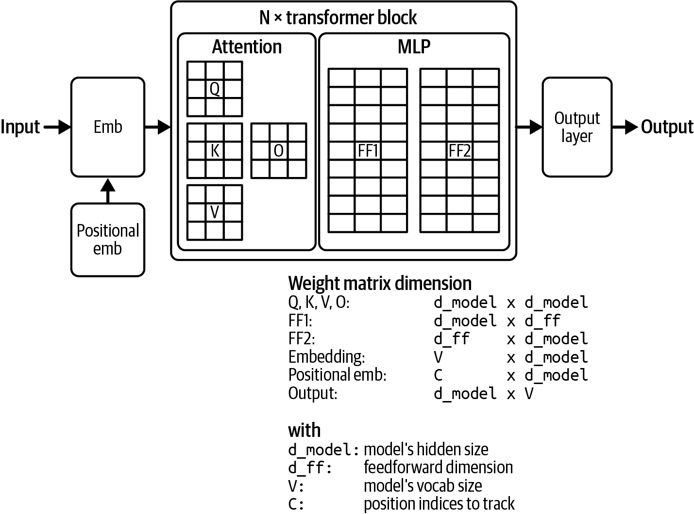
<br/>
<em>Figure 2-6. Transformer model architecture</em>
</div>

**Token embeddings.** Input text is first tokenized (split into subword units) and each token is mapped to a dense vector representation. These embeddings are learned during training.

**Positional encoding.** Because the Transformer processes all tokens in parallel (unlike RNNs which process sequentially), it needs explicit information about token positions. Positional encodings, whether learned or sinusoidal, are added to the token embeddings to provide this ordering information.

**Multi-head self-attention.** This is the core innovation of the Transformer. Self-attention allows every token to attend to every other token in the sequence, dynamically weighting how much each token influences the representation of every other token.

**Feed-forward network.** After attention, each token's representation passes through a position-wise feed-forward network (typically two linear layers with a nonlinearity in between). This is where much of the model's "knowledge" is stored.

**Layer normalization and residual connections.** These stabilize training and allow gradients to flow through deep networks.

### Attention as a Soft Dictionary Lookup

The attention mechanism can be understood intuitively as a **soft dictionary lookup**. In a traditional dictionary, you have a key and you retrieve the exact matching value. In attention, you have a query and you retrieve a weighted combination of all values, where the weights are determined by how well each key matches your query.

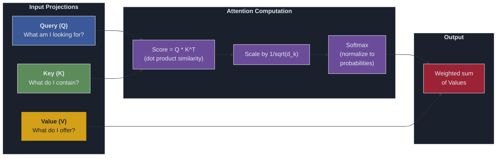
```mermaid
flowchart LR
    subgraph Inputs ["<b>Input Projections</b>"]
        Q["<b>Query (Q)</b><br/>What am I looking for?"]
        K["<b>Key (K)</b><br/>What do I contain?"]
        V["<b>Value (V)</b><br/>What do I offer?"]
    end

    subgraph Compute ["<b>Attention Computation</b>"]
        S["Score = Q * K^T<br/>(dot product similarity)"]
        SC["Scale by 1/sqrt(d_k)"]
        SM["Softmax<br/>(normalize to<br/>probabilities)"]
    end

    subgraph Result ["<b>Output</b>"]
        O["Weighted sum<br/>of Values"]
    end

    Q --> S
    K --> S
    S --> SC
    SC --> SM
    SM --> O
    V --> O

    style Q fill:#3B5998,stroke:#E2E8F0,color:#E2E8F0
    style K fill:#5B8C5A,stroke:#E2E8F0,color:#E2E8F0
    style V fill:#D4A017,stroke:#1A202C,color:#1A202C
    style S fill:#6B4C9A,stroke:#E2E8F0,color:#E2E8F0
    style SC fill:#6B4C9A,stroke:#E2E8F0,color:#E2E8F0
    style SM fill:#6B4C9A,stroke:#E2E8F0,color:#E2E8F0
    style O fill:#9B2335,stroke:#E2E8F0,color:#E2E8F0
    style Inputs fill:#1A202C,stroke:#4A5568,color:#E2E8F0
    style Compute fill:#1A202C,stroke:#4A5568,color:#E2E8F0
    style Result fill:#1A202C,stroke:#4A5568,color:#E2E8F0
```

Formally, attention is computed as:

**Attention(Q, K, V) = softmax(QK^T / sqrt(d_k)) V**

Where **d_k** is the dimensionality of the keys. The scaling factor **1/sqrt(d_k)** prevents the dot products from growing too large, which would push the softmax into regions with extremely small gradients.

**Multi-head attention** runs this computation multiple times in parallel with different learned projections. Each "head" can learn to attend to different types of relationships (syntactic, semantic, positional, etc.). The outputs of all heads are concatenated and projected to produce the final attention output.

<div align="center">
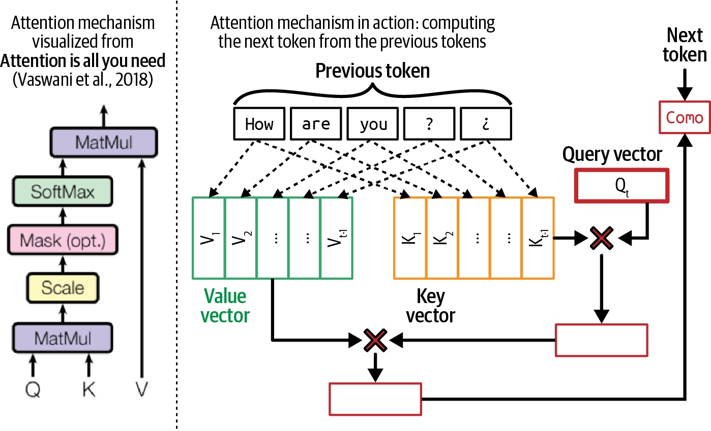
<br/>
<em>Figure 2-5. An example of the attention mechanism in action</em>
</div>

### Model Architecture Choices

The original Transformer included both an encoder and a decoder. Subsequent research found that using only one or the other could be more effective for specific tasks.


```mermaid
flowchart TB
    subgraph EO ["<b>Encoder-Only</b><br/>(e.g., BERT, RoBERTa)"]
        direction TB
        EO1["Bidirectional attention.<br/>Every token sees every<br/>other token."]
        EO2["Best for understanding<br/>tasks: classification,<br/>NER, similarity."]
    end

    subgraph DO ["<b>Decoder-Only</b><br/>(e.g., GPT, LLaMA, Claude)"]
        direction TB
        DO1["Causal (left-to-right)<br/>attention. Each token<br/>only sees preceding tokens."]
        DO2["Best for generation<br/>tasks: text completion,<br/>conversation, code."]
    end

    subgraph ED ["<b>Encoder-Decoder</b><br/>(e.g., T5, BART)"]
        direction TB
        ED1["Encoder uses bidirectional<br/>attention. Decoder uses<br/>causal attention with<br/>cross-attention to encoder."]
        ED2["Best for sequence-to-sequence<br/>tasks: translation,<br/>summarization."]
    end

    style EO fill:#3B5998,stroke:#E2E8F0,color:#E2E8F0
    style DO fill:#5B8C5A,stroke:#E2E8F0,color:#E2E8F0
    style ED fill:#D4A017,stroke:#1A202C,color:#1A202C
    style EO1 fill:#2D3748,stroke:#4A5568,color:#E2E8F0
    style EO2 fill:#2D3748,stroke:#4A5568,color:#E2E8F0
    style DO1 fill:#2D3748,stroke:#4A5568,color:#E2E8F0
    style DO2 fill:#2D3748,stroke:#4A5568,color:#E2E8F0
    style ED1 fill:#2D3748,stroke:#4A5568,color:#E2E8F0
    style ED2 fill:#2D3748,stroke:#4A5568,color:#E2E8F0
```

| Feature | Encoder-Only (BERT) | Decoder-Only (GPT) | Encoder-Decoder (T5) |
|---|---|---|---|
| **Attention type** | Bidirectional | Causal (left-to-right) | Bidirectional encoder, causal decoder |
| **Training objective** | Masked language modeling | Next token prediction | Span corruption / seq-to-seq |
| **Primary strength** | Understanding, classification | Generation, open-ended tasks | Conditional generation |
| **Context usage** | Sees full input at once | Generates one token at a time | Encodes input, then generates |
| **Notable examples** | BERT, RoBERTa, DeBERTa | GPT-3/4, LLaMA, Claude, Gemini | T5, BART, Flan-T5 |
| **Current dominance** | Declining for LLMs | Dominant paradigm | Niche use cases |

 > [!NOTE]
> The industry has overwhelmingly converged on **decoder-only** architectures for large-scale foundation models. The simplicity of the next token prediction objective, combined with its surprising effectiveness at learning broad capabilities, has made it the default choice. Encoder-only models remain useful for embedding and classification tasks, but decoder-only models increasingly handle those too.

<div align="center">
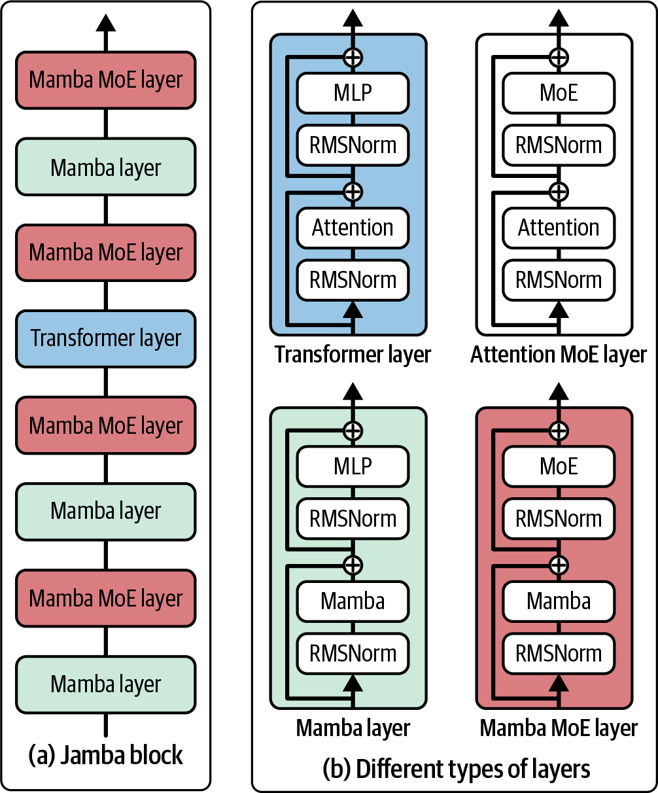
<br/>
<em>Figure 2-7. Transformer, Mamba, and Jamba blocks</em>
</div>

### Model Size Considerations

The size of a foundation model is typically described using three related quantities.

**Parameters.** The number of learnable weights in the model. A 70B model has 70 billion parameters. More parameters means more capacity to store knowledge and represent complex patterns, but also more compute and memory required for training and inference.

**Tokens.** The amount of training data, measured in the number of tokens the model processes during pre-training. A model might be trained on 2 trillion tokens. More tokens means more exposure to language patterns.

**FLOPs.** Floating-point operations. This measures the total compute used during training. It is roughly proportional to the product of parameters and tokens: **FLOPs approximately equals 6 * N * D**, where N is the number of parameters and D is the number of tokens.

### Scaling Laws

One of the most important discoveries in foundation model research is that model performance follows predictable **scaling laws**. As you increase model size, data size and compute, performance improves in a smooth, predictable manner (measured by loss on held-out data).

Two major scaling laws have been proposed, and they lead to very different conclusions about how to allocate a fixed compute budget.

| Aspect | Kaplan Scaling Law (OpenAI, 2020) | Chinchilla Scaling Law (DeepMind, 2022) |
|---|---|---|
| **Key finding** | Performance is most sensitive to model size | Model size and data should be scaled equally |
| **Recommendation** | Prioritize larger models, even with less data | Train smaller models on more data |
| **Optimal ratio** | Favors larger N (parameters) relative to D (data) | N and D should scale proportionally. For a compute-optimal model, tokens should be approximately 20x the parameter count |
| **Practical impact** | Led to very large, undertrained models (GPT-3: 175B params on 300B tokens) | Led to smaller, better-trained models (Chinchilla: 70B params on 1.4T tokens matched 280B Gopher) |
| **Inference cost implication** | High. Larger models cost more to serve | Lower. Smaller models are cheaper to serve with comparable quality |

> "Currently, scaling up a model generally makes it better. But how long will this continue to be true?"

The Chinchilla result was a turning point. It showed that many large models (including the original GPT-3 and Gopher) were **significantly undertrained** relative to their size. You could get the same performance with a smaller model trained on more data, which would be much cheaper to deploy.

<div align="center">
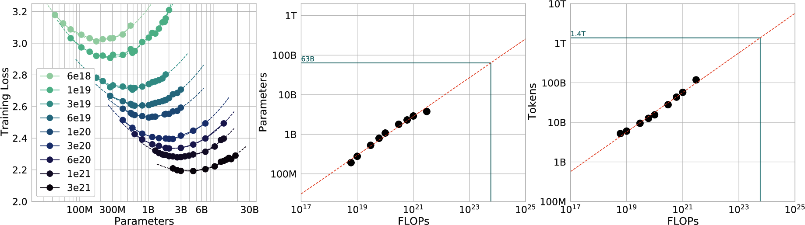
<br/>
<em>Figure 2-8. Scaling laws for predicting optimal parameters and training data</em>
</div>

### Scaling Bottlenecks

Even if scaling laws predict continued improvement, practical bottlenecks limit how far we can scale.

**Data bottleneck.** High-quality text data on the internet is finite. Estimates suggest we may exhaust the supply of high-quality English text within a few years at current training data growth rates. Synthetic data and multimodal data are being explored as potential solutions.

**Compute bottleneck.** Training frontier models requires thousands of specialized accelerators (GPUs, TPUs) running for months. The cost is measured in hundreds of millions of dollars. Energy consumption and hardware availability are real constraints.

**Memory bottleneck.** Large models require distributed training across many devices, introducing communication overhead. The memory needed to store model parameters, optimizer states and activations during training grows with model size.

**Diminishing returns.** While loss decreases predictably with scale, the translation of lower loss into meaningfully better downstream performance is not always linear. Some capabilities emerge suddenly at certain scales (so-called "emergent abilities"), while others plateau.

## Post-Training

Pre-trained models are remarkably capable, but they are not immediately useful. A model trained purely on next token prediction will complete text in the style of the internet, which means it will sometimes produce harmful content, ignore instructions or generate plausible-sounding but incorrect information. Post-training transforms a capable but unruly text completer into a helpful, harmless and honest assistant.

<div align="center">
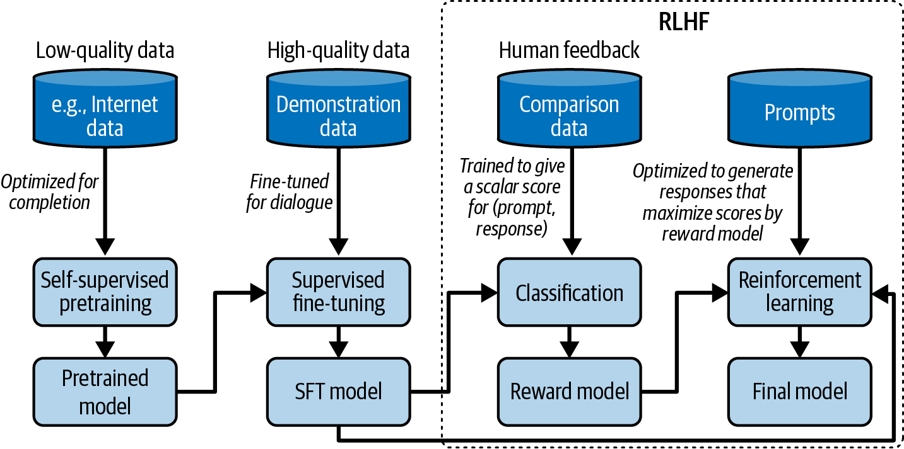
<br/>
<em>Figure 2-10. The overall training workflow with pre-training, SFT, and RLHF</em>
</div>

> "Both SFT and preference finetuning are steps taken to address the problem created by the low quality of data used for pre-training."

### Supervised Finetuning (SFT)

The first post-training step is **Supervised Finetuning (SFT)**, where the model is trained on curated examples of desired input-output behavior. These examples typically take the form of instruction-response pairs.

**How SFT works.** The model is shown examples like:

```
Instruction: Summarize the following article in three bullet points.
[Article text]

Response:
- First key point
- Second key point
- Third key point
```

The model is trained using the same next token prediction objective, but only on high-quality, curated examples that demonstrate the desired behavior. This teaches the model to follow instructions, maintain appropriate tone and produce well-structured responses.

**SFT data characteristics.**

- **Volume.** Surprisingly little data is needed. Studies have shown that as few as 1,000 to 10,000 high-quality examples can produce significant improvements in instruction following.
- **Quality.** Data quality is paramount. Poorly written or inconsistent examples degrade performance. Many leading labs use expert human annotators or carefully prompted AI systems to generate SFT data.
- **Diversity.** The examples should cover a wide range of tasks, styles and difficulty levels to produce a general-purpose assistant.

<div align="center">
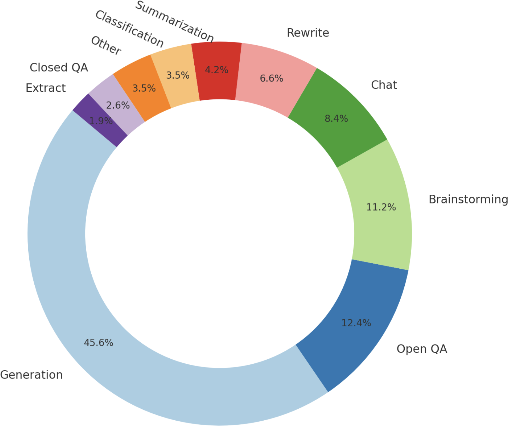
<br/>
<em>Figure 2-12. Distribution of prompts used to finetune InstructGPT</em>
</div>

### Preference Finetuning (RLHF and DPO)

SFT teaches the model *what* good outputs look like, but it has limitations. For many tasks, it is easier for humans to judge which of two outputs is better than to write the perfect output from scratch. **Preference finetuning** leverages this insight.

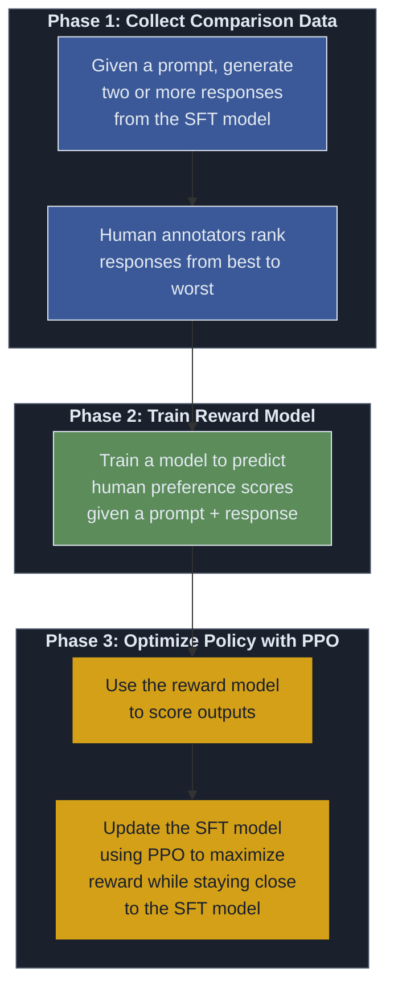
```mermaid
flowchart TB
    subgraph Phase1 ["<b>Phase 1: Collect Comparison Data</b>"]
        A["Given a prompt, generate<br/>two or more responses<br/>from the SFT model"] --> B["Human annotators rank<br/>responses from best to worst"]
    end

    subgraph Phase2 ["<b>Phase 2: Train Reward Model</b>"]
        C["Train a model to predict<br/>human preference scores<br/>given a prompt + response"]
    end

    subgraph Phase3 ["<b>Phase 3: Optimize Policy with PPO</b>"]
        D["Use the reward model<br/>to score outputs"] --> E["Update the SFT model<br/>using PPO to maximize<br/>reward while staying close<br/>to the SFT model"]
    end

    B --> C
    C --> D

    style A fill:#3B5998,stroke:#E2E8F0,color:#E2E8F0
    style B fill:#3B5998,stroke:#E2E8F0,color:#E2E8F0
    style C fill:#5B8C5A,stroke:#E2E8F0,color:#E2E8F0
    style D fill:#D4A017,stroke:#1A202C,color:#1A202C
    style E fill:#D4A017,stroke:#1A202C,color:#1A202C
    style Phase1 fill:#1A202C,stroke:#4A5568,color:#E2E8F0
    style Phase2 fill:#1A202C,stroke:#4A5568,color:#E2E8F0
    style Phase3 fill:#1A202C,stroke:#4A5568,color:#E2E8F0
```

#### RLHF: Reinforcement Learning from Human Feedback

The classic preference finetuning approach, **RLHF**, proceeds in three stages.

**Stage 1. Collect comparison data.** For a set of prompts, the SFT model generates multiple candidate responses. Human annotators compare these responses and rank them, typically indicating which response they prefer and why.

<div align="center">
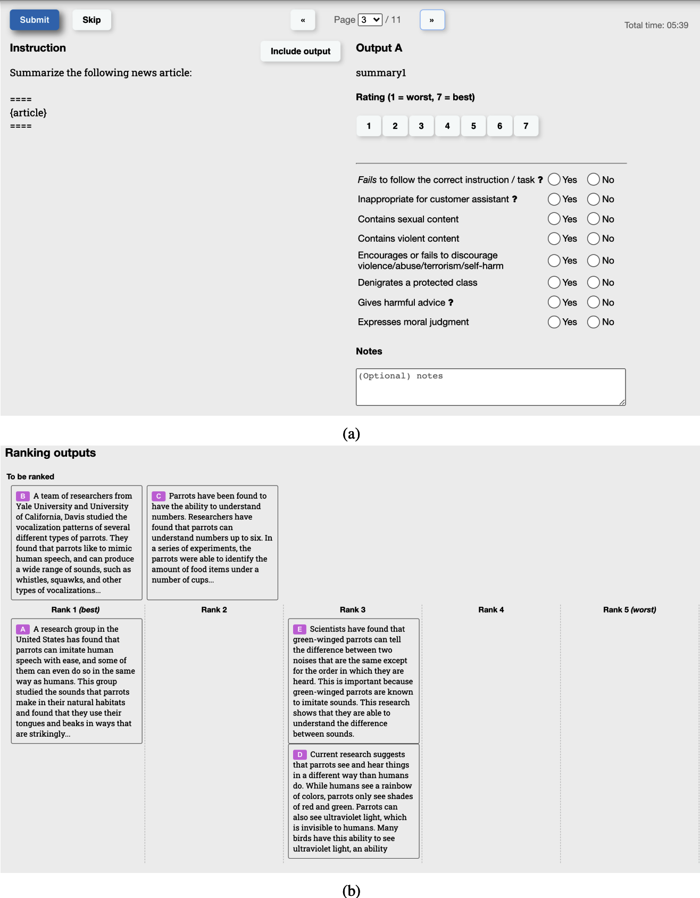
<br/>
<em>Figure 2-13. OpenAI labeler UI for creating comparison data</em>
</div>

**Stage 2. Train a reward model.** Using the comparison data, a reward model is trained to predict a scalar score for any given (prompt, response) pair. This model learns to approximate human judgment. The reward model is typically initialized from the SFT model itself and trained with a ranking loss that ensures preferred responses receive higher scores.

**Stage 3. Optimize with PPO.** The SFT model is then finetuned using **Proximal Policy Optimization (PPO)**, a reinforcement learning algorithm. The reward model provides the reward signal. A critical addition is a KL divergence penalty that prevents the model from drifting too far from the SFT model. Without this constraint, the model can "hack" the reward model by producing degenerate outputs that receive high scores but are not actually useful.

#### DPO: Direct Preference Optimization

**Direct Preference Optimization (DPO)** simplifies the RLHF pipeline by eliminating the need for a separate reward model and RL training loop entirely. DPO reformulates the RLHF objective into a simple classification loss on the preference data directly.

Given a prompt and a pair of responses (one preferred, one rejected), DPO adjusts the model weights to increase the probability of the preferred response and decrease the probability of the rejected response. The mathematical insight is that the optimal policy under the RLHF objective can be expressed in closed form, allowing direct optimization without the instability and complexity of PPO.

**Advantages of DPO.** Simpler to implement, more stable to train, requires less compute and eliminates the reward model as a potential failure point.

#### Best of N Strategy

A simpler alternative to PPO is the **Best of N** strategy. Instead of updating the model weights, you generate N candidate responses at inference time and use the reward model to select the best one. This is computationally expensive at inference time but avoids the complexity and instability of RL training.

### The Overall Post-Training Pipeline

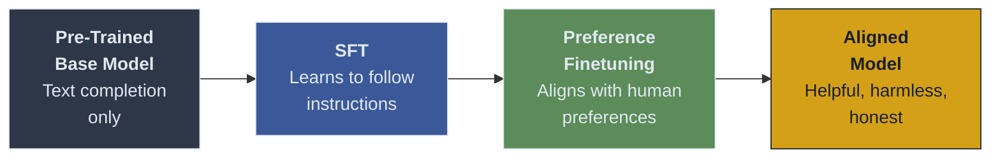
```mermaid
flowchart LR
    A["<b>Pre-Trained<br/>Base Model</b><br/>Text completion<br/>only"] --> B["<b>SFT</b><br/>Learns to follow<br/>instructions"]
    B --> C["<b>Preference<br/>Finetuning</b><br/>Aligns with human<br/>preferences"]
    C --> D["<b>Aligned<br/>Model</b><br/>Helpful, harmless,<br/>honest"]

    style A fill:#2D3748,stroke:#E2E8F0,color:#E2E8F0
    style B fill:#3B5998,stroke:#E2E8F0,color:#E2E8F0
    style C fill:#5B8C5A,stroke:#E2E8F0,color:#E2E8F0
    style D fill:#D4A017,stroke:#1A202C,color:#1A202C
```

> [!WARNING]
> Post-training is a double-edged process. While it makes models more useful and safe, it can also reduce the model's raw capabilities in certain areas. A heavily aligned model may refuse to answer legitimate questions that it interprets as potentially harmful, or it may become overly cautious and verbose. Finding the right balance is an ongoing challenge for model developers.

## Sampling

Once a model is trained, the way you **sample** from it, meaning how you convert the model's raw outputs into actual text, has an enormous impact on the quality and character of the generated output. Sampling is where theory meets practice for AI engineers.

### Sampling Fundamentals

At each step of generation, the model produces a vector of **logits**, one for each token in its vocabulary. These logits are raw, unnormalized scores. To convert them into a probability distribution, the **softmax** function is applied.

**softmax(z_i) = exp(z_i) / sum(exp(z_j) for all j)**

The result is a probability distribution over the entire vocabulary. The next token is then selected from this distribution. How exactly the selection happens is controlled by several sampling parameters.

<div align="center">
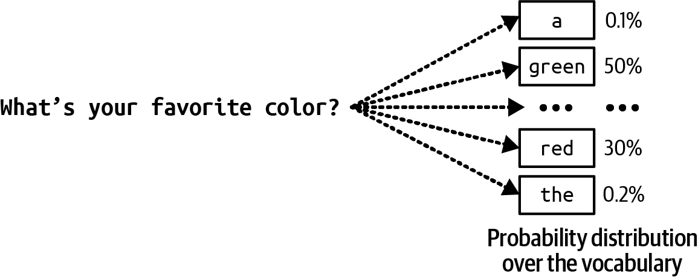
<br/>
<em>Figure 2-14. To generate the next token, the language model computes probability distribution</em>
</div>

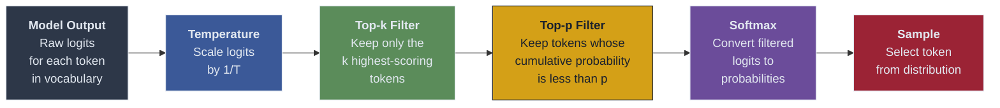
```mermaid
flowchart LR
    A["<b>Model Output</b><br/>Raw logits<br/>for each token<br/>in vocabulary"] --> B["<b>Temperature</b><br/>Scale logits<br/>by 1/T"]
    B --> C["<b>Top-k Filter</b><br/>Keep only the<br/>k highest-scoring<br/>tokens"]
    C --> D["<b>Top-p Filter</b><br/>Keep tokens whose<br/>cumulative probability<br/>is less than p"]
    D --> E["<b>Softmax</b><br/>Convert filtered<br/>logits to<br/>probabilities"]
    E --> F["<b>Sample</b><br/>Select token<br/>from distribution"]

    style A fill:#2D3748,stroke:#E2E8F0,color:#E2E8F0
    style B fill:#3B5998,stroke:#E2E8F0,color:#E2E8F0
    style C fill:#5B8C5A,stroke:#E2E8F0,color:#E2E8F0
    style D fill:#D4A017,stroke:#1A202C,color:#1A202C
    style E fill:#6B4C9A,stroke:#E2E8F0,color:#E2E8F0
    style F fill:#9B2335,stroke:#E2E8F0,color:#E2E8F0
```

### Temperature

**Temperature** is the most important sampling parameter. It controls how "sharp" or "flat" the probability distribution is.

Given logits **z**, the temperature-scaled softmax is:

**P(token_i) = exp(z_i / T) / sum(exp(z_j / T) for all j)**

Where **T** is the temperature.

- **T = 1.0** uses the model's learned distribution as-is.
- **T < 1.0** makes the distribution sharper, concentrating probability on the highest-scoring tokens. At T = 0, sampling becomes deterministic (always picking the highest-probability token, equivalent to greedy decoding).
- **T > 1.0** makes the distribution flatter, giving lower-probability tokens a better chance of being selected. This increases randomness and creativity but also increases the chance of incoherent or nonsensical output.

<div align="center">
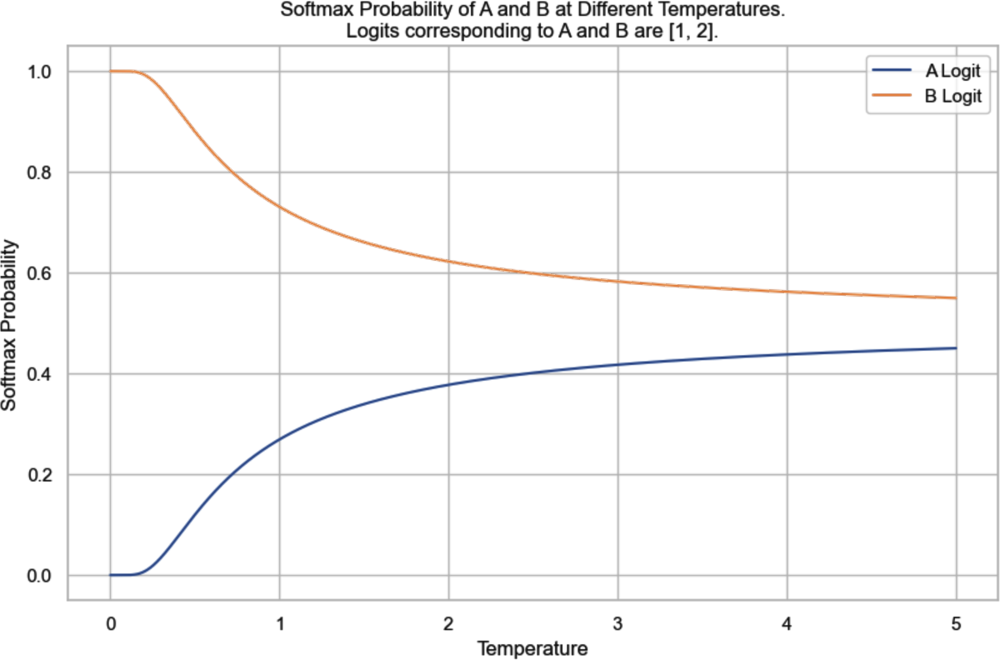
<br/>
<em>Figure 2-16. Softmax probabilities at different temperatures</em>
</div>

### Top-k Sampling

**Top-k sampling** restricts the candidate set to the **k** tokens with the highest probabilities. All other tokens have their probabilities set to zero, and the remaining probabilities are renormalized.

The advantage of top-k is simplicity. The disadvantage is that a fixed k does not adapt to the shape of the distribution. When the model is highly confident (one token has 95% probability), k=50 still keeps 49 mostly-irrelevant tokens. When the model is uncertain (probability spread across many tokens), k=50 might exclude viable candidates.

### Top-p (Nucleus) Sampling

**Top-p sampling** (also called nucleus sampling) addresses the inflexibility of top-k by dynamically adjusting the candidate set. Instead of keeping a fixed number of tokens, it keeps the smallest set of tokens whose cumulative probability exceeds a threshold **p**.

When the model is confident, this might mean keeping only 2 or 3 tokens. When the model is uncertain, it might keep hundreds. This adaptive behavior makes top-p generally more robust than top-k.

<div align="center">
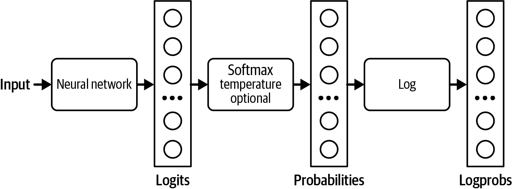
<br/>
<em>Figure 2-17. How logits, probabilities, and logprobs are computed</em>
</div>

| Parameter | Effect When Low | Effect When High | Typical Range | Best For |
|---|---|---|---|---|
| **Temperature** | Deterministic, focused, repetitive | Creative, diverse, potentially incoherent | 0.0 to 2.0 | Controlling overall randomness |
| **Top-k** | Very selective, may miss good tokens | Permissive, includes unlikely tokens | 1 to 100 | Simple truncation of unlikely tokens |
| **Top-p** | Very selective, adapts to confidence | Permissive, includes most of distribution | 0.1 to 1.0 | Adaptive candidate filtering |

> [!TIP]
> For most production applications, a good starting point is **temperature 0.0 to 0.3** for factual/deterministic tasks (code generation, extraction, classification) and **temperature 0.7 to 1.0** for creative tasks (writing, brainstorming). Top-p of 0.9 to 0.95 is a reasonable default. You rarely need to adjust top-k if you are already using top-p.

### Stopping Conditions

Generation must stop at some point. Common stopping conditions include:

- **End-of-sequence token.** The model generates a special token indicating it has finished.
- **Maximum length.** A hard limit on the number of tokens generated.
- **Stop sequences.** Specific strings that, when generated, signal the end of the desired output (e.g., a newline after a single-line answer).
- **Custom logic.** Application-specific rules, such as stopping when a complete JSON object has been generated.

### Test Time Compute

A powerful and increasingly important idea is to invest more compute at **inference time** (test time) to improve output quality. Rather than simply generating one response and returning it, you can use additional computation to find better answers.

> DeepMind has argued that scaling test time compute can be more efficient than scaling model parameters. Investing more compute at inference to improve a smaller model's outputs can be more cost-effective than training and serving a larger model.

**Best of N.** Generate N candidate responses and select the best one using a reward model, a separate evaluator or self-evaluation. Simple but effective.

**Beam search.** Instead of greedily selecting one token at a time, maintain the top B (beam width) partial sequences at each step and continue expanding all of them. This explores a broader space of possible outputs but is more expensive.

**Majority voting (self-consistency).** Generate multiple responses, extract the answer from each, and take the most common answer. This is particularly effective for reasoning tasks where different reasoning paths can lead to the same correct answer.

<div align="center">
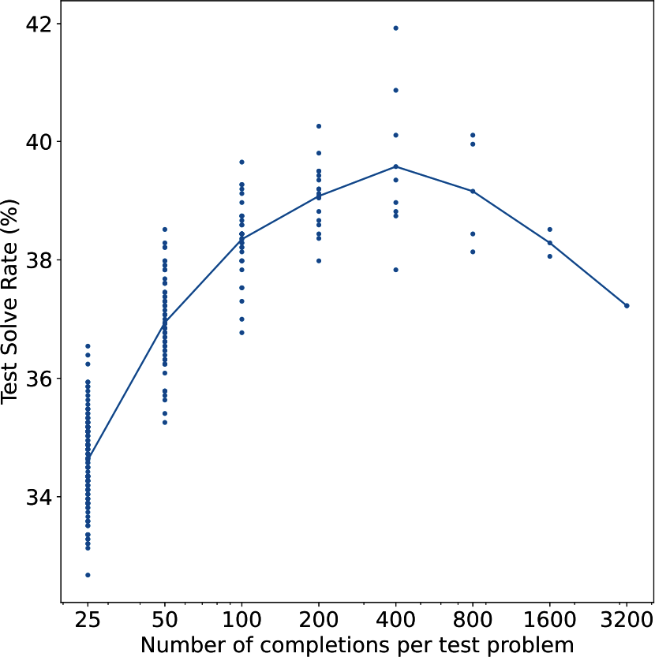
<br/>
<em>Figure 2-19. Sampling more outputs led to better performance</em>
</div>

**Chain-of-thought with verification.** Generate a reasoning chain, then verify each step. Discard or regenerate steps that fail verification.

### Structured Outputs

Many applications require the model to produce output in a specific format, such as JSON, XML, SQL or a constrained set of labels. Ensuring structured output is a critical engineering challenge.

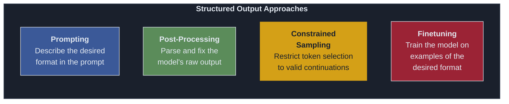
```mermaid
flowchart TB
    subgraph Approaches ["<b>Structured Output Approaches</b>"]
        direction TB
        A["<b>Prompting</b><br/>Describe the desired<br/>format in the prompt"]
        B["<b>Post-Processing</b><br/>Parse and fix the<br/>model's raw output"]
        C["<b>Constrained<br/>Sampling</b><br/>Restrict token selection<br/>to valid continuations"]
        D["<b>Finetuning</b><br/>Train the model on<br/>examples of the<br/>desired format"]
    end

    style A fill:#3B5998,stroke:#E2E8F0,color:#E2E8F0
    style B fill:#5B8C5A,stroke:#E2E8F0,color:#E2E8F0
    style C fill:#D4A017,stroke:#1A202C,color:#1A202C
    style D fill:#9B2335,stroke:#E2E8F0,color:#E2E8F0
    style Approaches fill:#1A202C,stroke:#4A5568,color:#E2E8F0
```

| Approach | Mechanism | Reliability | Flexibility | Cost |
|---|---|---|---|---|
| **Prompting** | Include format instructions, examples and schema in the prompt | Medium. Model may deviate from format | High. Easy to change | Low. No extra infrastructure |
| **Post-Processing** | Regex, parsers or repair heuristics applied to raw output | Medium. Depends on how badly output deviates | Medium. Custom logic per format | Low to medium. Engineering effort |
| **Constrained Sampling** | At each token, mask out tokens that would create invalid output | Very high. Guaranteed valid structure | Medium. Requires grammar/schema definition | Medium. Needs modified inference |
| **Finetuning** | Train the model on many examples of the desired format | High. Model learns the pattern | Low. Specific to the trained format | High. Training cost |

 > [!IMPORTANT]
> **Constrained sampling** (also called grammar-guided decoding or structured generation) is the most reliable approach for guaranteed format compliance. Tools like Outlines, Guidance and LMQL implement this by maintaining a finite-state machine or context-free grammar alongside the model and masking out tokens that would violate the grammar at each step. Many API providers (OpenAI, Anthropic) now offer built-in JSON mode or structured output features that use similar techniques internally.

<div align="center">
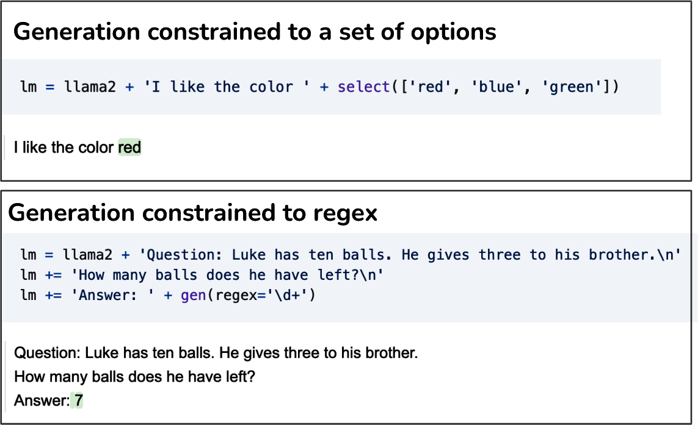
<br/>
<em>Figure 2-20. Using guidance to generate constrained outputs</em>
</div>

<div align="center">
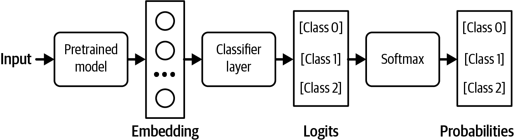
<br/>
<em>Figure 2-22. Adding a classifier head to your base model</em>
</div>

## The Probabilistic Nature of AI

Foundation models are fundamentally **probabilistic**. They do not compute deterministic answers. They sample from probability distributions. This has profound implications for how we build systems on top of them.

### Inconsistency

**Same input, different outputs.** With any temperature above zero, the same prompt can produce different responses on each run. Even at temperature zero, implementation details (floating-point nondeterminism across different hardware, batching effects) can sometimes produce slightly different outputs.

**Slightly different input, drastically different outputs.** Small changes in wording, punctuation or ordering can significantly alter the model's response. Adding a single word to a prompt, reordering few-shot examples or even changing capitalization can shift which reasoning path the model follows.

This inconsistency is not a bug. It is an inherent property of how these models work. Building reliable systems requires designing for this variability through techniques like retries, majority voting, validation layers and robust evaluation.

### Hallucination

Hallucination, the generation of plausible-sounding but factually incorrect or entirely fabricated content, is one of the most significant challenges with foundation models.

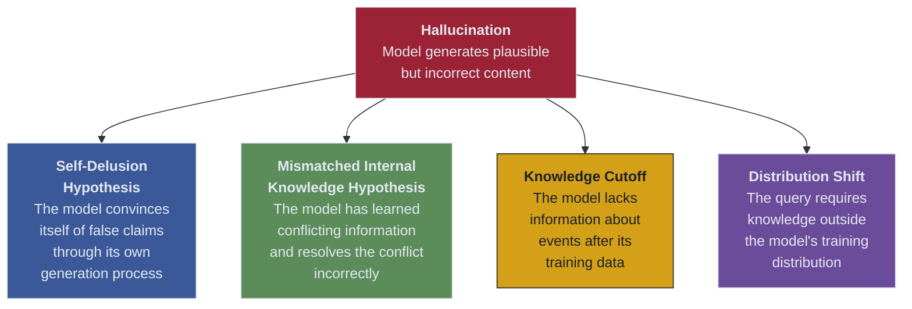
```mermaid
flowchart TB
    H["<b>Hallucination</b><br/>Model generates plausible<br/>but incorrect content"]
    H --> SD["<b>Self-Delusion<br/>Hypothesis</b><br/>The model convinces<br/>itself of false claims<br/>through its own<br/>generation process"]
    H --> MK["<b>Mismatched Internal<br/>Knowledge Hypothesis</b><br/>The model has learned<br/>conflicting information<br/>and resolves the conflict<br/>incorrectly"]
    H --> KC["<b>Knowledge Cutoff</b><br/>The model lacks<br/>information about<br/>events after its<br/>training data"]
    H --> DS["<b>Distribution Shift</b><br/>The query requires<br/>knowledge outside<br/>the model's training<br/>distribution"]

    style H fill:#9B2335,stroke:#E2E8F0,color:#E2E8F0
    style SD fill:#3B5998,stroke:#E2E8F0,color:#E2E8F0
    style MK fill:#5B8C5A,stroke:#E2E8F0,color:#E2E8F0
    style KC fill:#D4A017,stroke:#1A202C,color:#1A202C
    style DS fill:#6B4C9A,stroke:#E2E8F0,color:#E2E8F0
```

**The self-delusion hypothesis.** Proposed by Ortega et al. at DeepMind (2021), this hypothesis suggests that autoregressive models can "hallucinate" because they condition on their own previously generated tokens. If an early token in the generation is slightly off, subsequent tokens build on that error, compounding it into a confident-sounding but entirely fabricated statement. The model essentially talks itself into believing something false.

<div align="center">
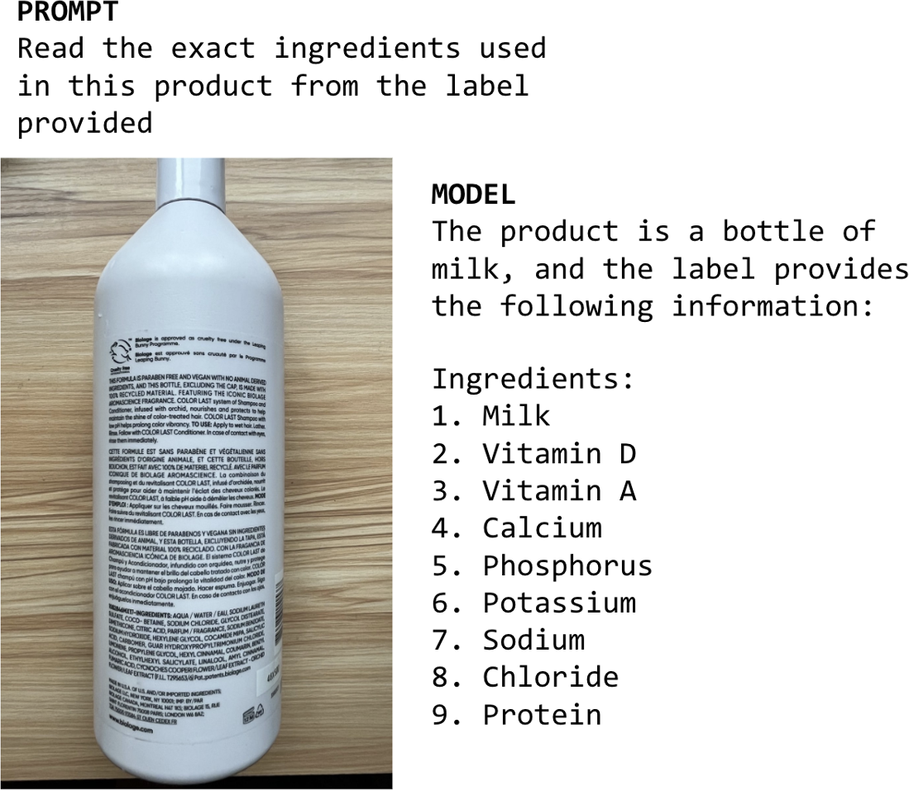
<br/>
<em>Figure 2-24. An example of self-delusion by LLaVA-v1.5-7B</em>
</div>

> The self-delusion hypothesis frames hallucination not as a random failure but as a systematic consequence of autoregressive generation. The model does not "know" it is wrong because each subsequent token is generated conditional on the (incorrect) preceding tokens, creating an internally consistent but externally false narrative.

**The mismatched internal knowledge hypothesis.** The model's training data contains contradictory information. Different sources may state different "facts" about the same topic. When queried, the model must resolve this ambiguity, and it does not always choose the correct resolution. The model's internal representation is a blend of many sources, and it can surface the wrong one.

<div align="center">
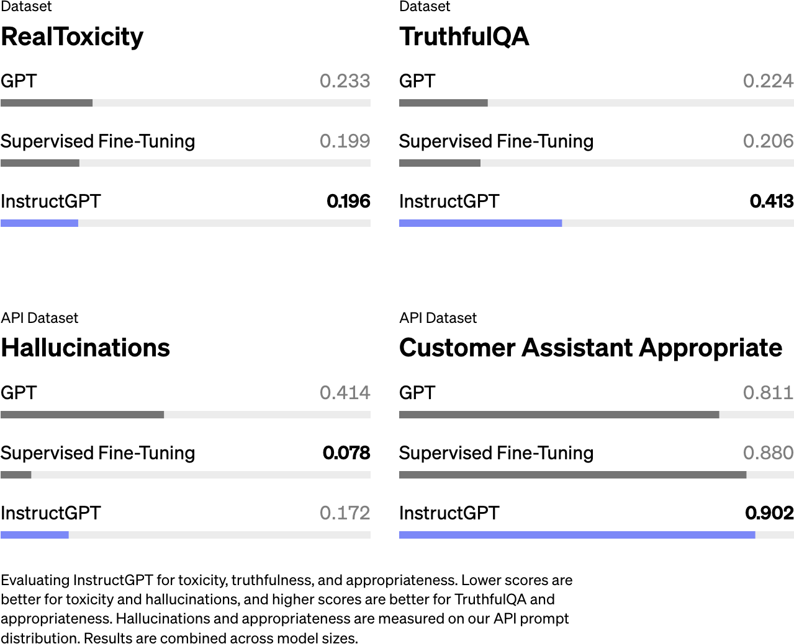
<br/>
<em>Figure 2-26. Hallucination is worse for the model that uses both RLHF and SFT</em>
</div>

> [!WARNING]
> Hallucination cannot be fully eliminated through prompting or post-training alone. It is a structural consequence of how language models work. Production systems must include verification layers, retrieval augmentation or human review for high-stakes applications. Never deploy an unguarded language model in a context where factual accuracy is critical.

## Chapter Summary

This chapter covered the four pillars of foundation models.

**Training data** is the raw material. Internet data provides scale but introduces biases, quality issues and coverage gaps. Data quality consistently matters more than quantity, and careful curation can enable smaller models to punch above their weight.

**Modeling** is the architecture. The Transformer, built on self-attention, is the dominant paradigm. Decoder-only architectures have won out for large-scale language models. Scaling laws provide predictable relationships between compute, data, model size and performance. The Chinchilla result showed that many early large models were significantly undertrained.

**Post-training** is the alignment process. SFT teaches models to follow instructions using curated examples. Preference finetuning (RLHF or DPO) further refines the model using human judgments of output quality. Together, these steps transform a raw text completer into a useful assistant.

**Sampling** is the interface between the model and the world. Temperature, top-k and top-p control the randomness and diversity of outputs. Test time compute techniques like Best of N and majority voting can improve quality at the cost of inference compute. Structured output approaches ensure the model produces properly formatted results.

Underpinning all of this is the **probabilistic nature** of these models. They are not deterministic machines. They are stochastic systems that sample from learned distributions. Inconsistency and hallucination are not bugs to be patched. They are inherent properties to be managed through careful system design.

> [!TIP]
> As an AI engineer, you will rarely train foundation models from scratch. But understanding the concepts in this chapter, from training data composition to sampling strategies, will make you far more effective at selecting models, diagnosing failures and building reliable systems on top of them.

## Navigation

[Previous: Chapter 1 - Introduction](01-introduction.md) | [Next: Chapter 3 - Evaluation Methodology](03-evaluation-methodology.md)
