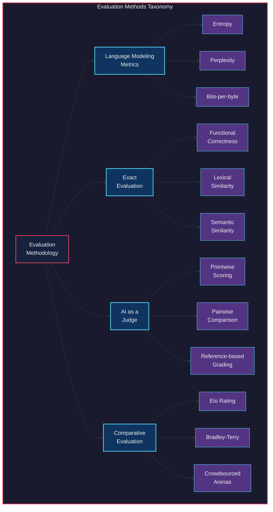
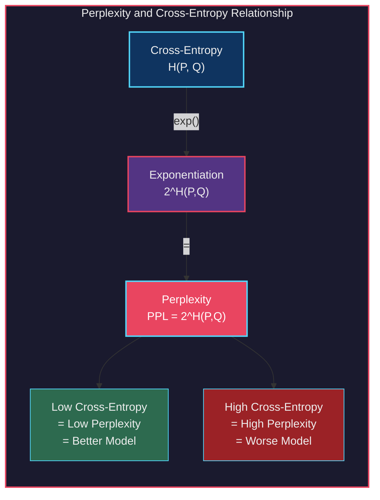
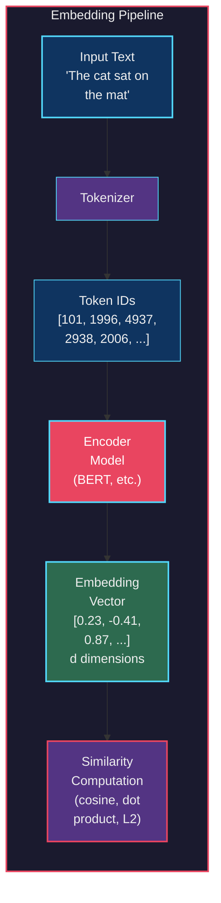
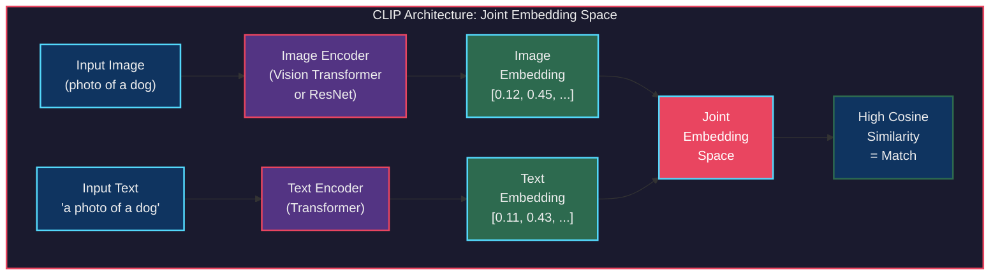
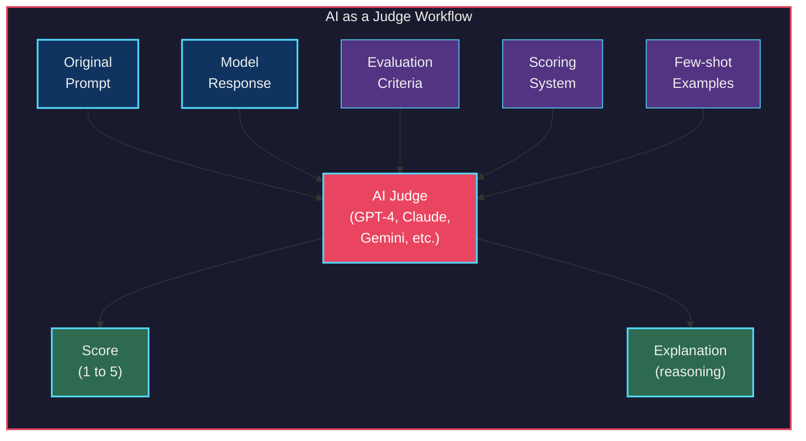
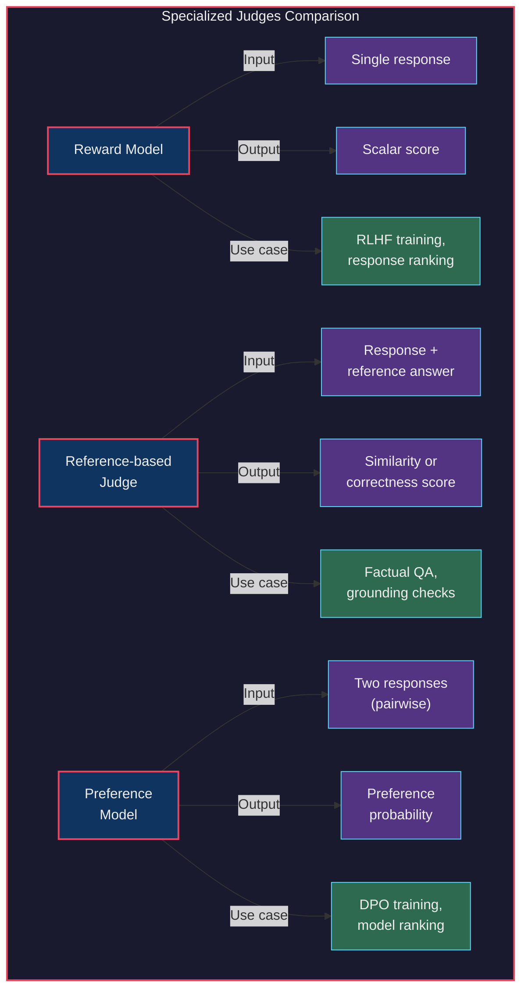
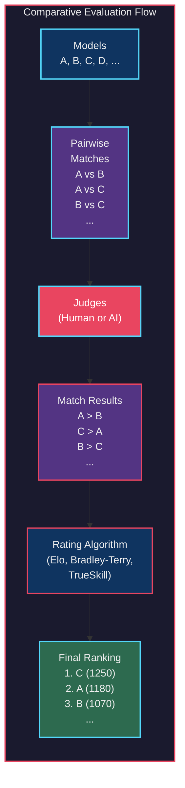

# Chapter 3. Evaluation Methodology

[Previous: Chapter 2 - Understanding Foundation Models](02-understanding-foundation-models.md) | [Next: Chapter 4 - Evaluate AI Systems](04-evaluate-ai-systems.md)

## Table of Contents

- [Overview of Evaluation Challenges](#overview-of-evaluation-challenges)
- [Language Modeling Metrics](#language-modeling-metrics)
- [Exact Evaluation](#exact-evaluation)
- [AI as a Judge](#ai-as-a-judge)
- [Ranking Models with Comparative Evaluation](#ranking-models-with-comparative-evaluation)
- [Summary](#summary)

---

## Overview of Evaluation Challenges

Foundation models present evaluation challenges that are fundamentally different from those of traditional machine learning. A classification model that predicts spam or not spam can be evaluated with precision, recall and F1. A regression model can be evaluated with mean squared error. These metrics are well understood, deterministic and unambiguous. Foundation models, by contrast, generate open-ended responses where the notion of "correct" becomes slippery and context dependent.

> [!IMPORTANT]
> Investment in evaluation consistently lags behind investment in model development. Teams spend months fine-tuning models and days evaluating them. This asymmetry is one of the most costly mistakes in applied AI engineering.

Consider a simple prompt such as "Explain quantum computing." There is no single correct answer. A response could be accurate but too technical. It could be accessible but imprecise. It could be well structured but incomplete. Evaluating such a response requires judgment about relevance, depth, coherence, factual accuracy and tone. No single metric captures all of these dimensions.

The challenge is compounded by the fact that foundation models are applied across a dizzying range of tasks. A single model might be used for code generation, creative writing, summarization, question answering and dialogue. Each task demands its own evaluation criteria, its own notion of quality and its own methodology.

This chapter surveys the major approaches to evaluation, from information theoretic metrics like perplexity, through exact matching and similarity metrics, to the increasingly popular paradigm of using AI models themselves as judges. It concludes with comparative evaluation methods that rank models against each other rather than scoring them in isolation.

 
<em>Figure 3-1. The trend of LLM evaluation papers over time</em>

The taxonomy above illustrates four broad families of evaluation methods. Each has strengths, weaknesses and appropriate use cases. Effective evaluation strategies typically combine multiple approaches.

 
<em>Figure 3-7. Evaluation framework overview</em>

## Language Modeling Metrics

Language modeling metrics are rooted in information theory. They measure how well a model predicts the next token in a sequence. While they do not directly measure the usefulness or quality of generated text, they provide a foundational lens for understanding model capability and are widely used in pre-training evaluation and data quality assessment.

### Entropy and Cross-Entropy

**Entropy** measures the average amount of information (or surprise) in a random variable. For a probability distribution *P* over tokens, entropy is defined as the expected value of the negative log probability.

In the context of language modeling, entropy captures how predictable a language is. A language where every sentence follows rigid patterns has low entropy. Natural language, with its rich expressiveness and ambiguity, has high entropy.

**Cross-entropy** measures the average number of bits needed to encode data from distribution *P* using a model distribution *Q*. When the model perfectly matches the true distribution, cross-entropy equals entropy. In practice, cross-entropy is always greater than or equal to entropy. The gap between them reflects how much the model's predictions diverge from reality.

> [!NOTE]
> Cross-entropy is the standard loss function for training language models. Minimizing cross-entropy during training is equivalent to maximizing the likelihood of the training data under the model. This is why cross-entropy serves double duty as both a training objective and an evaluation metric.

### Perplexity

Perplexity is the exponential of the cross-entropy. It can be interpreted as the effective number of choices the model is uncertain about at each step. A perplexity of 10 means the model is, on average, as confused as if it had to choose uniformly among 10 options at each position.

**Key properties of perplexity.**

- **Lower is better.** A perplexity of 1 means the model perfectly predicts every token.
- **Depends on tokenization.** Perplexity values are only comparable across models that use the same tokenizer. A model that tokenizes "running" as a single token faces a different prediction task than one that splits it into "run" and "##ning."
- **Depends on context window.** Models evaluated with longer context windows tend to show lower perplexity because they have more information to condition on.
- **Does not measure generation quality.** A model can have low perplexity while still generating incoherent, biased or unhelpful text. Perplexity measures prediction, not production.

### Bits-per-Byte and Bits-per-Character

Because perplexity depends on tokenization, researchers often use **bits-per-byte** (BPB) or **bits-per-character** (BPC) as tokenization independent alternatives. These metrics normalize the cross-entropy by the number of bytes or characters in the text rather than the number of tokens.

BPB is particularly useful for comparing models across different tokenizers and even different languages. A model with a BPB of 0.8 needs, on average, 0.8 bits to encode each byte of text. Lower values indicate better compression, which is a proxy for better language understanding.

> [!TIP]
> When comparing models that use different tokenizers, always prefer bits-per-byte over perplexity. Perplexity comparisons across tokenizers are misleading because the "vocabulary" over which the model distributes probability differs in size and composition.

### Practical Applications of Language Modeling Metrics

These metrics are most useful in three contexts.

1. **Pre-training evaluation.** Tracking perplexity during pre-training reveals whether the model is learning and when it plateaus.
2. **Data quality assessment.** High perplexity on a dataset may indicate noisy or out of distribution data. Low perplexity may indicate data leakage or contamination.
3. **Model comparison at the architecture level.** When comparing transformer variants or training recipes, perplexity provides a standardized yardstick, provided tokenization is held constant.

## Exact Evaluation

Exact evaluation methods produce deterministic, reproducible scores. They do not require human judgment or AI models to compute. They compare the model's output against a known reference or execute the output to verify correctness.

### Functional Correctness

For code generation tasks, the most reliable evaluation is to **run the code and check if it works**. This is the principle behind benchmarks like HumanEval and MBPP, which provide function signatures, docstrings and unit tests. The model generates a function body, and the test suite determines whether the implementation is correct.

The standard metric is **pass@k**, which measures the probability that at least one of *k* generated samples passes all unit tests. pass@1 is the most commonly reported variant, measuring whether a single generation is correct.

Functional correctness has a significant advantage over other evaluation methods. It is **unambiguous**. Code either passes the tests or it does not. There is no room for disagreement about scoring. However, it also has limitations. Test suites may not cover edge cases. A function can pass all tests while being inefficient, unreadable or fragile.

> [!WARNING]
> Executing model generated code poses security risks. Always sandbox code execution in isolated environments. Never run generated code with access to production systems, network resources or sensitive data.

### Similarity Measurements

When there is no executable artifact, evaluation often falls back to measuring the **similarity** between the model's output and a reference answer. There are two families of similarity metrics. Lexical similarity measures surface level overlap in words and n-grams. Semantic similarity measures meaning using learned representations.

#### Lexical Similarity Metrics

| Metric | What It Measures | How It Works | Best For | Limitations |
|--------|-----------------|--------------|----------|-------------|
| **Exact Match** | Perfect string identity | Binary comparison. 1 if strings are identical, 0 otherwise | Short factual answers, entity extraction | Too strict for open-ended generation. "New York" vs "new york" scores 0 |
| **BLEU** | Precision of n-gram overlap | Counts how many n-grams in the candidate appear in the reference. Applies a brevity penalty for short outputs | Machine translation | Ignores recall. Penalizes valid paraphrases. No semantic understanding |
| **ROUGE** | Recall of n-gram overlap | Counts how many n-grams in the reference appear in the candidate. ROUGE-L uses longest common subsequence | Summarization | Ignores precision (partially). Rewards verbose outputs that contain reference terms |
| **METEOR** | Balanced overlap with linguistic awareness | Combines precision and recall with stemming, synonymy and word order penalties | Machine translation | More complex to compute. Still fundamentally surface level |
| **CIDEr** | Consensus with multiple references | Uses TF-IDF weighted n-gram similarity across multiple reference captions | Image captioning | Requires multiple references. Designed for captioning, less useful elsewhere |

 
<em>Figure 3-5. An image-captioning task example where Fuyu generated a caption for Big Ben</em>

> [!NOTE]
> BLEU and ROUGE are the most widely used lexical metrics, but they have well documented shortcomings. Two sentences can have the same meaning with zero n-gram overlap. "The cat sat on the mat" and "A feline rested upon the rug" would score poorly on all lexical metrics despite conveying essentially the same information.

#### Semantic Similarity Using Embeddings

Semantic similarity addresses the fundamental limitation of lexical metrics by comparing **meaning** rather than surface form. The idea is simple. Convert both the candidate and reference into dense vector representations (embeddings), then compute the distance or similarity between them.

This requires an introduction to embeddings, one of the most important concepts in modern AI engineering.

### Introduction to Embeddings

An **embedding** is a dense vector representation of an input (text, image, audio or any other modality) in a continuous vector space. Embeddings are produced by neural networks trained so that semantically similar inputs are mapped to nearby points in the vector space.

**How embeddings work.** A neural network processes the input and produces a fixed size vector. This vector captures semantic properties of the input. Words, sentences or documents with similar meanings produce vectors that are close together (measured by cosine similarity or Euclidean distance). Dissimilar inputs produce vectors that are far apart.

**Why embeddings matter for evaluation.** Instead of comparing strings character by character, you compare their meanings. "The cat sat on the mat" and "A feline rested on the rug" would have high cosine similarity despite sharing few words.

#### Embedding Models

| Model | Embedding Dimensions | Modalities | Key Characteristics |
|-------|---------------------|------------|-------------------|
| **BERT** | 768 (base), 1024 (large) | Text | Bidirectional context. Good for sentence level semantics. Widely used as a foundation for specialized models |
| **Sentence Transformers** | 384 to 1024 | Text | Built on BERT/RoBERTa. Specifically trained for sentence similarity using contrastive learning |
| **OpenAI text-embedding-3-large** | 3072 (configurable) | Text | High quality commercial embeddings. Support for dimension reduction via Matryoshka training |
| **Cohere Embed v3** | 1024 | Text | Supports multiple languages. Separate embeddings for search queries vs documents |
| **CLIP (ViT-L/14)** | 768 | Text + Image | Joint embedding space for text and images. Enables cross-modal similarity |
| **Google Gemini Embeddings** | 768 | Text | Optimized for retrieval. Supports task specific prefixes |

#### Embedding Quality Evaluation

How do you evaluate whether embeddings are good? The most common approach is through **downstream task performance**. Good embeddings should make downstream tasks like retrieval, classification and clustering easier. The MTEB (Massive Text Embedding Benchmark) evaluates embeddings across dozens of tasks and datasets.

Key dimensions of embedding quality include the following.

- **Retrieval accuracy.** Can the embeddings find relevant documents for a query?
- **Clustering coherence.** Do semantically related items form tight clusters?
- **Classification linearity.** Can a simple linear classifier achieve strong performance on top of the embeddings?
- **Semantic textual similarity.** Do cosine similarities correlate with human judgments of similarity?

#### Joint and Multimodal Embedding Spaces

One of the most powerful ideas in modern representation learning is the **joint embedding space**, where inputs from different modalities (text, images, audio) are mapped into the same vector space. This enables cross-modal retrieval. You can search for images using text queries, or find text descriptions that match an image.

**CLIP** (Contrastive Language Image Pre-training) is the most influential example of this approach. Developed by OpenAI, CLIP trains an image encoder and a text encoder jointly using a contrastive objective. Matching image text pairs are pulled together in the embedding space while non-matching pairs are pushed apart. The model is trained on hundreds of millions of image text pairs scraped from the internet.

 
<em>Figure 3-6. CLIP architecture trained using image text pairs</em>

CLIP enables several powerful capabilities.

- **Zero-shot image classification.** Classify images into categories never seen during training by comparing image embeddings to text embeddings of category descriptions.
- **Image search with natural language.** Retrieve images by encoding a text query and finding the nearest image embeddings.
- **Multimodal evaluation.** Score how well a generated image matches a text description by measuring embedding similarity.

> [!TIP]
> When using embeddings for evaluation, always normalize your vectors before computing cosine similarity. Most embedding models return unnormalized vectors, and skipping normalization can lead to misleading similarity scores.

## AI as a Judge

The limitations of exact evaluation metrics have driven the rapid adoption of a different paradigm. Using AI models themselves to evaluate AI outputs. This approach, known as **AI as a judge** (or LLM as a judge), treats a language model as a proxy for human evaluation.

> "58% of evaluations on their platform were done by AI judges." This statistic from LangChain's 2023 report illustrates how quickly this approach has moved from research curiosity to industry standard practice.

### Why AI as a Judge

AI judges offer four compelling advantages over human evaluation.

1. **Speed.** An AI judge can evaluate thousands of responses in minutes. Human evaluation at the same scale would take days or weeks.
2. **Cost.** At pennies per evaluation, AI judges are orders of magnitude cheaper than hiring human annotators.
3. **Flexibility.** You can change evaluation criteria instantly by modifying the prompt. No retraining human annotators required.
4. **Correlation with human judgment.** Research consistently shows strong agreement between AI judges and human evaluators.

> "The agreement between GPT-4 and humans reached 85%, which is even higher than the agreement among humans (81%)."

This finding is remarkable. It suggests that in many evaluation scenarios, AI judges are not merely acceptable substitutes for humans. They may actually be more consistent.

 
<em>Figure 3-8. An example of an AI judge evaluating answer quality</em>

### How to Use AI as a Judge

There are three primary modes of AI judge evaluation.

#### Mode 1. Evaluate Quality by Itself (Pointwise)

The simplest approach. Give the AI judge a prompt and a response, and ask it to score the response on one or more criteria. No reference answer is needed. This is useful when there is no ground truth or when the task is sufficiently open-ended that multiple valid answers exist.

**Example.** "Rate the following response for helpfulness on a scale of 1 to 5, where 1 is completely unhelpful and 5 is exceptionally helpful."

#### Mode 2. Compare to a Reference Response

Provide the AI judge with the prompt, the model's response and a reference (gold standard) response. The judge evaluates how well the model's response matches the reference in terms of accuracy, completeness and other criteria.

This mode is particularly useful for factual question answering, where there is a known correct answer but multiple valid phrasings.

#### Mode 3. Compare Two Responses (Pairwise)

Present two responses to the judge and ask which one is better. This is often more reliable than absolute scoring because humans (and AI judges) find it easier to make relative judgments than absolute ones.

> "It is easier to compare two outputs than to give each output a concrete score."

Pairwise comparison also reduces the impact of scale calibration issues. Different judges might use a 1 to 5 scale very differently, but most judges can reliably say which of two responses is superior.

#### Common Evaluation Criteria

Different evaluation frameworks define different criteria, and the same criterion name can mean different things across tools. This inconsistency is a significant practical challenge.

| Criterion | Azure AI Studio | MLflow | LangChain | Ragas |
|-----------|----------------|--------|-----------|-------|
| **Relevance** | Does the response address the question | How relevant is the response to the input | Whether the output is relevant to the input | How relevant the answer is to the question |
| **Faithfulness** | Not included by default | Not included by default | Not included by default | Whether the answer is grounded in the given context |
| **Coherence** | Is the response well organized and logical | Quality of language and organization | Not included by default | Not included by default |
| **Groundedness** | Is the response grounded in the provided context | Measures grounding in context | Not included by default | Not included by default |
| **Harmfulness** | Does the response contain harmful content | Not included by default | Whether the output is harmful | Not included by default |
| **Answer Correctness** | Not included by default | Not included by default | Correctness of the response | Factual correctness of the answer compared to ground truth |

> [!WARNING]
> The table above illustrates a critical problem. "Relevance" means subtly different things in every tool. Before adopting any evaluation framework, read the actual prompts used to define each criterion. Surface level names are misleading.

### How to Prompt an AI Judge

A well structured AI judge prompt includes four components.

1. **Task description.** Clearly state what the judge should do. "You are an expert evaluator. Your task is to assess the quality of the following response."
2. **Criteria definition.** Define exactly what each criterion means. Do not rely on the judge's interpretation of vague terms like "quality" or "relevance." Be specific. "Relevance means the response directly addresses the user's question without introducing tangential information."
3. **Scoring system.** Provide a rubric with explicit descriptions for each score level. "1 means the response is completely irrelevant. 3 means the response partially addresses the question but misses key aspects. 5 means the response fully and precisely addresses the question."
4. **Examples (optional but recommended).** Include one or two examples of responses at different quality levels with their scores and explanations. This calibrates the judge and reduces scoring variance.

> [!TIP]
> Always ask the AI judge to provide its reasoning before the score, not after. This "chain of thought" approach improves scoring quality by forcing the judge to articulate its assessment before committing to a number. If the score comes first, the explanation tends to be a post-hoc rationalization.

### Limitations of AI as a Judge

Despite its popularity, AI as a judge has important limitations that practitioners must understand and mitigate.

#### Inconsistency

The same AI judge can give different scores to the same response on different runs. This is partly due to temperature settings and partly due to the inherent stochasticity of autoregressive generation. Setting temperature to 0 reduces but does not eliminate this issue.

#### Criteria Ambiguity

As shown in the table above, the same criterion name means different things in different tools and contexts. A score of 4 on "relevance" from one tool is not comparable to a score of 4 on "relevance" from another.

> "Do not trust any AI judge if you can't see the model and the prompt used for the judge."

This is critical advice. The evaluation prompt is as important as the model being evaluated. Without transparency into the judge's instructions, evaluation results are uninterpretable.

#### Increased Costs and Latency

Every evaluation requires an additional API call, which costs money and takes time. For large scale evaluations, the cost of the judge can become significant. Evaluating 10,000 responses with GPT-4 might cost hundreds of dollars and take hours.

#### Biases

AI judges exhibit systematic biases that can distort evaluation results.

| Bias | Description | Impact | Mitigation |
|------|-------------|--------|------------|
| **Self-bias** | Models rate their own outputs higher than outputs from other models | Inflates scores for the judge's own model family. GPT-4 rates GPT-4 outputs higher | Use a different model as judge than the model being evaluated |
| **Position bias** | In pairwise comparisons, judges tend to prefer the response presented first | First response gets an unfair advantage, typically 5 to 10 percentage points | Randomize presentation order. Run each comparison twice with swapped positions |
| **Verbosity bias** | Judges prefer longer, more detailed responses regardless of accuracy | Rewards padding and irrelevant detail over conciseness | Explicitly instruct the judge to penalize unnecessary verbosity. Include examples of concise high quality responses |
| **Authority bias** | Judges are influenced by confident, authoritative tone even when content is wrong | Confident but incorrect responses may score higher than tentative but correct ones | Include criteria that specifically assess factual accuracy independent of tone |
| **Format bias** | Judges prefer well formatted responses (bullet points, headers) over plain text | Rewards formatting over content quality | Evaluate content and formatting as separate criteria |

> [!IMPORTANT]
> Position bias is one of the most consistently observed biases in AI judging. The standard mitigation is to run every pairwise comparison twice, swapping the order of responses, and only counting a result as decisive if the same response wins in both orderings.

### What Models Can Act as Judges

Three paradigms exist for selecting a judge model.

**Stronger model judges weaker model.** This is the most common approach. Use GPT-4 or Claude to judge outputs from smaller models. The assumption is that a stronger model can reliably assess a weaker model's outputs. This works well when the quality gap is large but breaks down when models are close in capability.

**Self-evaluation.** A model evaluates its own outputs. This is cheaper (no need for a more expensive model) but suffers from self-bias. Models tend to rate their own outputs favorably. Self-evaluation can still be useful for detecting obvious failures, such as refusals, hallucinations or off-topic responses.

**Weaker model judges stronger model.** Perhaps surprisingly, this can work in constrained evaluation scenarios. A smaller model can reliably check for specific criteria like format compliance, length requirements or the presence of required elements, even when evaluating outputs from a stronger model.

### Specialized Judges

Beyond general purpose language models, several specialized architectures have been developed for evaluation tasks.

**Reward models** are trained on human preference data to assign a scalar score to a single response. They are central to RLHF (Reinforcement Learning from Human Feedback) training pipelines. A reward model takes a prompt and a response as input and outputs a single number indicating quality. These models are fast and cheap to run but limited to the quality dimensions present in their training data.

**Reference-based judges** compare a model's response to a known correct answer. They go beyond simple string matching by using learned representations to assess semantic equivalence. These are particularly useful for factual question answering and grounded generation tasks.

**Preference models** are trained to predict which of two responses a human would prefer. Unlike reward models that score single responses, preference models are inherently comparative. They are used in DPO (Direct Preference Optimization) training and in evaluation scenarios where relative quality matters more than absolute scores.

 
<em>Figure 3-9. How PandaLM works for model comparison</em>

## Ranking Models with Comparative Evaluation

### Pointwise vs Comparative Evaluation

The evaluation methods discussed so far are primarily **pointwise**. They assign a score to each output independently. Comparative evaluation takes a fundamentally different approach. Instead of scoring outputs in isolation, it **compares** them against each other.

| Aspect | Pointwise Evaluation | Comparative Evaluation |
|--------|---------------------|----------------------|
| **Unit of measurement** | Absolute score per response | Relative ranking among responses |
| **Ease of judgment** | Harder. Requires calibrated scoring | Easier. Just pick the better response |
| **Consistency** | Lower. Scale calibration varies across judges | Higher. Relative judgments are more stable |
| **Scalability** | O(n). Score each response once | O(n^2). Every pair must be compared |
| **Sensitivity to ties** | Can express ties naturally via equal scores | Ties are harder to handle in ranking algorithms |
| **Interpretability** | A score of 4.2 has intuitive meaning | A rank of 3rd requires context about the field |

### How Comparative Evaluation Works

Comparative evaluation proceeds in three steps.

1. **Generate matches.** Select pairs of models (or responses) to compare. In a tournament with *n* models, the complete set of pairwise comparisons is *n(n-1)/2*.
2. **Collect judgments.** For each pair, a judge (human or AI) determines which response is better. The judge may also indicate a tie.
3. **Compute rankings.** Feed the match results into a rating algorithm that produces a global ranking.

### Rating Algorithms

Several algorithms convert pairwise comparison results into global rankings.

**Elo Rating System.** Originally developed for chess, Elo assigns each model a numeric rating. After each match, the winner gains points and the loser loses points. The number of points exchanged depends on the expected outcome. An upset (a lower rated model beating a higher rated one) produces a larger rating change. Elo is simple and interpretable, but it is sensitive to the order of matches and assumes a single dimension of skill.

**Bradley-Terry Model.** A statistical model that estimates the probability that model A beats model B as a function of their respective strengths. Unlike Elo, Bradley-Terry considers all matches simultaneously rather than updating sequentially. This makes it more robust but more computationally expensive. The model assumes that the probability of A beating B is proportional to the ratio of their strengths.

**TrueSkill.** Developed by Microsoft for Xbox matchmaking, TrueSkill extends Elo by tracking both a model's estimated skill and the **uncertainty** in that estimate. New models with few matches have high uncertainty, meaning their ratings change rapidly. Established models with many matches have low uncertainty and more stable ratings. TrueSkill also handles multiplayer scenarios, though this is less relevant for LLM evaluation.

### Challenges of Comparative Evaluation

**Scalability bottlenecks.** With *n* models, the number of pairwise comparisons grows quadratically. Evaluating 100 models requires 4,950 comparisons. If each comparison requires a human judge, this becomes prohibitively expensive. Adaptive sampling strategies (choosing which pairs to compare based on current ratings) can reduce the number of comparisons needed, but at the cost of increased algorithmic complexity.

**Lack of standardization.** Different arenas use different prompts, different judge instructions and different rating algorithms. Results from one arena are not directly comparable to results from another.

**Quality control.** In crowdsourced settings, some judges are careless, adversarial or simply not qualified to evaluate responses on technical topics. Detecting and filtering low quality judgments is an ongoing challenge.

### Crowdsourced Evaluation. LMSYS Chatbot Arena

The most prominent example of large scale comparative evaluation is **LMSYS Chatbot Arena**, created by researchers at UC Berkeley. The arena works as follows.

1. A user visits the website and types a prompt.
2. Two anonymous models generate responses.
3. The user reads both responses and votes for the better one (or declares a tie).
4. After voting, the models' identities are revealed.
5. All votes are aggregated using the Bradley-Terry model to produce a global leaderboard.

 Chatbot Arena has collected millions of votes and has become one of the most trusted leaderboards in the AI community. Its strength lies in the diversity of prompts (real users asking real questions) and the scale of its data collection.

 
<em>Figure 3-10. ChatGPT asks users to compare two outputs side by side</em>

> [!NOTE]
> Chatbot Arena's success demonstrates the power of crowdsourced evaluation, but it also has limitations. The user population skews toward AI enthusiasts and researchers, not representative end users. Prompts tend to be short, open-ended questions rather than complex, domain specific tasks. The arena measures general conversational quality, not performance on specific applications.

### From Comparative Performance to Absolute Performance

A common question is whether comparative rankings can tell us anything about absolute performance. If Model A beats Model B 60% of the time, does that mean Model A is "good"? Not necessarily. Both models could be terrible, with A being slightly less terrible.

Comparative evaluation tells you about **relative** quality. For **absolute** quality assessment, you still need pointwise evaluation, human review or task specific benchmarks. The two approaches are complementary. Comparative evaluation identifies which model is best. Pointwise evaluation tells you whether the best is good enough.

### The Future of Comparative Evaluation

> "Unlike benchmarks that become useless when model performance achieves perfect scores, comparative evaluations will never get saturated as long as newer, stronger models are introduced."

This is a profound observation. Static benchmarks have a natural expiration date. Once all models score 95% or above, the benchmark loses its discriminative power. Comparative evaluation, by contrast, is inherently adaptive. There is always a meaningful comparison to be made between the current best model and the next contender.

The future likely involves.

- **Automated arena systems** where AI judges replace human voters for most comparisons, with humans providing calibration and oversight.
- **Domain specific arenas** for medicine, law, coding, education and other verticals where general purpose arenas lack depth.
- **Continuous evaluation** integrated into CI/CD pipelines, where every model update is automatically compared against the current production model.
- **Multi-dimensional rankings** that separate overall quality from specific dimensions like factual accuracy, reasoning, creativity and safety.

## Summary

Evaluation is the foundation on which all AI engineering decisions rest. Without reliable evaluation, you cannot know whether a model improvement is real, whether a prompt change helps or whether a deployment is safe.

This chapter covered four families of evaluation methods.

**Language modeling metrics** like perplexity and bits-per-byte provide information theoretic measures of model quality. They are most useful during pre-training and for comparing model architectures, but they do not directly measure the quality of generated text.

**Exact evaluation** methods, including functional correctness (pass@k), lexical similarity (BLEU, ROUGE) and semantic similarity (embedding based), provide deterministic, reproducible scores. They work well when there is a clear reference answer but struggle with open-ended generation.

**AI as a judge** uses language models to evaluate other language models. It is fast, cheap, flexible and surprisingly well correlated with human judgment. However, it introduces its own biases (self-bias, position bias, verbosity bias) and requires careful prompt engineering to be reliable.

**Comparative evaluation** ranks models by pitting them against each other in pairwise comparisons. It is easier and more consistent than pointwise scoring, and it scales naturally as new models appear. Crowdsourced arenas like Chatbot Arena have demonstrated the power of this approach at scale.

> [!IMPORTANT]
> No single evaluation method is sufficient. The most robust evaluation strategies combine multiple approaches. Use perplexity for pre-training diagnostics. Use exact metrics for tasks with clear reference answers. Use AI judges for open-ended quality assessment. Use comparative evaluation for model selection. And always validate your evaluation pipeline against human judgment on a meaningful sample.

The next chapter builds on this foundation by examining how to evaluate complete AI systems, not just individual model outputs, but end to end pipelines including retrieval, routing and multi-step reasoning.

[Previous: Chapter 2 - Understanding Foundation Models](02-understanding-foundation-models.md) | [Next: Chapter 4 - Evaluate AI Systems](04-evaluate-ai-systems.md)
