# Chapter 6. RAG and Agents

[Previous: Chapter 5 - Prompt Engineering](05-prompt-engineering.md) | [Next: Chapter 7 - Finetuning](07-finetuning.md)

> "From the early days of foundation models, it was clear that the RAG pattern would be immensely valuable."
> Chip Huyen

Foundation models are powerful, but they are not omniscient. They have knowledge cutoffs, they hallucinate and they cannot act on the world without external tools. This chapter covers two of the most important architectural patterns in AI engineering. **Retrieval-Augmented Generation (RAG)** grounds model outputs in real, retrievable data. **Agents** give models the ability to plan, use tools and take actions in their environment. Together, they transform a static language model into a dynamic, context-aware, action-capable system.

## Table of Contents

- [RAG (Retrieval-Augmented Generation)](#rag-retrieval-augmented-generation)
  - [Why RAG](#why-rag)
  - [RAG Architecture Overview](#rag-architecture-overview)
  - [Retrieval Methods](#retrieval-methods)
  - [Vector Search](#vector-search)
  - [Chunking Strategies](#chunking-strategies)
  - [Reranking Retrieved Results](#reranking-retrieved-results)
  - [Query Optimization](#query-optimization)
- [Agents](#agents)
  - [What Is an Agent](#what-is-an-agent)
  - [Tools and Function Calling](#tools-and-function-calling)
  - [Planning](#planning)
  - [Reflection and Error Correction](#reflection-and-error-correction)
  - [Agent Failure Modes and Evaluation](#agent-failure-modes-and-evaluation)
- [Memory](#memory)
  - [Three Memory Mechanisms](#three-memory-mechanisms)
  - [Memory Management](#memory-management)
  - [Benefits of Memory](#benefits-of-memory)
- [Summary](#summary)
- [Practitioner Checklist](#practitioner-checklist)

## RAG (Retrieval-Augmented Generation)

### Why RAG

Foundation models are trained on massive corpora, but they have fundamental limitations that RAG directly addresses.

**Knowledge cutoff.** A model trained in January 2024 knows nothing about events in March 2024. RAG lets you inject up-to-date information at inference time without retraining the model.

**Hallucination reduction.** When a model generates from memory alone, it can confidently fabricate facts. When grounded in retrieved documents, the model has real source material to draw from. This does not eliminate hallucination entirely, but it dramatically reduces it.

**Domain specificity.** Your company's internal documentation, proprietary data and specialized knowledge bases are not in the model's training data. RAG makes this information accessible without finetuning.

**Verifiability.** RAG systems can return citations alongside their answers. Users can verify claims by inspecting the source documents, which builds trust and enables auditing.

**Cost efficiency.** Updating a retrieval index is orders of magnitude cheaper than retraining or finetuning a foundation model. You can keep your system current by simply updating the document store.

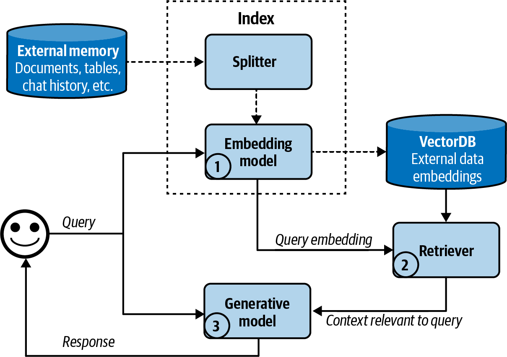
 
<em>Figure 6-1. The retrieve-then-generate pattern</em>

> [!IMPORTANT]
> RAG is not a silver bullet. If the retrieval step returns irrelevant or incorrect documents, the generator will produce low-quality or misleading outputs. The quality of a RAG system is bounded by the quality of its retrieval.

### RAG Architecture Overview

The core RAG pattern is straightforward. Given a user query, retrieve relevant documents from an external knowledge base, augment the prompt with those documents and generate a response conditioned on both the query and the retrieved context.

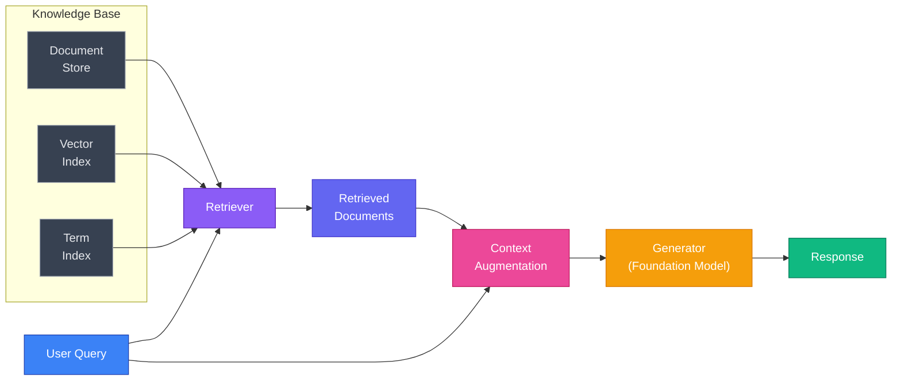

The pipeline has two main phases.

1. **Indexing phase (offline).** Documents are preprocessed, chunked, embedded and stored in a retrieval index. This happens before any user query arrives.
2. **Query phase (online).** A user query triggers retrieval, context augmentation and generation. This must be fast enough for interactive use.

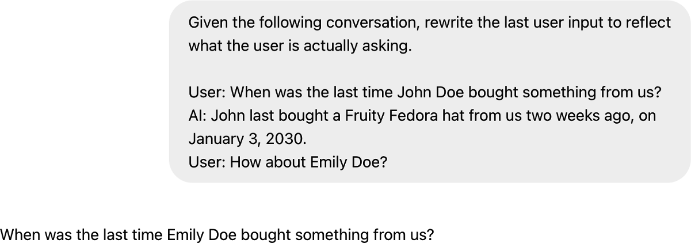
 
<em>Figure 6-2. A basic RAG architecture</em>

### Retrieval Methods

There are three broad families of retrieval methods, each with distinct strengths.

#### Term-based Retrieval

Term-based methods match queries to documents using lexical overlap. They count how often query terms appear in documents and score relevance accordingly.

**TF-IDF (Term Frequency, Inverse Document Frequency)** scores a term higher if it appears frequently in a document but rarely across the corpus. Common words like "the" get low scores. Rare, informative words get high scores.

**BM25** is the modern standard for term-based retrieval. It improves on TF-IDF by adding document length normalization and a saturation function that prevents very high term frequencies from dominating the score. BM25 is the default ranking function in Elasticsearch and Apache Lucene.

**Strengths of term-based retrieval.** Exact keyword matching is reliable. If a user searches for "CUDA error 803," a term-based system will find documents containing that exact string. Term-based methods are also fast, well understood and require no GPU infrastructure.

**Weaknesses of term-based retrieval.** These methods fail on semantic similarity. A query about "how to terminate a process" will not match a document about "how to kill a running program" unless the exact terms overlap.

#### Embedding-based Retrieval

Embedding-based retrieval encodes both queries and documents into dense vector representations in a shared semantic space. Similarity is computed using distance metrics like cosine similarity or dot product.

The key advantage is **semantic matching.** "Terminate a process" and "kill a running program" will have similar embeddings even though they share no terms. This captures meaning rather than surface form.

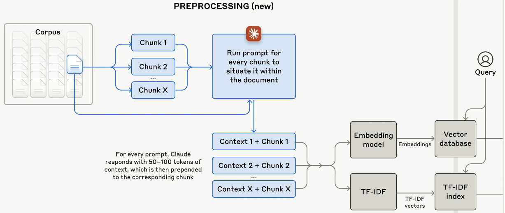
 
<em>Figure 6-3. How an embedding-based semantic retriever works</em>

Embedding models are typically trained using contrastive learning on large datasets of query-document pairs. Popular models include OpenAI's text-embedding-ada-002, Cohere's Embed and open-source models like E5, BGE and GTE.

**Weaknesses of embedding-based retrieval.** Embeddings can miss exact matches that term-based methods catch trivially. They also require GPU infrastructure for encoding and specialized vector databases for search.

#### Hybrid Retrieval

Hybrid retrieval combines term-based and embedding-based methods to get the best of both worlds. A common approach is to run both retrievers in parallel, then fuse their results using **Reciprocal Rank Fusion (RRF)** or a learned score combination.

| Dimension | Term-based (BM25) | Embedding-based | Hybrid |
|---|---|---|---|
| **Matching type** | Lexical (exact terms) | Semantic (meaning) | Both |
| **Handles synonyms** | No | Yes | Yes |
| **Handles exact strings** | Yes | Poorly | Yes |
| **Infrastructure** | Standard search index | Vector database + GPU | Both |
| **Latency** | Very low | Low to moderate | Moderate |
| **Cold start** | Works immediately | Needs embedding model | Needs both |
| **Best for** | Keyword heavy queries, codes, IDs | Natural language queries | Production systems needing broad coverage |

> [!TIP]
> In production, hybrid retrieval is almost always the right default. It handles the widest range of query types and degrades gracefully. Start with BM25 plus a good embedding model, fuse with RRF and iterate from there.

### Vector Search

When using embedding-based retrieval, you need an efficient way to find the nearest neighbors of a query vector among potentially millions of document vectors. Exact nearest neighbor search is too slow at scale. **Approximate Nearest Neighbor (ANN)** algorithms trade a small amount of accuracy for dramatic speedups.

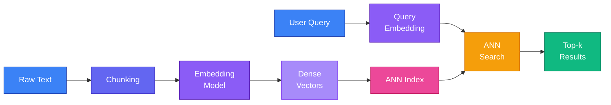

#### ANN Algorithms

**IVF (Inverted File Index).** The vector space is partitioned into clusters using k-means. At query time, only the nearest clusters are searched. This reduces the search space dramatically. The tradeoff is controlled by the `nprobe` parameter, which determines how many clusters to search.

**HNSW (Hierarchical Navigable Small World).** Builds a multi-layer graph where each node is connected to its approximate nearest neighbors. Search starts at the top layer (sparse, long-range connections) and progressively moves to lower layers (dense, short-range connections). HNSW offers excellent recall and speed but requires more memory than IVF.

**Product Quantization (PQ).** Compresses vectors by splitting them into subvectors and quantizing each independently. This reduces memory usage significantly at the cost of some accuracy. PQ is often combined with IVF (IVF-PQ) for large-scale deployments.

**ScaNN (Scalable Nearest Neighbors).** Google's library that uses anisotropic vector quantization. It optimizes for the inner product metric and achieves state-of-the-art recall/speed tradeoffs.

#### Vector Databases

Several purpose-built databases have emerged to manage vector search at scale.

**Pinecone** is a fully managed vector database. It handles indexing, replication and scaling automatically. Good for teams that want minimal operational overhead.

**Weaviate** is open-source and supports hybrid search (vector plus keyword) natively. It also supports multimodal data.

**Milvus** is an open-source vector database designed for billion-scale vector search. It supports multiple index types including IVF, HNSW and DiskANN.

**Chroma** is lightweight and developer-friendly. It is popular for prototyping and smaller-scale applications.

**pgvector** adds vector search capabilities to PostgreSQL. If you already use Postgres, this avoids introducing a new database into your stack.

> [!NOTE]
> You do not always need a dedicated vector database. For smaller datasets (under a few hundred thousand documents), libraries like FAISS or Annoy running in-memory can be simpler and faster than a full database deployment.

### Chunking Strategies

Before documents can be embedded and indexed, they must be split into chunks. The chunking strategy significantly affects retrieval quality. Chunks that are too large dilute the relevant signal with noise. Chunks that are too small lose important context.

| Strategy | Description | Pros | Cons | Best For |
|---|---|---|---|---|
| **Fixed-size** | Split every N tokens/characters with optional overlap | Simple, predictable, easy to implement | Splits mid-sentence, ignores document structure | Uniform documents, quick prototyping |
| **Semantic** | Split at natural boundaries (paragraphs, sections, topics) | Preserves meaning, respects document structure | More complex, variable chunk sizes | Well-structured documents with clear sections |
| **Recursive** | Try splitting by paragraphs first, then sentences, then characters | Adapts to document structure, good defaults | Slightly more complex than fixed-size | General purpose, LangChain's default |

**Fixed-size chunking** is the simplest approach. You pick a chunk size (e.g., 512 tokens) and optionally overlap adjacent chunks by some number of tokens (e.g., 50 tokens). The overlap ensures that information at chunk boundaries is not lost.

**Semantic chunking** uses the document's natural structure. Split at paragraph breaks, section headers or topic shifts. Some implementations use embedding similarity between consecutive sentences to detect topic boundaries. When consecutive sentences have low similarity, that is a natural split point.

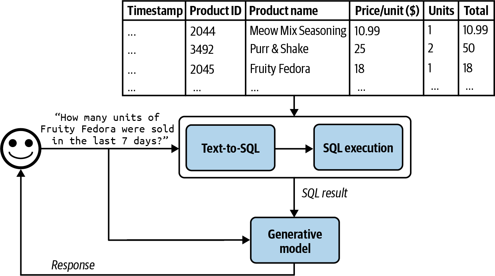
 
<em>Figure 6-5. Anthropic augments chunks with context for situational retrieval</em>

**Recursive chunking** tries a hierarchy of separators. First try to split by double newlines (paragraphs). If the resulting chunks are still too large, split by single newlines. Then by sentences. Then by words. This produces chunks that respect document structure while staying within size limits.

> [!TIP]
> Chunk size interacts with your embedding model. Most embedding models perform best on text lengths similar to their training data. For many models, 256 to 512 tokens is a sweet spot. Always benchmark different chunk sizes on your specific data and queries.

### Reranking Retrieved Results

Initial retrieval (whether term-based, embedding-based or hybrid) returns a set of candidate documents. **Reranking** applies a more expensive but more accurate model to rescore these candidates and reorder them.

The retriever prioritizes recall. It casts a wide net. The reranker prioritizes precision. It sorts the catch.

**Cross-encoder rerankers** take a (query, document) pair as input and output a relevance score. Unlike bi-encoders used in retrieval (which encode query and document independently), cross-encoders attend to both simultaneously. This captures fine-grained interactions but is too slow to apply to the entire corpus. That is why reranking is applied only to the top-k retrieved results.

Popular rerankers include Cohere Rerank, models from the cross-encoder family on Hugging Face and ColBERT-style late-interaction models that offer a middle ground between speed and accuracy.

**The typical pipeline.** Retrieve 50 to 100 candidates with a fast retriever, then rerank to select the top 5 to 10 for the generator.

### Query Optimization

The user's raw query is often not the best query for retrieval. Query optimization techniques transform the query to improve retrieval results.

#### Query Rewriting

Rewrite the user's query into a form that is more likely to match relevant documents. This can be done with a lightweight LLM call. For example, a conversational query like "What about the pricing?" can be rewritten to "What is the pricing for the enterprise plan?" by incorporating context from the conversation history.

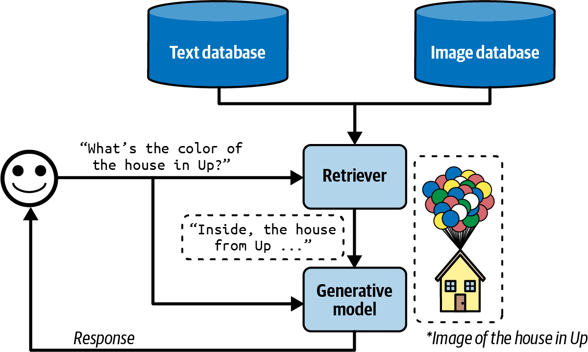
 
<em>Figure 6-4. Using generative models to rewrite queries</em>

#### Query Expansion

Generate multiple reformulations of the query and retrieve documents for each. Then merge and deduplicate the results. This increases recall by covering different phrasings of the same intent.

#### HyDE (Hypothetical Document Embeddings)

Instead of embedding the query directly, generate a **hypothetical answer** to the query using the LLM, then embed that hypothetical answer and use it for retrieval. The intuition is that a hypothetical answer is more likely to be semantically similar to the actual answer document than the short query is.

For example, the query "What causes aurora borealis?" might be expanded into a paragraph explaining the phenomenon. That paragraph's embedding will be closer to actual documents about auroras than the embedding of the short question.

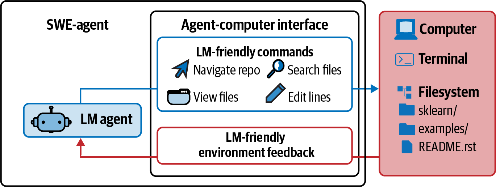
 
<em>Figure 6-6. Multimodal RAG augments query with text and images</em>

> [!WARNING]
> HyDE can backfire if the LLM generates a confidently wrong hypothetical answer. The retrieval will then find documents similar to the wrong answer, compounding the error. Use HyDE judiciously and monitor its impact on retrieval quality.

## Agents

### What Is an Agent

An agent is a system that uses a foundation model to decide what actions to take in an environment to accomplish a goal. Unlike a simple prompt-response system, an agent can observe its environment, plan a sequence of steps, use tools and adapt based on feedback.

> "Just as the right tools can help humans be vastly more productive, tools enable models to accomplish many more tasks."
> Chip Huyen

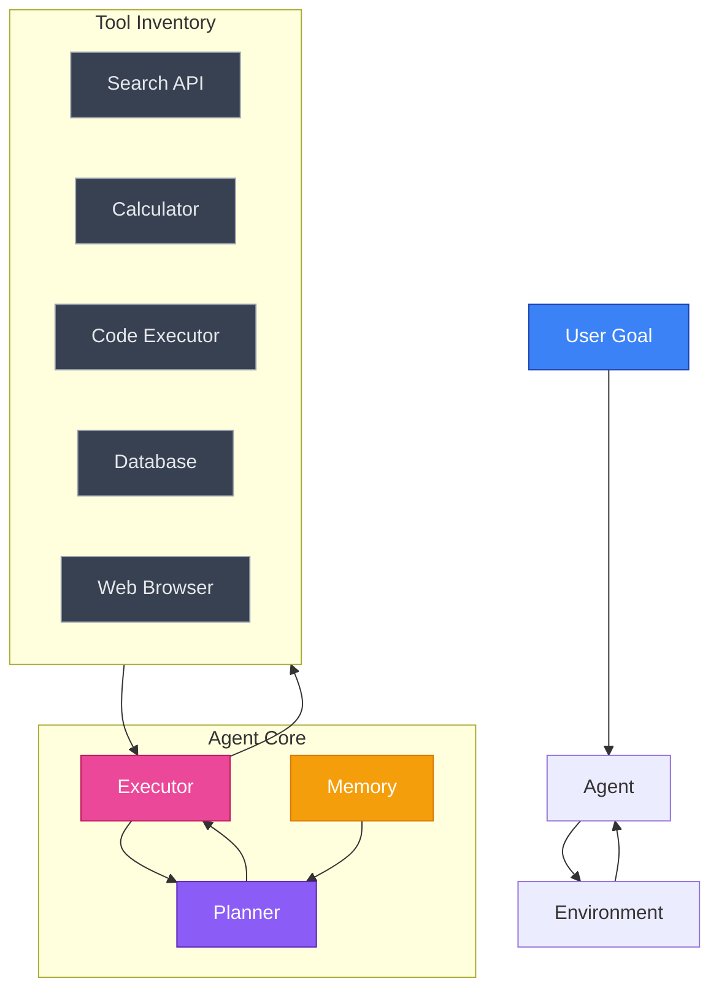

An agent has three core components.

**Environment.** The world the agent operates in. This could be a codebase, a web browser, a set of APIs, a database or a physical robot's surroundings. The environment defines what the agent can observe and what actions are available.

**Tools.** The actions the agent can take. Tools range from simple (a calculator, a search API) to complex (executing code, making HTTP requests, modifying a database). Tools are the agent's hands.

**Planning.** The agent's ability to decompose a goal into a sequence of actions, anticipate outcomes and adjust when things go wrong. Planning is the agent's brain.

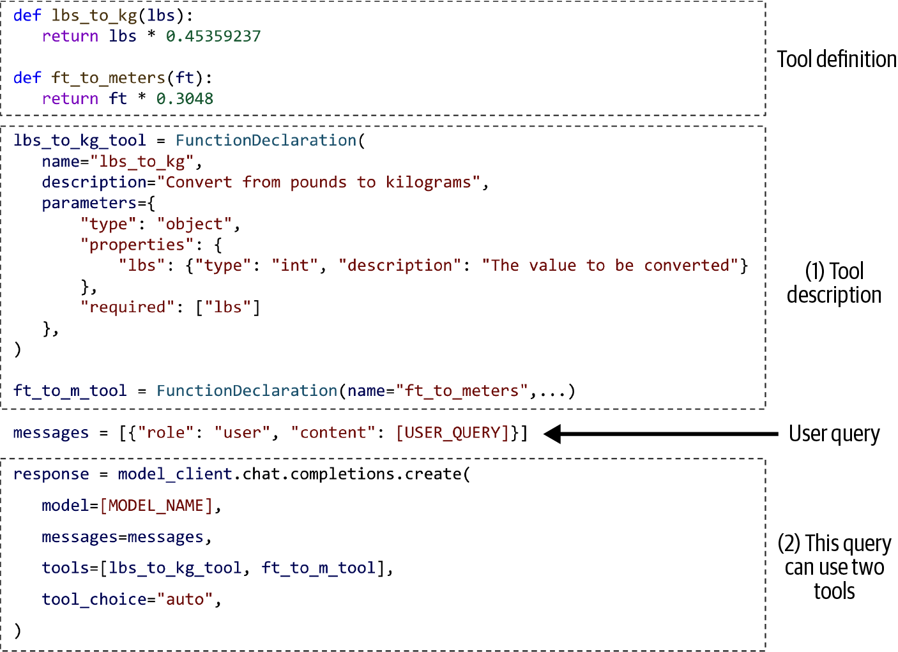
 
<em>Figure 6-8. SWE-agent coding agent visualization</em>

#### Read Actions vs Write Actions

A critical distinction in agent design is between **read actions** and **write actions**.

**Read actions** observe the environment without modifying it. Examples include searching a database, reading a file or fetching a web page. Read actions are low risk. If the agent makes a mistake, nothing is damaged.

**Write actions** modify the environment. Examples include sending an email, executing a database write, making a purchase or deleting a file. Write actions are high risk and often irreversible.

> "Just as you shouldn't give an intern the authority to delete your production database, you shouldn't allow an unreliable AI to initiate bank transfers."
> Chip Huyen

> [!IMPORTANT]
> Always implement human-in-the-loop approval for high-stakes write actions. The more consequential the action, the more oversight is required. Start with read-only agents and gradually expand to write actions as you build confidence in the system's reliability.

### Tools and Function Calling

#### Tool Inventories

An agent's capabilities are defined by its tool inventory. The tools available determine what the agent can and cannot do.

| Category | Examples | Risk Level | Notes |
|---|---|---|---|
| **Information retrieval** | Web search, document lookup, database query | Low | Read-only, safe to automate |
| **Computation** | Calculator, code execution, data analysis | Low to Medium | Sandboxed execution recommended |
| **Communication** | Send email, post message, create ticket | Medium to High | Human approval recommended |
| **Data modification** | Database write, file edit, API mutation | High | Human approval required |
| **Financial** | Payment processing, transfers, purchases | Very High | Strict human oversight required |

> [!TIP]
> Start with a small, well-tested tool inventory. It is tempting to give agents access to everything, but each additional tool increases the chance of misuse and makes planning harder. Add tools incrementally as needs arise.

#### Function Calling API Patterns

Modern LLM APIs (OpenAI, Anthropic, Google) support **function calling** natively. The model does not execute the function itself. Instead, it outputs a structured JSON object specifying which function to call and with what arguments. Your application code then executes the function and returns the result to the model.

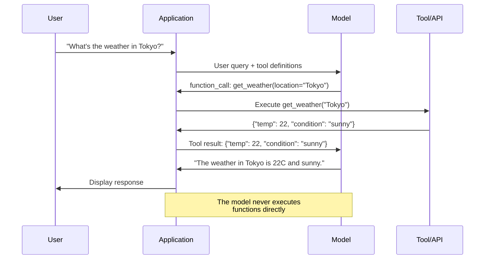

The function calling workflow has distinct phases.

1. **Definition.** You provide the model with a schema of available functions, including names, descriptions and parameter specifications.
2. **Selection.** The model decides whether to call a function and which one, based on the user's query and the function descriptions.
3. **Invocation.** The model outputs the function name and arguments as structured JSON.
4. **Execution.** Your application code executes the function.
5. **Integration.** The function result is fed back to the model, which incorporates it into its response.

> "Always ask the system to report what parameter values it uses for each function call. Inspect these values to make sure they are correct."
> Chip Huyen

#### Tool Selection and Evaluation

When an agent has many tools available, selecting the right tool for a given subtask becomes a non-trivial problem. Several strategies exist.

**Description-based selection.** The model reads tool descriptions and picks the most relevant one. This works well when descriptions are clear and tools have distinct purposes.

**Few-shot selection.** Provide examples of queries mapped to correct tools. This helps the model learn the mapping.

**Two-stage selection.** First narrow down to a category of tools, then select within that category. This scales better to large tool inventories.

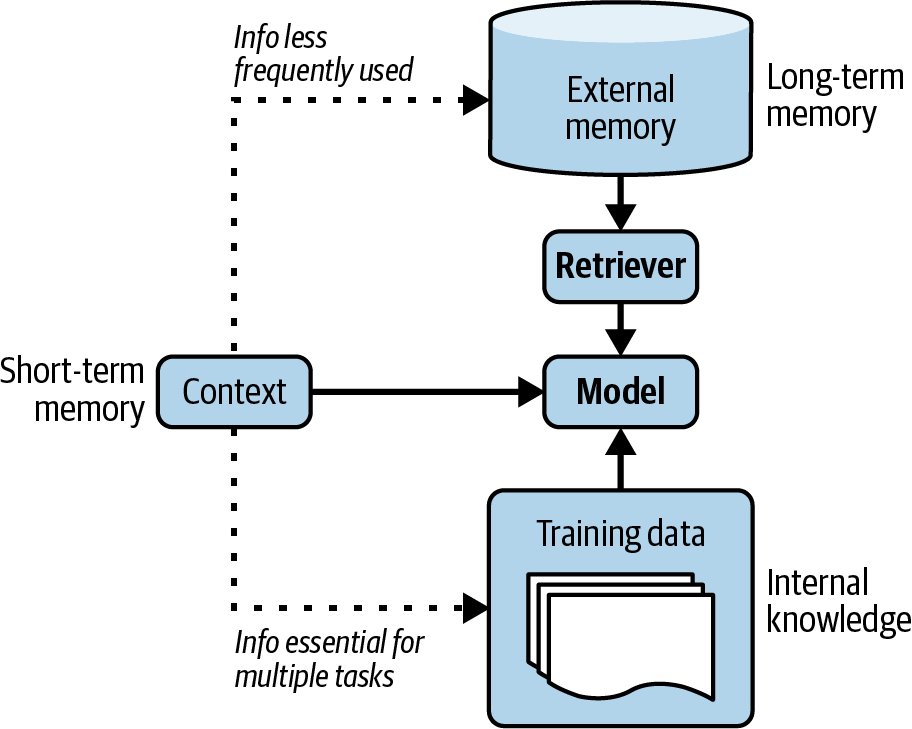
 
<em>Figure 6-14. Different models express different tool use patterns</em>

#### Tool Transition Patterns

Agents often need to use multiple tools in sequence, where the output of one tool becomes the input to another. Common patterns include chaining (output of tool A feeds into tool B), branching (choose between tools based on intermediate results) and aggregation (combine results from multiple tools).

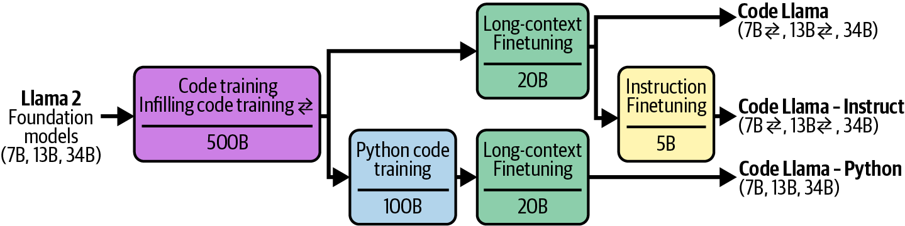
 
<em>Figure 6-15. Tool transition tree</em>

### Planning

Planning is the most intellectually ambitious component of an agent. It involves decomposing a high-level goal into a sequence of concrete actions, anticipating potential obstacles and adapting when execution diverges from expectations.

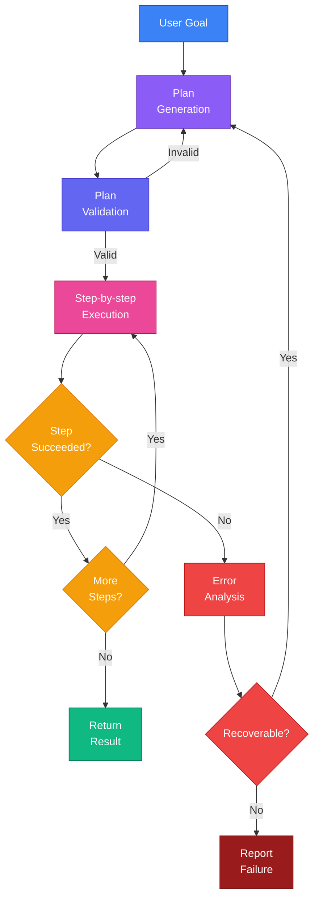

#### Foundation Models as Planners

There is active debate about whether LLMs can truly plan. Subbarao Kambhampati and others have argued that LLMs are better described as "approximate retrieval engines" for plans seen during training, rather than genuine planners that can reason about novel situations.

> "The plans that come out of LLMs may look reasonable to the lay user, and yet lead to execution time interactions and errors."
> Subbarao Kambhampati

The practical implication is that **LLM-generated plans should always be validated before execution.** The model may produce plans that look plausible but contain subtle errors, such as incorrect parameter values, missing dependencies or steps in the wrong order.

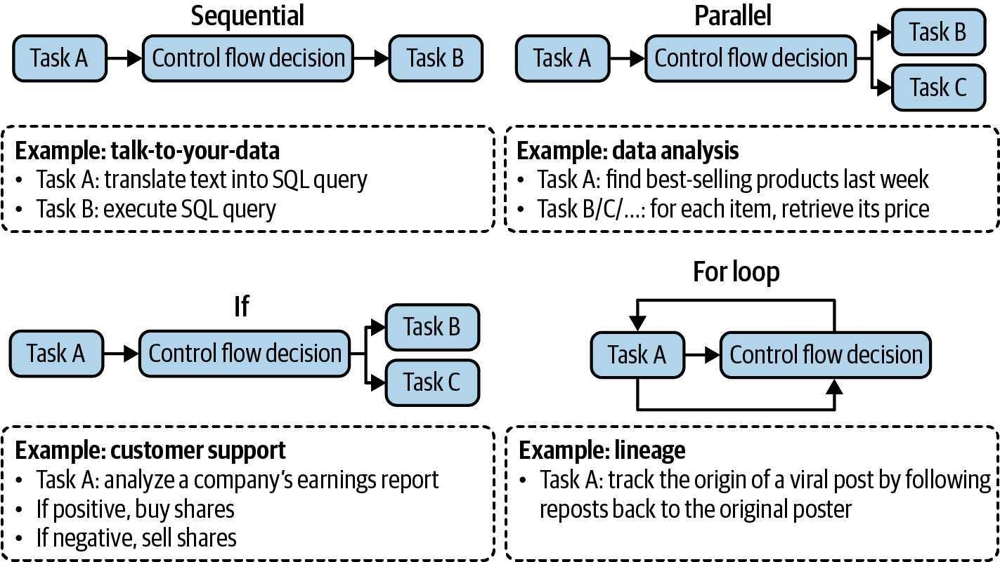
 
<em>Figure 6-9. Decoupling planning and execution</em>

#### FM vs RL Planners

**Foundation model planners** generate plans using natural language reasoning. They are flexible and can handle open-ended tasks, but they struggle with precise multi-step reasoning and may hallucinate invalid plans.

**Reinforcement learning planners** learn planning policies through trial and error in a defined environment. They excel in well-defined domains (game playing, robotics) but struggle to generalize to new environments.

In practice, the most robust approach is a **hybrid.** Use the foundation model for high-level plan generation and decomposition, but validate and constrain execution using deterministic logic.

#### Plan Generation with Prompts

You can elicit plans from foundation models using structured prompting techniques.

**Chain-of-thought prompting** asks the model to think step by step. This improves plan quality for moderately complex tasks.

**Plan-and-solve prompting** explicitly asks the model to first devise a plan, then execute it. For example. "First, create a step-by-step plan to answer the question. Then, execute each step."

**Tree-of-thought prompting** explores multiple plan branches and evaluates them before committing. This is more expensive but produces higher-quality plans for complex tasks.

#### Planning Granularity

Plans can be specified at different levels of granularity, from exact function calls to high-level natural language descriptions.

| Granularity | Example | Pros | Cons |
|---|---|---|---|
| **Exact function names** | `search_db(query="revenue Q3", table="financials")` | Precise, directly executable | Rigid, requires exact tool knowledge |
| **Natural language steps** | "Search the financial database for Q3 revenue" | Flexible, easier for model to generate | Requires interpretation layer to execute |
| **Mixed** | "Step 1: Use search_db to find Q3 revenue data" | Balances precision and flexibility | More complex parsing |

> [!NOTE]
> Finer granularity gives more control but requires the model to know exact function signatures. Coarser granularity is more flexible but introduces an interpretation layer that can introduce errors. The right level depends on the reliability of your model and the complexity of your tool inventory.

#### Complex Plans and Control Flows

Real-world tasks often require plans with complex control flows beyond simple sequential execution.

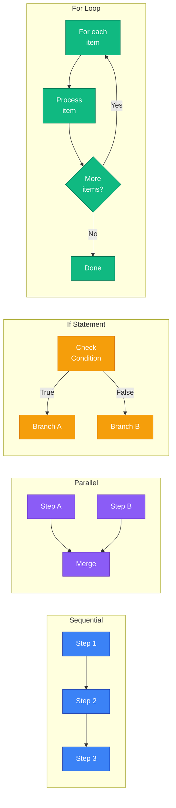

**Sequential.** Steps execute one after another. The output of each step is available to subsequent steps. This is the simplest and most common pattern.

**Parallel.** Independent steps execute simultaneously. Results are merged afterward. For example, searching multiple databases in parallel and combining the results.

**Conditional (If Statement).** The next step depends on the outcome of a previous step. For example, if a search returns no results, try a different query. If it returns results, proceed to summarization.

**Iterative (For Loop).** Repeat a step for each item in a collection. For example, for each document in the retrieved set, extract key facts and compile them.

These control flows can be nested. A parallel step might contain sequential sub-steps. A loop body might contain conditionals. The complexity of the plan should match the complexity of the task.

### Reflection and Error Correction

Agents inevitably make mistakes. The ability to detect errors, reflect on what went wrong and correct course is what separates robust agents from brittle ones.

#### ReAct Framework

The **ReAct (Reasoning + Acting)** framework interleaves reasoning and action in a loop. At each step, the agent generates a thought (reasoning about what to do next), takes an action (using a tool) and observes the result. This cycle repeats until the task is complete.

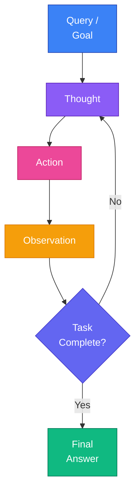

**Thought.** "I need to find the current stock price of AAPL. I should use the stock_price tool."

**Action.** `stock_price(symbol="AAPL")`

**Observation.** `{"price": 187.42, "currency": "USD", "timestamp": "2024-03-15T14:30:00Z"}`

**Thought.** "I now have the stock price. The user also asked for the P/E ratio. I should use the financial_metrics tool."

The key insight of ReAct is that making reasoning explicit (in the "Thought" step) improves action quality. The model is not just blindly calling tools. It is articulating why it is taking each action, which helps it stay on track.

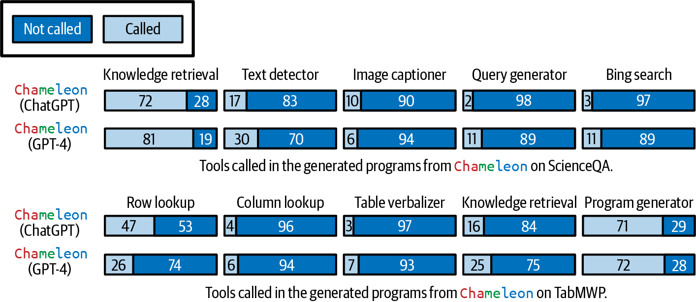
 
<em>Figure 6-12. Agent following the ReAct framework</em>

#### Reflexion Framework

**Reflexion** extends ReAct by adding an explicit self-evaluation step after task completion. The agent reviews its trajectory (the sequence of thoughts, actions and observations), identifies what went well and what went wrong, and stores these reflections in memory for future tasks.

This creates a learning loop. An agent that fails to solve a coding problem might reflect. "I forgot to handle the edge case where the input list is empty. Next time, I should check for empty inputs before processing." This reflection is stored and retrieved for similar future tasks.

#### Self-Critique Mechanisms

Several techniques enable agents to catch and correct their own errors.

**Output verification.** After generating a response, the agent checks whether the response actually answers the question. If not, it tries again.

**Consistency checks.** The agent generates multiple responses and checks for consistency. Inconsistent responses suggest uncertainty or errors.

**Constraint validation.** Before executing an action, the agent verifies that the planned action satisfies known constraints (e.g., parameter types, value ranges, permissions).

### Agent Failure Modes and Evaluation

Understanding how agents fail is essential for building reliable systems.

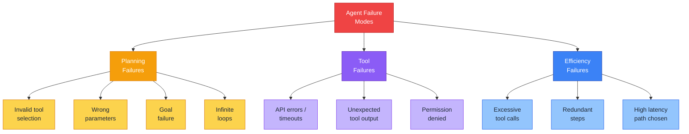

| Failure Mode | Description | Example | Mitigation |
|---|---|---|---|
| **Invalid tool selection** | Agent picks a tool that cannot accomplish the subtask | Using a calculator to search the web | Better tool descriptions, few-shot examples |
| **Wrong parameters** | Correct tool but incorrect arguments | `search(query="")` with empty query | Parameter validation, type checking |
| **Goal failure** | Agent completes all steps but does not achieve the goal | Answering a different question than asked | Output verification, goal-checking prompts |
| **Infinite loops** | Agent repeats the same action without progress | Retrying a failed API call indefinitely | Step limits, loop detection |
| **API errors** | External tool fails or times out | Third-party API returns 500 error | Retry logic, fallback tools, graceful degradation |
| **Excessive tool calls** | Agent uses far more steps than necessary | Making 20 API calls when 3 would suffice | Step budgets, efficiency metrics |

**Key metrics for agent evaluation.**

**Task completion rate.** What fraction of tasks does the agent successfully complete? This is the most important metric.

**Step efficiency.** How many steps does the agent take compared to an optimal trajectory? Fewer steps means faster execution and lower cost.

**Error recovery rate.** When the agent encounters an error, how often does it successfully recover?

**Cost per task.** Total API calls, tokens consumed and wall-clock time per completed task.

> [!WARNING]
> Always set a maximum step limit for agents. Without one, a confused agent can enter an infinite loop, consuming tokens and API calls indefinitely. A reasonable default is 10 to 20 steps for most tasks.

## Memory

> "An AI coach is practically useless if every time you want the coach's advice, you have to explain your whole life story."
> Chip Huyen

Memory enables agents to retain and recall information across interactions. Without memory, every conversation starts from scratch. The agent has no context about the user, no memory of past interactions and no way to build on previous work.

### Three Memory Mechanisms

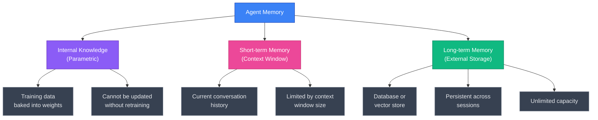

| Mechanism | Storage | Capacity | Persistence | Update Method | Analogy |
|---|---|---|---|---|---|
| **Internal knowledge** | Model weights | Vast but fixed | Permanent until retrained | Finetuning or retraining | Long-term human memory |
| **Short-term memory** | Context window | Limited (4K to 128K tokens) | Current session only | Append to conversation | Working memory |
| **Long-term memory** | External database | Unlimited | Across sessions | Read/write API | Notes and journals |

**Internal knowledge** is what the model learned during training. It is encoded in the model's parameters. It is vast but static. You cannot update it without retraining or finetuning the model.

**Short-term memory** is the conversation history within the current context window. Every message in the conversation is visible to the model. This is limited by the context window size. Once the conversation exceeds the window, earlier messages must be dropped or summarized.

**Long-term memory** is stored externally in a database, vector store or file system. The agent explicitly reads from and writes to this store. It persists across sessions and has no inherent capacity limit.

### Memory Management

As conversations grow, they eventually exceed the context window. Memory management strategies determine what information to keep, what to discard and how to condense.

#### FIFO Strategy

The simplest approach is **First In, First Out.** When the context window fills up, drop the oldest messages. This is easy to implement but crude. Important early context (like the user's name, preferences or the initial task specification) may be lost.

#### Summarization-based Memory

Instead of dropping old messages, **summarize** them. Periodically compress the conversation history into a shorter summary and replace the full history with the summary. This preserves key information while freeing up context window space.

A common implementation. After every N turns, call the LLM to summarize the conversation so far. Prepend the summary to the context and discard the raw messages.

The tradeoff is that summarization loses detail. Specific numbers, exact quotes and nuanced points may be lost in the summary.

#### Reflection-based Memory Management

A more sophisticated approach uses the model to **decide what is important** before storing or discarding information. The model reflects on the conversation and extracts key facts, preferences and action items. These are stored as structured memory entries that can be efficiently retrieved later.

For example, after a coaching session, the model might extract.
- "User's goal is to run a marathon by December."
- "User currently runs 3 times per week."
- "User has a knee injury history."

These structured entries are stored in long-term memory and retrieved in future sessions to provide continuity.

### Benefits of Memory

**Context window overflow management.** Without memory management, long conversations simply break. Memory strategies keep the system functional as conversations grow.

**Persistence across sessions.** Long-term memory allows the agent to remember users across sessions, building a relationship over time.

**Consistency.** Memory prevents the agent from contradicting earlier statements or asking questions it has already asked.

**Data integrity.** By explicitly managing what is stored and what is discarded, you can ensure sensitive information is handled appropriately.

> [!TIP]
> Implement memory as a separate service with clear read/write APIs. This makes it reusable across different agents and applications. Store memories with metadata (timestamp, source, confidence) to enable intelligent retrieval and expiration.

## Summary

This chapter covered two foundational architectural patterns for AI engineering.

**RAG** extends foundation models with external knowledge. The core pipeline is retrieve, augment, generate. Key decisions include choosing retrieval methods (term-based, embedding-based or hybrid), chunking strategies, vector search algorithms and whether to add reranking and query optimization.

**Agents** extend foundation models with tools and planning capabilities. The core loop is observe, plan, act, reflect. Key decisions include tool inventory design, planning granularity, control flow complexity and failure handling. The distinction between read and write actions is critical for safety.

**Memory** enables agents to maintain state across interactions. The three layers of memory (internal knowledge, short-term context, long-term external storage) work together to give agents continuity and personalization.

These patterns are composable. A RAG system can serve as a tool within an agent. An agent can use memory to improve its RAG queries over time. The most capable AI systems combine all three.

## Practitioner Checklist

- [ ] Start RAG with hybrid retrieval (BM25 plus embeddings) as the default
- [ ] Benchmark multiple chunking strategies on your specific data
- [ ] Add a reranker if retrieval precision is insufficient
- [ ] Implement query optimization (rewriting, expansion) before adding model complexity
- [ ] Begin with read-only agents before enabling write actions
- [ ] Implement human-in-the-loop approval for high-stakes actions
- [ ] Set maximum step limits for all agents
- [ ] Log every tool call with parameters for debugging and evaluation
- [ ] Validate function call parameters before execution
- [ ] Implement memory management before context windows become a bottleneck
- [ ] Store memories with metadata for intelligent retrieval and expiration
- [ ] Measure task completion rate, step efficiency and cost per task
- [ ] Monitor for infinite loops and excessive tool calls in production

[Previous: Chapter 5 - Prompt Engineering](05-prompt-engineering.md) | [Next: Chapter 7 - Finetuning](07-finetuning.md)
