# Chapter 7. Finetuning

[Previous: Chapter 6 - RAG and Agents](06-rag-and-agents.md) | [Next: Chapter 8 - Dataset Engineering](08-dataset-engineering.md)

> "The process of finetuning itself isn't hard. Many finetuning frameworks handle the training process for you."
> Chip Huyen

Finetuning is the practice of taking a pretrained foundation model and adapting it to a specific task or domain by continuing training on a curated dataset. It is one of the most powerful techniques in the AI engineer's toolkit, but also one of the most misunderstood. This chapter explores when finetuning makes sense, how different finetuning methods work and the practical tactics for executing a successful finetuning project. From full finetuning to parameter efficient methods like LoRA and QLoRA, from model merging to multi-task training, this chapter gives you a thorough understanding of the landscape.

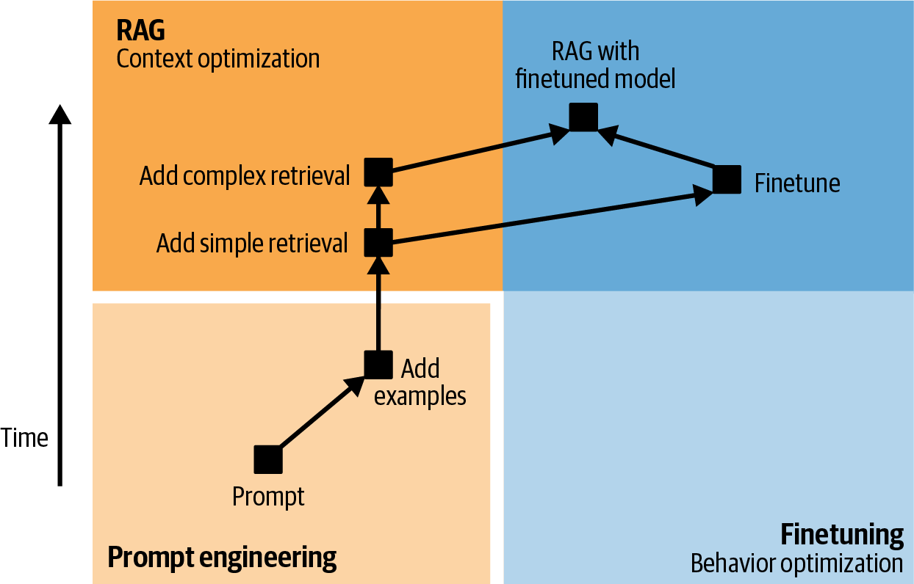
 
<em>Figure 7-1. The making of different Code Llama models</em>

## Table of Contents

- [Why and When to Finetune](#why-and-when-to-finetune)
  - [Reasons to Finetune](#reasons-to-finetune)
  - [Reasons Not to Finetune](#reasons-not-to-finetune)
  - [Finetuning vs RAG](#finetuning-vs-rag)
- [Finetuning Overview](#finetuning-overview)
  - [Transfer Learning History](#transfer-learning-history)
  - [Feature Based vs Finetuning Based Transfer](#feature-based-vs-finetuning-based-transfer)
  - [Full Finetuning vs Parameter Efficient Methods](#full-finetuning-vs-parameter-efficient-methods)
  - [Memory Requirements for Finetuning](#memory-requirements-for-finetuning)
- [Finetuning Techniques](#finetuning-techniques)
  - [Full Finetuning](#full-finetuning)
  - [Parameter Efficient Finetuning Overview](#parameter-efficient-finetuning-overview)
  - [Adapter Methods](#adapter-methods)
  - [Soft Prompt Tuning](#soft-prompt-tuning)
  - [LoRA Deep Dive](#lora-deep-dive)
  - [QLoRA](#qlora)
  - [Model Merging and Multi Task Finetuning](#model-merging-and-multi-task-finetuning)
- [Finetuning Tactics](#finetuning-tactics)
  - [Finetuning Frameworks and Base Models](#finetuning-frameworks-and-base-models)
  - [Finetuning Hyperparameters](#finetuning-hyperparameters)
- [Summary](#summary)
- [Practitioner Checklist](#practitioner-checklist)

## Why and When to Finetune

The decision to finetune should not be taken lightly. It requires data, compute and ongoing maintenance. Before jumping into finetuning, it is essential to understand when it delivers genuine value and when simpler approaches will suffice.

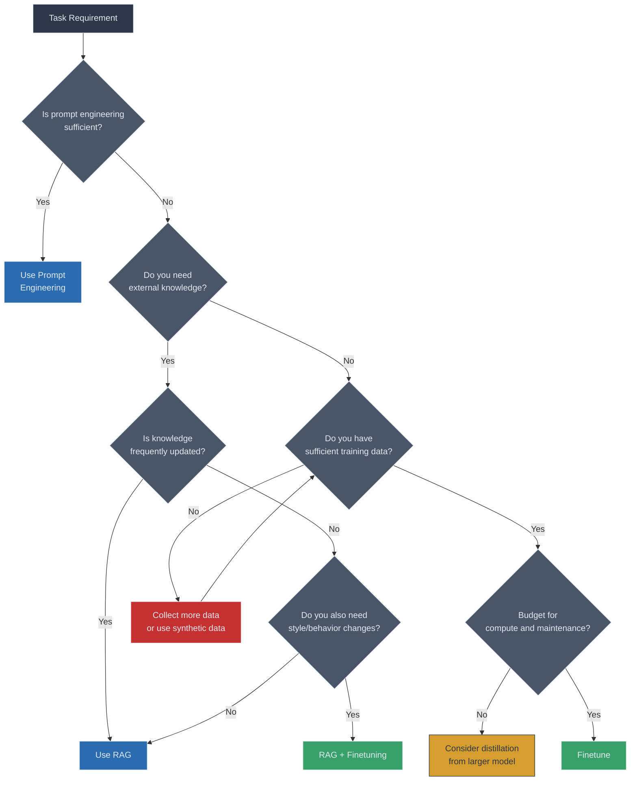

### Reasons to Finetune

There are several compelling reasons why teams choose to finetune foundation models.

**Better performance on specific tasks.** General purpose models are designed to be good at everything but often fall short on specialized tasks. Finetuning on domain specific data can significantly improve accuracy, relevance and consistency for your particular use case. A model finetuned on legal documents will produce more accurate legal analysis than a general model prompted with the same instructions.

**Data privacy and compliance.** When your data cannot leave your infrastructure, finetuning an open source model on premises becomes the only viable option. This is particularly relevant in healthcare, finance and government sectors where regulatory requirements mandate strict data governance.

**Cost reduction at scale.** A smaller finetuned model can often match or exceed the performance of a much larger general model on specific tasks. If you are making millions of API calls per month, replacing GPT-4 class API calls with a finetuned Llama model can reduce costs by an order of magnitude.

**Latency improvement.** Smaller finetuned models run faster. In latency sensitive applications such as real time recommendations or interactive coding assistants, a small finetuned model deployed on your own infrastructure can deliver sub-100ms responses where a large API model would take seconds.

**Behavioral control.** Finetuning gives you precise control over the model's output style, tone and format. If you need the model to always respond in a specific JSON schema, or to adopt a particular brand voice, finetuning encodes these behaviors directly into the model weights.

### Reasons Not to Finetune

> [!WARNING]
> Finetuning is not always the right answer. Consider these risks carefully before committing to a finetuning project.

**High upfront and ongoing costs.** Finetuning requires GPU compute for training, human effort for data curation and engineering time for pipeline development. Beyond the initial training, you must also maintain the finetuned model as base models improve and your data distribution shifts.

**Data requirements.** You need high quality, representative training data. For supervised finetuning, this typically means hundreds to thousands of carefully curated input/output examples. Collecting, cleaning and labeling this data is often the most expensive part of the process.

**Risk of catastrophic forgetting.** Neural networks are prone to forgetting old tasks when trained on new ones. A model finetuned too aggressively on a narrow task may lose general capabilities that made it useful in the first place. Balancing specialization with generality is a persistent challenge.

**Maintenance burden.** Foundation models are improving rapidly. When a new base model is released that outperforms your finetuned model, you may need to repeat the entire finetuning process. This creates an ongoing operational burden that prompt engineering and RAG approaches do not share.

**Evaluation complexity.** Evaluating a finetuned model is harder than evaluating a prompted model. You need to assess both task specific performance and general capability retention, often requiring multiple evaluation suites.

### Finetuning vs RAG

Finetuning and Retrieval Augmented Generation (RAG) are often presented as competing approaches, but they are fundamentally complementary. They solve different problems and can be combined effectively.

| Dimension | Finetuning | RAG |
|-----------|-----------|-----|
| **Primary purpose** | Adapt model behavior, style and capabilities | Provide model with external or up to date knowledge |
| **Knowledge update speed** | Requires retraining to update knowledge | Updates immediately when source documents change |
| **Data requirements** | Curated training examples (hundreds to thousands) | Document corpus with retrieval infrastructure |
| **Compute cost** | High upfront (GPU training), lower inference | Lower upfront, higher per query (retrieval + generation) |
| **Hallucination control** | Model may still hallucinate confidently | Can ground responses in retrieved documents |
| **Best for** | Style, format, behavior, domain vocabulary | Factual accuracy, citations, dynamic knowledge |
| **Maintenance** | Retrain when base model or data changes | Maintain document index and retrieval pipeline |
| **Latency** | Single model inference | Retrieval step adds latency |

> [!TIP]
> The most effective production systems often combine both approaches. Finetune a model for your domain's vocabulary, style and reasoning patterns, then augment it with RAG for factual grounding and up to date knowledge.

**When to use finetuning alone.** Use finetuning when you need to change how the model behaves rather than what it knows. Examples include adapting output format, teaching domain specific reasoning patterns, reducing model size for deployment and encoding stylistic preferences.

**When to use RAG alone.** Use RAG when you need to inject knowledge that changes frequently or when you need to cite sources. Examples include customer support over product documentation, legal research across case law and question answering over internal wikis.

**When to combine both.** Combine finetuning and RAG when you need both behavioral adaptation and knowledge grounding. For example, a medical chatbot might be finetuned to reason in clinical terminology and follow diagnostic protocols, while using RAG to retrieve the latest treatment guidelines.

## Finetuning Overview

### Transfer Learning History

Finetuning is a form of transfer learning, which is the practice of applying knowledge learned in one setting to a different but related setting. The concept has a long history in machine learning, but its modern incarnation traces a clear arc from computer vision through NLP to today's foundation models.

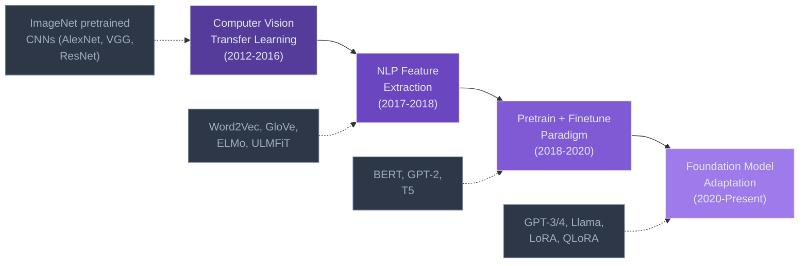

**Computer vision era (2012 to 2016).** Transfer learning first proved its value in computer vision. Models pretrained on ImageNet, a dataset of over 14 million labeled images, learned general visual features like edges, textures and shapes in early layers and increasingly abstract concepts in deeper layers. Practitioners discovered that freezing the early layers and finetuning only the later layers on a new task produced excellent results even with small datasets. This approach became standard practice and dramatically lowered the barrier to building high performing vision models.

**NLP feature extraction era (2017 to 2018).** NLP lagged behind vision in transfer learning for years because language was considered harder to learn in a generalizable way. The breakthrough came with contextual word embeddings. ELMo (2018) showed that pretrained language representations could capture nuanced word meanings in context. ULMFiT (2018) by Jeremy Howard and Sebastian Ruder demonstrated that discriminative finetuning and gradual unfreezing could make transfer learning practical for NLP tasks.

**Pretrain and finetune paradigm (2018 to 2020).** BERT (2018) and GPT-2 (2019) established the paradigm that dominates today. Pretrain a large model on massive unlabeled text, then finetune it on a smaller labeled dataset for a specific task. BERT showed that a single pretrained model could be finetuned to achieve state of the art results across many NLP benchmarks simultaneously. T5 (2020) unified all NLP tasks into a text to text format, further simplifying the finetuning process.

**Foundation model adaptation (2020 to present).** With models growing to hundreds of billions of parameters, full finetuning became impractical for most organizations. This spawned parameter efficient methods like LoRA, adapter layers and prompt tuning. The focus shifted from finetuning all parameters to adapting the smallest possible subset while maintaining performance.

### Feature Based vs Finetuning Based Transfer

There are two fundamental approaches to transfer learning.

**Feature based transfer.** In this approach, the pretrained model is used as a fixed feature extractor. You freeze the pretrained weights entirely and train a new model (typically a small classifier or regressor) on top of the extracted features. Word2Vec and GloVe embeddings were used this way. You would extract word vectors and feed them into a separate model. The pretrained model itself never changes.

**Finetuning based transfer.** In this approach, you update the pretrained model's weights during training on the new task. This allows the model to adapt its internal representations to the specific characteristics of your data. The entire model (or a subset of it) is modified. This approach is more powerful than feature based transfer because the model can reshape its learned representations to better fit the target task.

> [!NOTE]
> Modern foundation model adaptation almost exclusively uses finetuning based transfer. The pretrained model's representations are so powerful that even small amounts of finetuning data can steer the model's behavior dramatically.

### Full Finetuning vs Parameter Efficient Methods

The core tension in modern finetuning is between full finetuning (updating all model parameters) and parameter efficient finetuning (updating only a small subset).

| Dimension | Full Finetuning | Parameter Efficient (PEFT) |
|-----------|----------------|---------------------------|
| **Parameters updated** | All model parameters | Typically 0.1% to 10% of parameters |
| **Memory requirements** | Very high (model + optimizer + gradients) | Significantly lower |
| **Training speed** | Slower per step | Faster per step |
| **Performance ceiling** | Highest potential | Slightly lower but often comparable |
| **Risk of catastrophic forgetting** | Higher | Lower (original weights preserved) |
| **Multi-task deployment** | Requires separate model copies | Can share base model, swap adapters |
| **Hardware requirements** | Multiple high end GPUs | Often single GPU |

> "Many finetuning techniques have been developed with the same motivation: to achieve strong performance on a minimal memory footprint."
> Chip Huyen

### Memory Requirements for Finetuning

Understanding memory requirements is critical for planning your finetuning infrastructure. GPU memory during training is consumed by four major components.

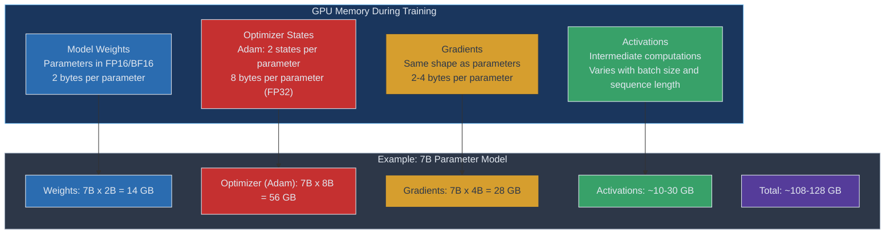

**Model weights.** The parameters of the model itself. In FP16 or BF16 precision, each parameter requires 2 bytes. A 7B parameter model needs approximately 14 GB just for its weights.

**Optimizer states.** The Adam optimizer, which is the standard for training transformers, maintains two additional states per parameter (first moment and second moment estimates). These are stored in FP32, requiring 8 bytes per parameter. For a 7B model, this adds approximately 56 GB.

**Gradients.** During backpropagation, gradients must be stored for every trainable parameter. In FP32, this requires 4 bytes per parameter. In mixed precision training, gradients may use 2 bytes per parameter during the backward pass.

**Activations.** The intermediate outputs of each layer must be stored for use during backpropagation. The memory for activations scales with batch size, sequence length and model depth. Activation checkpointing (recomputing activations during the backward pass instead of storing them) can significantly reduce this cost at the expense of extra computation.

> [!IMPORTANT]
> The optimizer states are typically the largest consumer of GPU memory during training. This is why parameter efficient methods that only train a small subset of parameters achieve such dramatic memory savings. If you only train 1% of parameters, you only need optimizer states for that 1%.

## Finetuning Techniques

### Full Finetuning

Full finetuning updates every parameter in the model during training. You start with a pretrained model, load your training data and run standard gradient descent optimization across all layers.

**Advantages of full finetuning.** Full finetuning offers the highest potential performance because the model can reshape all of its internal representations. Every layer, from the embedding layer through the attention heads to the output projection, can adapt to the target task. This flexibility is especially valuable when the target domain differs significantly from the pretraining data.

**Disadvantages of full finetuning.** The costs are substantial. You need enough GPU memory to hold the model weights, optimizer states, gradients and activations simultaneously. For a 70B parameter model, this can require a cluster of 8 or more A100 80GB GPUs. You also need to store a complete copy of the model for each finetuned variant, which makes multi-task deployment expensive.

**When to use full finetuning.** Full finetuning is most appropriate when you have significant compute resources, when maximum performance is critical and when the target task is substantially different from the pretraining distribution. If you are a large organization finetuning a model that will serve millions of users, the investment in full finetuning may be justified by even marginal performance gains.

### Parameter Efficient Finetuning Overview

Parameter Efficient Finetuning (PEFT) encompasses a family of techniques designed to adapt large models while training only a tiny fraction of the total parameters. The core insight is that the pretrained model already contains most of the knowledge needed for downstream tasks. Only a small perturbation to the weights is necessary for adaptation.

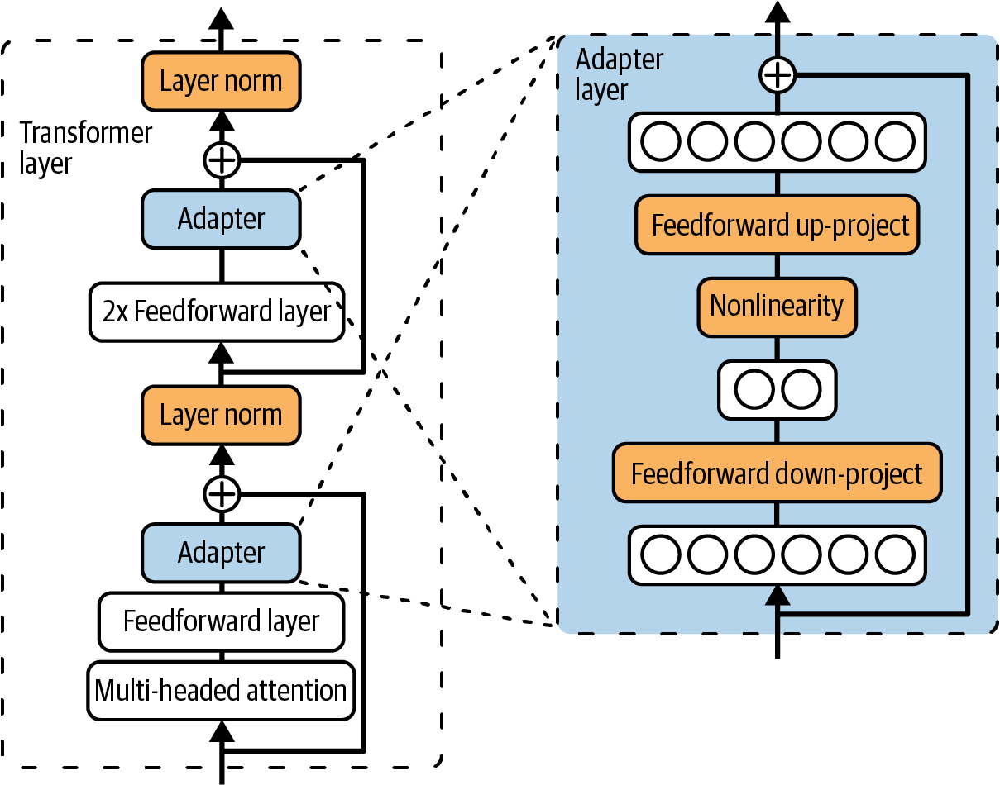
 
<em>Figure 7-7. Partial finetuning requires many trainable parameters</em>

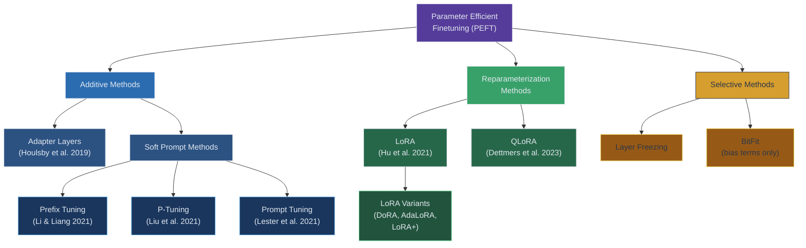

> "The better trained an LLM is, the easier it is to finetune the model using a small number of trainable parameters and a small amount of data."
> Chip Huyen

### Adapter Methods

Adapter methods insert small trainable modules into each transformer layer while keeping the original pretrained weights frozen. The original adapter architecture was proposed by Houlsby et al. (2019).

**How adapters work.** An adapter module is a small bottleneck neural network inserted between the layers of a transformer. It typically consists of a down projection that reduces the hidden dimension, a nonlinearity (such as ReLU) and an up projection that restores the original dimension. A residual connection is added so that the adapter can learn the identity function and have zero impact on the pretrained model at initialization.

**Architecture details.** In the original design, two adapter modules are inserted per transformer layer. One after the multi-head attention sublayer and one after the feed forward sublayer. Each adapter might have a bottleneck dimension of 64 compared to a model hidden dimension of 4096, making the adapters very small relative to the full model.

**Performance.** Houlsby et al. showed that adapters could match full finetuning performance on GLUE benchmarks while adding only 3.6% additional parameters. This was a breakthrough result that inspired much subsequent work.

**Limitations.** Adapter modules add sequential computation to each layer, which increases inference latency. Unlike LoRA (discussed below), adapters cannot be merged into the base model weights to eliminate this overhead.

### Soft Prompt Tuning

Soft prompt methods add learnable embeddings to the input or to the internal representations of the model, while keeping all model parameters frozen. The key insight is that the model's behavior can be steered by prepending carefully optimized "virtual tokens" to the input.

**Prefix tuning (Li and Liang, 2021).** Prefix tuning prepends learnable vectors to the key and value matrices at every transformer layer. Unlike hard prompts (which are constrained to real words in the vocabulary), these prefix vectors can take any value in the continuous embedding space. This gives them much greater expressive power. Prefix tuning typically adds a few hundred to a few thousand parameters and can achieve competitive performance on specific tasks.

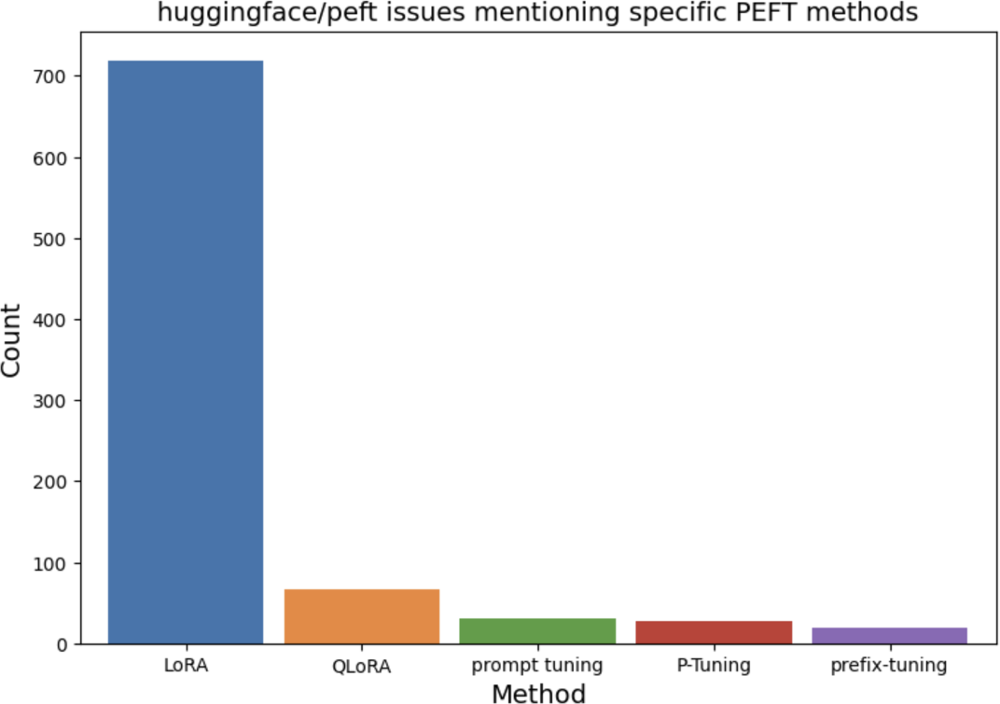
 
<em>Figure 7-9. Hard and soft prompts combined to change model behavior</em>

**P-Tuning (Liu et al., 2021).** P-Tuning inserts trainable continuous embeddings into the input sequence, but uses an LSTM encoder to model dependencies between the trainable tokens. This stabilizes training and improves performance, particularly on smaller models.

**Prompt tuning (Lester et al., 2021).** Prompt tuning is the simplest soft prompt method. It prepends a small number of learnable tokens (typically 20 to 100) to the input embeddings at only the first layer. Despite its simplicity, Lester et al. showed that prompt tuning scales remarkably well. With a sufficiently large model (T5 11B), prompt tuning matches the performance of full finetuning.

> [!NOTE]
> Soft prompt methods are extremely parameter efficient, often requiring fewer than 0.1% additional parameters. However, they can be sensitive to initialization and may underperform on smaller models. They also make debugging harder because the learned prompts have no human interpretable meaning.

### LoRA Deep Dive

LoRA (Low Rank Adaptation) has become the dominant finetuning method for large language models. From the analysis of 1,000+ GitHub issues on huggingface/peft, "it's clear that LoRA dominates." Its combination of simplicity, effectiveness and inference efficiency has made it the default choice for most practitioners.

#### How LoRA Works

LoRA is based on the hypothesis that the weight updates during finetuning have a low intrinsic rank. Instead of updating a full weight matrix W of dimension d x d, LoRA decomposes the update into two much smaller matrices.

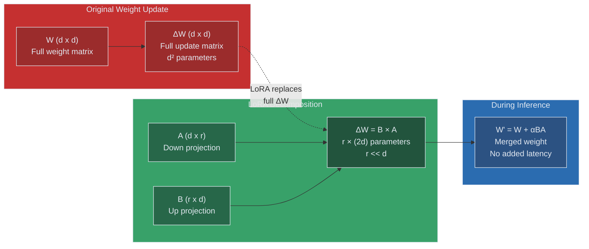

The original weight matrix W remains frozen. The update is parameterized as the product of two low rank matrices: **A** (dimension d x r) and **B** (dimension r x d), where r is the rank and is typically much smaller than d (common values are 4, 8, 16, 32 or 64). Matrix A is initialized with a random Gaussian distribution and B is initialized to zero, so the initial value of the product BA is zero. This means the model starts exactly where the pretrained model left off.

During training, the forward pass computes h = Wx + (alpha/r) * BAx, where alpha is a scaling hyperparameter. Only A and B receive gradient updates. During inference, the LoRA weights can be merged directly into W by computing W' = W + (alpha/r) * BA, adding zero latency overhead.

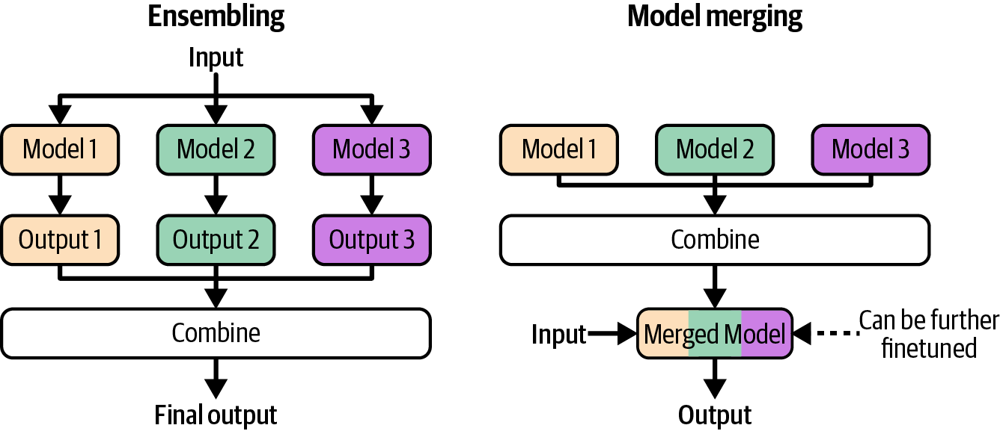
 
<em>Figure 7-11. LoRA decomposes weight matrix W into product of two smaller matrices</em>

#### Why LoRA Works

The theoretical justification for LoRA rests on the concept of intrinsic dimensionality. Research by Aghajanyan et al. (2021) showed that pretrained language models have a low intrinsic dimensionality. This means that the effective number of parameters needed to describe a finetuning solution is much smaller than the total number of parameters in the model.

Intuitively, a well pretrained model has already learned rich representations of language. Finetuning for a specific task only requires small adjustments to these representations, and these adjustments lie in a low dimensional subspace. LoRA exploits this by restricting the update to a low rank subspace, which is a natural fit for the structure of the problem.

#### LoRA Configurations

**Which weight matrices to adapt.** In a transformer, the attention mechanism has four weight matrices: query (Wq), key (Wk), value (Wv) and output (Wo). The feed forward network has two additional matrices. The original LoRA paper found that adapting the query and value matrices yielded the best results for a given parameter budget.

| Weight Matrices Adapted | WikiSQL Accuracy | MultiNLI Accuracy | Trainable Parameters |
|------------------------|-----------------|-------------------|---------------------|
| Wq only | 70.4 | 91.0 | 4.7M |
| Wk only | 70.0 | 90.8 | 4.7M |
| Wv only | 73.0 | 91.0 | 4.7M |
| Wq + Wv | 73.4 | 91.3 | 9.4M |
| Wq + Wk + Wv + Wo | 73.7 | 91.7 | 18.8M |

> [!TIP]
> In practice, many practitioners now apply LoRA to all linear layers in the transformer (query, key, value, output and both feed forward matrices). While the original paper focused on attention matrices, subsequent work has shown that broader application with a lower rank can be more effective for the same parameter budget.

**Rank selection.** Higher ranks allow more expressive updates but increase the number of trainable parameters. The original paper found that ranks as low as 1 or 2 could be surprisingly effective, and that increasing beyond rank 8 provided diminishing returns for many tasks. Common practice is to start with rank 8 or 16 and adjust based on performance.

**Alpha scaling.** The alpha parameter controls the magnitude of the LoRA update relative to the original weights. A common heuristic is to set alpha equal to twice the rank (e.g. alpha=16 for rank=8). Higher alpha values produce larger updates and can speed convergence but may also cause instability.

#### LoRA Memory Comparison

The memory savings from LoRA are dramatic, especially for large models.

| Model | Full Model Size | LoRA Adapter Size (r=16) | Reduction Factor |
|-------|----------------|--------------------------|-----------------|
| Llama 2 7B | 14 GB (FP16) | ~33 MB | ~430x |
| Llama 2 13B | 26 GB (FP16) | ~51 MB | ~510x |
| Llama 2 70B | 140 GB (FP16) | ~160 MB | ~875x |
| GPT-3 175B | 350 GB (FP16) | ~350 MB | ~1000x |

#### Serving LoRA Adapters

One of LoRA's most compelling advantages is its deployment flexibility. There are two primary approaches to serving LoRA adapters.

**Merge and deploy.** Before deployment, merge the LoRA weights into the base model by computing W' = W + (alpha/r) * BA. This produces a standard model with no additional inference overhead. This approach is simple and efficient but requires a separate model copy for each LoRA variant.

**Separate serving.** Keep the base model and LoRA adapters separate at inference time. This allows multiple LoRA adapters to share a single base model, dramatically reducing memory requirements for multi-task or multi-tenant deployments.

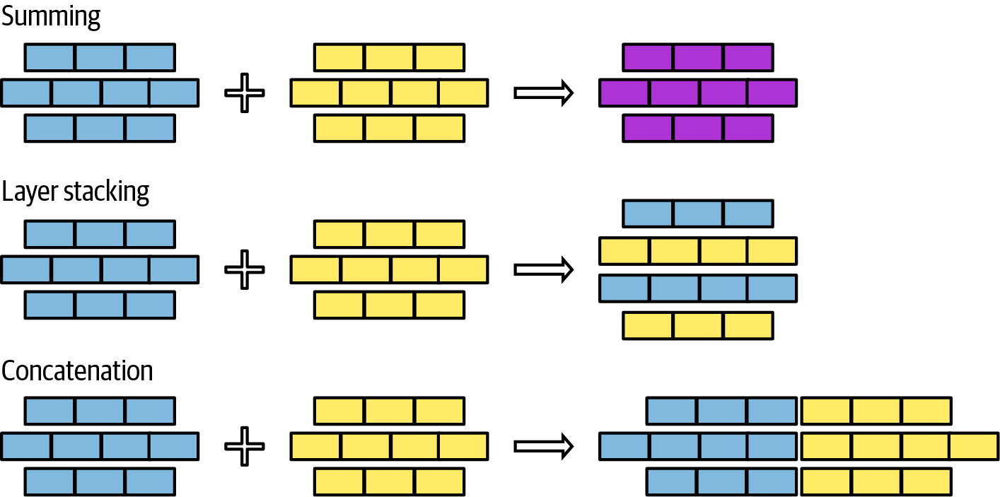
 
<em>Figure 7-12. Keeping LoRA adapters separate allows reuse of the same full-rank matrix</em>

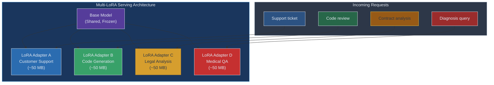

**Apple's multi-LoRA example.** Apple demonstrated the power of multi-LoRA serving in their on-device AI strategy. They use a single base language model on the device and dynamically load small LoRA adapters for different tasks such as summarization, proofreading, reply suggestions and creative writing. Each adapter is only a few tens of megabytes, allowing dozens of specialized capabilities to be stored on a single device without duplicating the base model. This approach enables efficient use of constrained device memory while offering highly specialized model behavior per task.

### QLoRA

QLoRA (Quantized LoRA) extends LoRA by quantizing the base model to 4-bit precision before applying LoRA adapters. Proposed by Dettmers et al. (2023), QLoRA makes it possible to finetune a 65B parameter model on a single 48GB GPU, a feat that would otherwise require a multi-GPU cluster.

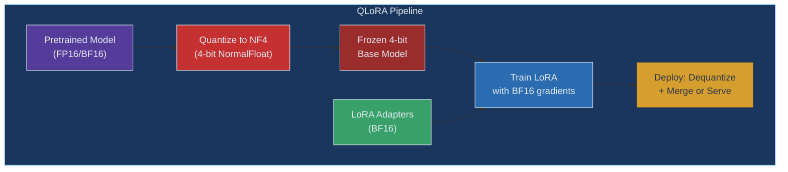

**Key innovations in QLoRA.**

**NF4 (4-bit NormalFloat) quantization.** QLoRA introduces the NF4 data type, which is information theoretically optimal for normally distributed data. Neural network weights tend to follow a normal distribution, making NF4 a better fit than standard 4-bit integer quantization. NF4 divides the quantization range into 16 bins that are evenly spaced in terms of probability under a standard normal distribution, giving more precision where the data is densest.

**Double quantization.** QLoRA applies quantization to the quantization constants themselves. The first quantization converts FP16 weights to NF4. The second quantization reduces the memory needed to store the quantization scaling factors. This saves an additional 0.37 bits per parameter on average.

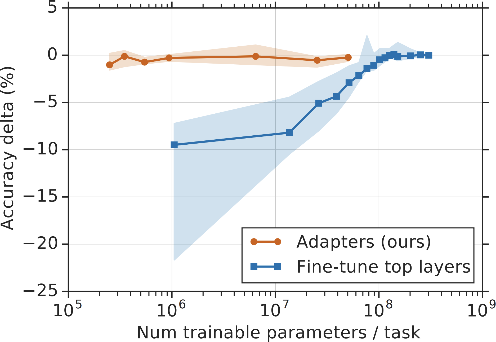
 
<em>Figure 7-6. Different floating point formats with range and precision</em>

**Paged optimizers.** QLoRA uses NVIDIA unified memory to handle memory spikes during training. When GPU memory runs out during gradient checkpointing, optimizer states are automatically offloaded to CPU memory and paged back when needed. This prevents out of memory errors without requiring manual memory management.

**Guanaco models.** The authors demonstrated QLoRA by training the Guanaco family of models, which achieved remarkable results.

| Model | Elo Rating | vs ChatGPT Win Rate | vs GPT-4 Win Rate | Training Time | GPU |
|-------|-----------|--------------------|--------------------|--------------|-----|
| Guanaco 65B | 1477 | ~50% | ~25% | 24 hours | Single 48GB |
| Guanaco 33B | 1455 | ~45% | ~22% | 12 hours | Single 24GB |
| GPT-4 | 1517 | ~75% | N/A | N/A | N/A |
| ChatGPT (GPT-3.5) | 1439 | N/A | ~20% | N/A | N/A |

The Guanaco 65B model achieved 99.3% of the ChatGPT performance level on the Vicuna benchmark while being trainable on a single GPU. This demonstrated that high quality finetuning was accessible to researchers and organizations without large compute budgets.

> [!IMPORTANT]
> QLoRA's combination of NF4 quantization and LoRA adapters reduces the memory requirements for finetuning a 65B model from approximately 780 GB (full finetuning with Adam) to under 48 GB. This is a reduction of more than 16x, bringing large model finetuning within reach of consumer hardware.

### Model Merging and Multi Task Finetuning

Model merging is a technique for combining multiple finetuned models into a single model without additional training. It has become an important tool in the open source model community.

> "Without finetuning, model merging can be done without GPUs, making merging particularly attractive to indie model developers."
> Chip Huyen

Model merging exploits the fact that models finetuned from the same base share a common weight space. Because they start from the same initialization, their weight differences (called task vectors) tend to be compatible and can be combined meaningfully.

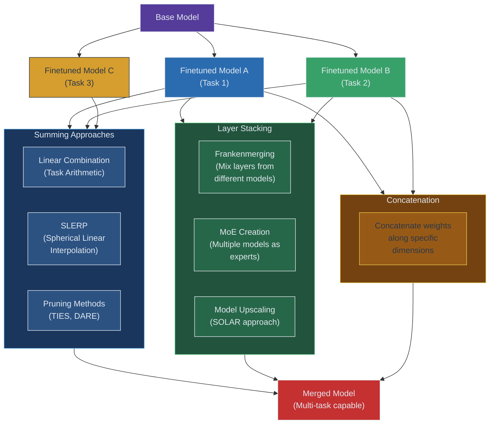

#### Summing Approaches

**Linear combination (Task Arithmetic).** The simplest merging approach computes a weighted average of model weights. Given a base model with weights W_base and two finetuned models with weights W_A and W_B, the merged model is computed as W_merged = W_base + lambda_A * (W_A - W_base) + lambda_B * (W_B - W_base). The terms (W_A - W_base) and (W_B - W_base) are called task vectors. By adjusting the scaling coefficients lambda_A and lambda_B, you control how much each task's specialization contributes to the merged model.

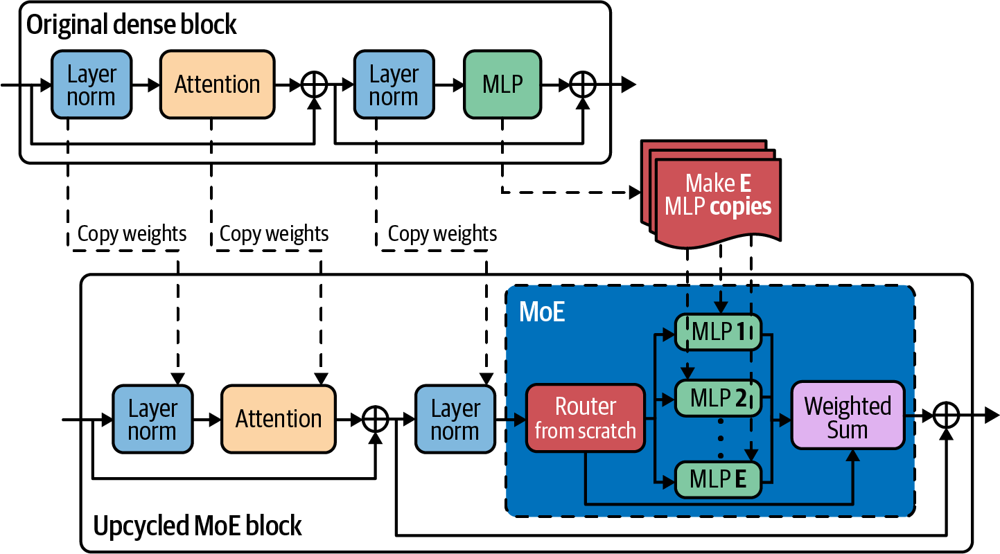
 
<em>Figure 7-15. How to linearly combine two layers</em>

**SLERP (Spherical Linear Interpolation).** SLERP treats weight vectors as points on a high dimensional sphere and interpolates along the geodesic (shortest path on the sphere) between them. This preserves the magnitude of weight vectors better than linear interpolation, which tends to shrink weights toward the origin. SLERP can only merge two models at a time, so merging three or more models requires sequential pairwise merging.

**Pruning redundant parameters (TIES, DARE).** When merging multiple task vectors, parameter conflicts can arise. Two models might adjust the same parameter in opposite directions, leading to cancellation. TIES (Yadav et al., 2023) addresses this by pruning small magnitude changes, resolving sign conflicts through majority voting and then merging. DARE (Yu et al., 2023) takes a different approach by randomly dropping a large fraction of task vector elements (90% or more) and rescaling the remaining elements. Both methods reduce interference between task vectors and produce cleaner merges.

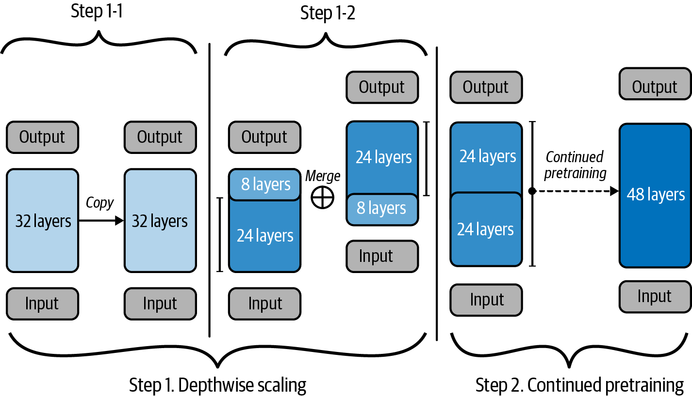
 
<em>Figure 7-17. Keeping top 20 percent of task vector achieves best results</em>

#### Layer Stacking

**Frankenmerging.** Rather than combining weights within each layer, frankenmerging constructs a new model by selecting entire layers from different finetuned models. For example, you might take layers 0 through 15 from Model A and layers 16 through 31 from Model B. This approach can produce surprisingly effective models, especially when the source models have complementary strengths in different parts of the network.

**MoE creation.** Multiple finetuned models can be combined into a Mixture of Experts (MoE) architecture. Each finetuned model becomes an "expert" and a router network is added to direct inputs to the appropriate expert. This approach preserves each model's full capabilities but increases the total parameter count.

**Model upscaling (SOLAR approach).** The SOLAR method by Kim et al. (2023) takes a different approach to layer stacking. It duplicates the layers of a model (for example, copying a 32 layer model to create a 48 layer model), removes some redundant middle layers and then continues pretraining. This creates a larger model that inherits the knowledge of the smaller model while having greater capacity for learning.

#### Concatenation

Concatenation methods join weight matrices along specific dimensions rather than averaging them. This increases model capacity but also increases model size. Concatenation is less commonly used than summing or stacking approaches.

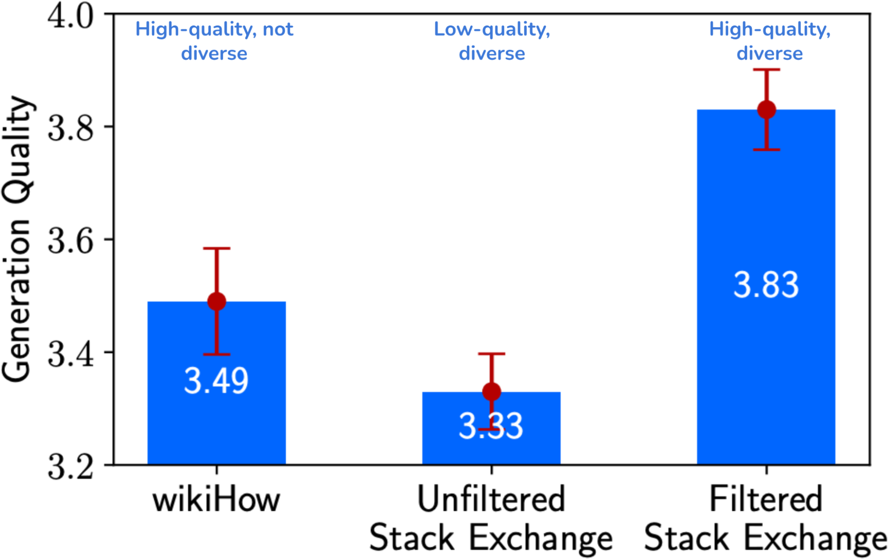
 
<em>Figure 7-20. Merging two LoRA adapters using concatenation</em>

#### Ensembling vs Merging Comparison

| Dimension | Ensembling | Model Merging |
|-----------|-----------|--------------|
| **Inference cost** | Runs all models, highest cost | Single model, same as base |
| **Memory** | Must load all models | Single model footprint |
| **Quality** | Generally highest quality | Variable, sometimes surprising quality |
| **GPU requirement** | Required for inference | Not required for merging itself |
| **Flexibility** | Easy to add/remove models | Must recompute merge |
| **Best for** | Maximum quality when cost is secondary | Resource constrained multi-task deployment |

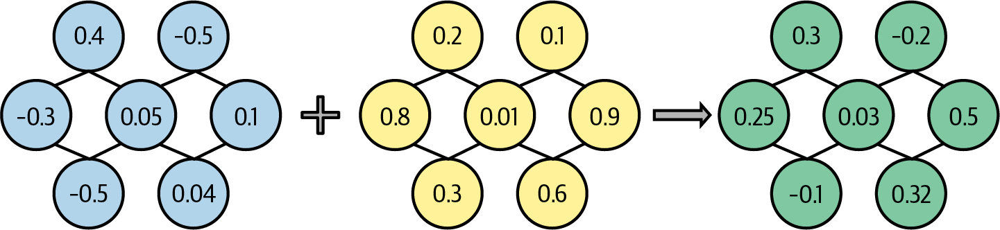
 
<em>Figure 7-13. How ensembling and model merging work</em>

## Finetuning Tactics

### Finetuning Frameworks and Base Models

Choosing the right base model and finetuning framework is a critical first step. There are two primary paths to arriving at a finetuned model.

```mermaid
graph TD
    subgraph Paths["Two Paths to a Finetuned Model"]
        direction TB

        subgraph Progression["Progression Path"]
            P1["Small Model"] --> P2["Evaluate Performance"]
            P2 --> P3{"Good enough?"}
            P3 -->|No| P4["Try larger model<br/>or more data"]
            P4 --> P2
            P3 -->|Yes| P5["Deploy finetuned<br/>model"]
        end

        subgraph Distillation["Distillation Path"]
            D1["Large Teacher Model<br/>(e.g. GPT-4)"] --> D2["Generate training<br/>data from teacher"]
            D2 --> D3["Finetune smaller<br/>student model"]
            D3 --> D4["Evaluate student<br/>vs teacher"]
            D4 --> D5{"Acceptable<br/>quality gap?"}
            D5 -->|No| D6["More/better<br/>teacher data"]
            D6 --> D3
            D5 -->|Yes| D7["Deploy student<br/>model"]
        end
    end

    style Paths fill:#1A365D,stroke:#63B3ED,color:#E2E8F0
    style Progression fill:#2D3748,stroke:#A0AEC0,color:#E2E8F0
    style Distillation fill:#2D3748,stroke:#A0AEC0,color:#E2E8F0
    style P1 fill:#2B6CB0,stroke:#E2E8F0,color:#E2E8F0
    style P2 fill:#2B6CB0,stroke:#E2E8F0,color:#E2E8F0
    style P3 fill:#4A5568,stroke:#E2E8F0,color:#E2E8F0
    style P4 fill:#C53030,stroke:#E2E8F0,color:#E2E8F0
    style P5 fill:#38A169,stroke:#E2E8F0,color:#E2E8F0
    style D1 fill:#553C9A,stroke:#E2E8F0,color:#E2E8F0
    style D2 fill:#553C9A,stroke:#E2E8F0,color:#E2E8F0
    style D3 fill:#553C9A,stroke:#E2E8F0,color:#E2E8F0
    style D4 fill:#553C9A,stroke:#E2E8F0,color:#E2E8F0
    style D5 fill:#4A5568,stroke:#E2E8F0,color:#E2E8F0
    style D6 fill:#C53030,stroke:#E2E8F0,color:#E2E8F0
    style D7 fill:#38A169,stroke:#E2E8F0,color:#E2E8F0
```

**Progression path.** Start with a small model, finetune it, evaluate and scale up if the performance is insufficient. This is the more traditional path and works well when you have a clear evaluation framework. You might start with a 7B model and only move to a 13B or 70B model if the smaller model cannot meet your quality bar.

**Distillation path.** Use a large, capable model (such as GPT-4) to generate training data, then finetune a smaller model on that data. This path leverages the quality of the larger model while producing a smaller, faster and cheaper model for deployment. Many of the most popular open source chat models (such as Alpaca and Vicuna) were created using this distillation approach.

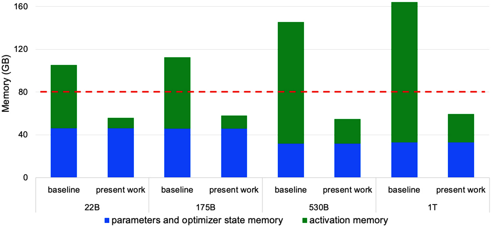
 
<em>Figure 7-3. Example application development flows</em>

**Framework selection.** Finetuning frameworks range from managed API services to fully open source libraries.

*API based finetuning* is offered by providers like OpenAI, Google and Mistral. You upload your data and the provider handles training infrastructure, hyperparameter tuning and model serving. This is the simplest option but gives you the least control and ties you to the provider's model ecosystem.

*Open source frameworks* like Hugging Face Transformers, Axolotl, LLaMA-Factory and Unsloth give you full control over the training process. You choose the base model, set hyperparameters, manage your own compute and own the resulting model weights. This path requires more engineering effort but provides maximum flexibility.

> [!TIP]
> If you are new to finetuning, start with an API based service to validate that finetuning improves your use case. Once you have confirmed the value, consider moving to an open source framework for greater control and potentially lower costs at scale.

### Finetuning Hyperparameters

Hyperparameter selection can have a dramatic impact on finetuning outcomes. The key hyperparameters to tune are learning rate, batch size, number of epochs and prompt loss weight.

| Hyperparameter | Typical Range | Notes |
|---------------|--------------|-------|
| **Learning rate** | 1e-5 to 5e-5 (full), 1e-4 to 3e-4 (LoRA) | Most critical hyperparameter. Too high causes instability. Too low wastes compute. |
| **Batch size** | 4 to 64 (effective, with gradient accumulation) | Larger batches give smoother gradients but may reduce generalization. |
| **Number of epochs** | 1 to 5 for instruction tuning | More epochs risk overfitting, especially with small datasets. Monitor validation loss. |
| **LoRA rank (r)** | 4 to 64 | Higher rank increases capacity but also parameter count. Start with 8 or 16. |
| **LoRA alpha** | 2x rank is common heuristic | Controls magnitude of LoRA update. Higher alpha means larger updates. |
| **Weight decay** | 0.0 to 0.1 | Regularization to prevent overfitting. Often set to 0 for short finetuning runs. |
| **Warmup ratio** | 0.03 to 0.1 | Gradually ramps up learning rate at the start of training. |
| **Prompt loss weight** | 0.0 to 1.0 | Weight of the loss on prompt tokens vs completion tokens. |

**Learning rate.** The learning rate is the single most important hyperparameter. For full finetuning, learning rates are typically in the range of 1e-5 to 5e-5, much lower than pretraining learning rates, because you want to make small adjustments to already well learned representations. For LoRA, learning rates can be higher (1e-4 to 3e-4) because you are only updating the small adapter weights. A cosine learning rate schedule with warmup is the most common choice.

**Batch size and gradient accumulation.** Larger batch sizes produce more stable gradient estimates but require more GPU memory. When you cannot fit a large batch in memory, gradient accumulation lets you simulate a larger batch by accumulating gradients over multiple forward/backward passes before updating weights. For example, if your GPU can handle a batch size of 4, you can set gradient accumulation steps to 8 to simulate an effective batch size of 32.

**Number of epochs.** For instruction finetuning, 1 to 3 epochs is usually sufficient. More epochs risk overfitting, especially when the training dataset is small. A common sign of overfitting is when training loss continues to decrease but validation loss starts increasing. Monitor validation metrics closely and consider early stopping.

**Prompt loss weight.** In instruction finetuning, the training data typically consists of a prompt (the instruction) followed by a completion (the desired response). The prompt loss weight controls how much the loss on the prompt tokens contributes to the total loss. Setting it to 0 means the model is only trained to predict the completion tokens and the prompt tokens are essentially masked. This focuses the model's learning on generating good responses rather than memorizing instructions. Many practitioners set prompt loss weight to 0, though including some prompt loss (0.1 to 0.5) can help with format following.

> [!NOTE]
> Hyperparameter tuning for finetuning is less extensive than for pretraining because the model is already well initialized. In practice, a reasonable set of defaults (learning rate 2e-5, batch size 16, 3 epochs, cosine schedule) will get you most of the way there. Focus your experimentation budget on data quality and selection, which typically has a larger impact than hyperparameter tuning.

## Summary

Finetuning is a powerful technique for adapting pretrained models to specific tasks and domains. The decision to finetune should be based on a clear analysis of whether the performance gains justify the costs of data curation, compute and ongoing maintenance.

The landscape of finetuning methods has evolved from full finetuning toward parameter efficient approaches. LoRA has emerged as the dominant method due to its simplicity, effectiveness and deployment flexibility. QLoRA extends this further by quantizing the base model, making large model finetuning accessible on consumer hardware.

Model merging offers an intriguing approach for combining specialized capabilities without additional training. Techniques like task arithmetic, SLERP and TIES allow indie developers to create multi-task models using only CPU compute.

The practical execution of finetuning involves careful choices about base models, frameworks and hyperparameters. Starting with an API service for validation and moving to open source frameworks for production is a sensible path for most teams.

Key takeaways from this chapter.

1. **Start simple.** Try prompt engineering and RAG before finetuning. Only finetune when these simpler approaches fall short.
2. **PEFT is the default.** Full finetuning is rarely necessary. LoRA and QLoRA provide comparable performance at a fraction of the cost.
3. **Data quality dominates.** The quality of your training data matters far more than most hyperparameter choices.
4. **Plan for maintenance.** Finetuned models require ongoing attention as base models improve and data distributions shift.
5. **Consider multi-LoRA serving.** If you need multiple specialized models, share a single base model with task specific LoRA adapters.
6. **Model merging is underrated.** For combining capabilities from multiple models, merging techniques can be surprisingly effective and require no GPU compute.

## Practitioner Checklist

- [ ] Confirm that prompt engineering and RAG are insufficient before starting a finetuning project
- [ ] Define clear evaluation metrics tied to your business objective before finetuning
- [ ] Curate high quality training data with diverse, representative examples
- [ ] Start with a small model and scale up only if needed (progression path)
- [ ] Use LoRA or QLoRA as your default finetuning method unless full finetuning is justified
- [ ] Monitor validation loss during training to detect overfitting early
- [ ] Evaluate both task specific performance and general capability retention
- [ ] Consider multi-LoRA serving if you need multiple specialized model behaviors
- [ ] Plan for model versioning, rollback and ongoing maintenance
- [ ] Document your finetuning configuration, data sources and evaluation results for reproducibility

[Previous: Chapter 6 - RAG and Agents](06-rag-and-agents.md) | [Next: Chapter 8 - Dataset Engineering](08-dataset-engineering.md)
