# Chapter 8. Dataset Engineering

[Previous: Chapter 7 - Finetuning](07-finetuning.md) | [Next: Chapter 9 - Inference Optimization](09-inference-optimization.md)

> "Manual inspection of data has probably the highest value-to-prestige ratio of any activity in machine learning."
> Greg Brockman

Dataset engineering is the discipline of curating, augmenting, synthesizing, verifying and processing training data for post-training AI models. While much of the attention in AI engineering goes to model architectures and training algorithms, the quality of the data often determines the ceiling of model performance. This chapter dives deep into the techniques and strategies that make post-training data effective. From crafting instruction datasets for supervised finetuning to generating synthetic preference data for RLHF, from rule-based augmentation to AI-powered data synthesis pipelines like those used in Llama 3, this chapter provides a comprehensive guide to the art and science of building high-quality training datasets.

<div align="center">
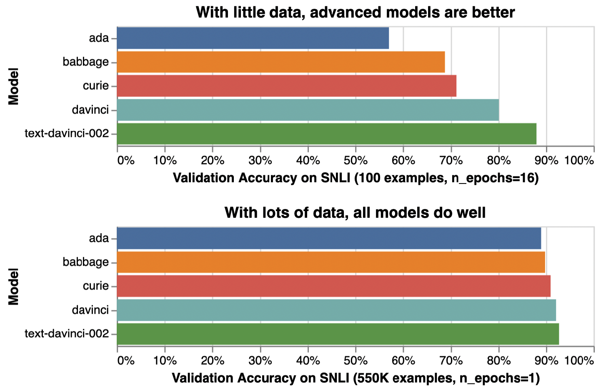
<br/>
<em>Figure 8-1. Dataset engineering overview</em>
</div>

## Table of Contents

- [Training Data for Post-Training](#training-data-for-post-training)
  - [Instruction Data for SFT](#instruction-data-for-sft)
  - [Preference Data for RLHF and DPO](#preference-data-for-rlhf-and-dpo)
  - [Data Quality Dimensions](#data-quality-dimensions)
- [Data Augmentation and Synthesis](#data-augmentation-and-synthesis)
  - [Why Data Synthesis](#why-data-synthesis)
  - [Traditional Data Synthesis Techniques](#traditional-data-synthesis-techniques)
  - [AI-Powered Data Synthesis](#ai-powered-data-synthesis)
  - [Data Verification](#data-verification)
  - [Limitations of AI-Generated Data](#limitations-of-ai-generated-data)
- [Model Distillation](#model-distillation)
  - [What Is Distillation](#what-is-distillation)
  - [Distillation in Practice](#distillation-in-practice)
  - [Model Bootstrapping](#model-bootstrapping)
- [Data Processing](#data-processing)
  - [Inspect Data](#inspect-data)
  - [Deduplicate Data](#deduplicate-data)
  - [Clean and Filter Data](#clean-and-filter-data)
  - [Format Data](#format-data)
- [Summary](#summary)

## Dataset Engineering Pipeline Overview

The dataset engineering process follows a structured pipeline from raw data collection through to a training-ready dataset. Each stage introduces quality gates and transformations that shape the final training signal.

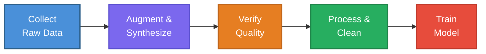

> [!IMPORTANT]
> Data engineering is often the most impactful and least glamorous part of building AI systems. The best models are built on the best data, not merely the best architectures.

## Training Data for Post-Training

Post-training refers to the additional training that happens after a model has been pretrained on a large, general corpus. The two dominant post-training paradigms are **supervised finetuning (SFT)** and **reinforcement learning from human feedback (RLHF)**, and each requires a distinct type of training data.

### Instruction Data for SFT

Supervised finetuning uses **instruction data**, which consists of input/output pairs where the input is a user instruction (or prompt) and the output is the desired response. This is the data format that teaches a pretrained model to follow instructions, answer questions, summarize documents, write code and perform other tasks.

#### What Good Instruction Data Looks Like

Good instruction data has several defining characteristics.

**Clarity of instructions.** Each instruction should be unambiguous. The model should be able to determine exactly what is being asked without needing additional context. Vague instructions like "tell me about science" produce vague training signals, whereas specific instructions like "explain the mechanism of CRISPR-Cas9 gene editing in three paragraphs" produce clear, learnable mappings.

**High-quality responses.** The response should be accurate, complete, well-structured and appropriate in tone. A response that is factually correct but poorly formatted teaches the model bad habits. A response that is beautifully written but factually wrong is even more dangerous.

**Diversity of tasks.** The instruction dataset should cover a wide range of tasks, domains and difficulty levels. A dataset that consists entirely of simple question-answering pairs will produce a model that is good at answering simple questions but struggles with complex reasoning, creative writing or multi-step tasks.

**Appropriate length and detail.** Responses should be neither too terse nor excessively verbose. The ideal response length depends on the task. A yes/no question should receive a concise answer, while a request for a detailed analysis should receive a thorough response.

> [!TIP]
> When evaluating instruction data quality, read a random sample of 50 to 100 examples carefully. This manual inspection often reveals systematic problems that automated metrics miss.

#### Instruction Data Sources

Instruction data can come from several sources.

1. **Human-written data.** This is the gold standard. Human annotators write instructions and craft ideal responses. Organizations like Scale AI, Surge AI and others specialize in producing this data. The cost is high but the quality is typically superior.

2. **Crowdsourced data.** Projects like Open Assistant and Dolly collected instruction data from volunteers. The quality varies widely, and significant filtering is needed, but the scale can be impressive.

3. **Existing NLP datasets converted to instruction format.** Many existing datasets (question-answering, summarization, translation) can be reformatted as instruction/response pairs. The FLAN collection did this at scale, converting over 1,800 NLP tasks into a unified instruction format.

4. **AI-generated data.** Models like GPT-4 can be prompted to generate instruction/response pairs. This is the approach used by Alpaca, Vicuna and many other projects. Quality depends on the generation pipeline and verification steps.

5. **User interaction logs.** Real user queries and expert responses (for example, from customer support systems or internal tools) can be repurposed as instruction data, subject to privacy and consent considerations.

### Preference Data for RLHF and DPO

RLHF and DPO require **preference data** rather than simple input/output pairs. Preference data consists of a prompt paired with two or more responses, where one response is marked as preferred over the other. This data format teaches the model not just what a good response looks like, but what makes one response *better* than another.

#### Comparison Data Format

The standard format for preference data is a triplet of (prompt, chosen response, rejected response). Some datasets extend this to rankings of three or more responses. The key information is the *relative ordering* of quality, not an absolute quality score.

For example, given a prompt "What causes the Northern Lights?", two responses might be generated. The annotator selects the response that is more accurate, more helpful, better structured or otherwise superior. This preference signal is used to train a reward model (in RLHF) or directly optimize the policy (in DPO).

#### Human Annotation Challenges

Collecting high-quality preference data is surprisingly difficult.

**Subjectivity.** Different annotators may have different preferences, especially for open-ended tasks like creative writing or style preferences. Two equally valid responses may receive inconsistent preference labels depending on the annotator.

**Annotator fatigue.** Comparing two long, detailed responses is cognitively demanding. Annotators who are tired or rushed tend to default to superficial heuristics, such as preferring the longer response or the one that starts with a more confident tone.

**Expertise requirements.** For specialized domains like medicine, law or advanced mathematics, annotators need domain expertise to judge response quality. Generic crowdworkers may not be able to distinguish between a correct and an incorrect medical explanation.

**Cost.** Preference annotation is more expensive than simple labeling because each example requires reading and comparing multiple responses. At scale, this cost can become prohibitive.

> [!NOTE]
> Anthropic's research found that "LM-written datasets approach the quality of human-written ones, sometimes even exceeding them." This has led many teams to use AI-assisted annotation pipelines where models generate candidate responses and human annotators only need to rank them, rather than writing responses from scratch.

### Data Quality Dimensions

The quality of a training dataset can be evaluated along three primary dimensions. **Quantity**, **coverage** and **quality** form a triangle of considerations that must be balanced.

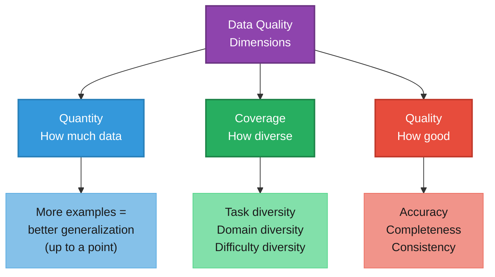

**Quantity.** More data generally leads to better models, but with diminishing returns. Research has shown that data quality matters more than quantity beyond a certain threshold. LIMA demonstrated that only 1,000 carefully curated examples could produce a surprisingly capable model, challenging the assumption that massive datasets are always necessary.

<div align="center">
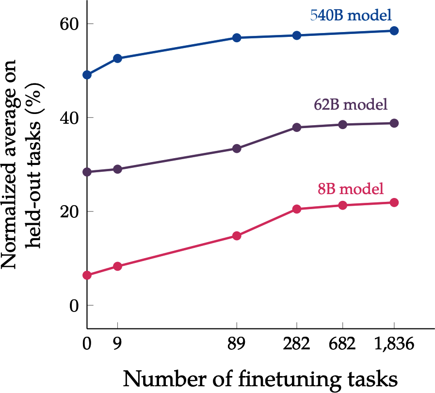
<br/>
<em>Figure 8-3. Performance gain curve with different dataset sizes</em>
</div>

**Coverage.** The dataset should cover the distribution of tasks and domains the model will encounter in production. Gaps in coverage lead to gaps in capability. If the training data contains no coding examples, the model will struggle with code. If it contains no multilingual data, it will underperform in non-English languages.

**Quality.** Each individual example should be correct, well-formed and representative of the desired behavior. A small number of high-quality examples can be more valuable than a large number of low-quality ones. The "garbage in, garbage out" principle applies with full force.

> "Garbage in, garbage out" has never been more true than in the context of finetuning language models. A model finetuned on poor data will confidently produce poor outputs.

> [!WARNING]
> Do not assume that more data is always better. A dataset of 10,000 high-quality, diverse examples can outperform a dataset of 100,000 noisy, repetitive examples. Always prioritize quality and coverage before scaling quantity.

## Data Augmentation and Synthesis

When the available training data is insufficient in quantity, coverage or quality, data augmentation and synthesis techniques can fill the gaps. This section covers both traditional and AI-powered approaches to generating additional training data.

### Why Data Synthesis

Data synthesis serves five primary purposes.

| Purpose | Description | Example |
|---|---|---|
| **Increase quantity** | Generate more training examples when the original dataset is small | Augmenting a 1K dataset to 50K through paraphrasing and template expansion |
| **Increase coverage** | Fill gaps in task or domain coverage | Generating coding examples in underrepresented programming languages |
| **Increase quality** | Create cleaner, more consistent examples than raw collected data | Using AI to rewrite messy, inconsistent human responses |
| **Mitigate privacy concerns** | Generate synthetic data that preserves statistical properties without exposing real user data | Creating synthetic medical records for training |
| **Distill capabilities** | Transfer knowledge from a large teacher model to a smaller student model | Using GPT-4 outputs to train a 7B parameter model |

### Traditional Data Synthesis Techniques

Traditional data synthesis predates the era of large language models and relies on programmatic, rule-based approaches. These techniques remain valuable because they are deterministic, fast, cheap and do not require access to a powerful AI model.

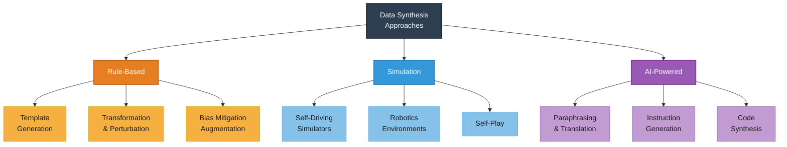

#### Rule-Based Synthesis

**Template-based generation** involves defining templates with slots that are filled programmatically. For example, a math problem template might be "What is {number1} {operation} {number2}?" where each slot is filled from a predefined set of values. This approach can generate large volumes of data quickly but produces relatively predictable patterns.

**Transformation-based augmentation** applies structured modifications to existing examples. For text data, this includes synonym replacement, random insertion, random swap and random deletion. For code, this includes variable renaming, code reformatting and dead code insertion. These transformations preserve the semantic meaning while changing the surface form.

**Perturbation** introduces controlled noise or modifications to create harder or more varied examples. Adding typos, changing word order slightly or injecting distractors into multiple-choice options are all forms of perturbation.

#### Bias Mitigation Through Augmentation

One powerful application of data augmentation is reducing bias in training data. By systematically modifying protected attributes in examples, the model can be trained to treat different demographic groups more equitably.

| Original Example | Augmented Example | Bias Addressed |
|---|---|---|
| "The doctor checked **his** patients." | "The doctor checked **her** patients." | Gender bias in profession association |
| "John, an engineer, solved the problem." | "Aisha, an engineer, solved the problem." | Name-based ethnic bias |
| "The young programmer was brilliant." | "The experienced programmer was brilliant." | Age bias in tech |
| "The American researcher published findings." | "The Nigerian researcher published findings." | Geographic bias |

This approach is sometimes called **counterfactual data augmentation**. The idea is to create matched pairs that differ only in the protected attribute, forcing the model to learn that the attribute is irrelevant to the task. Research has shown that this technique can measurably reduce bias in downstream model behavior while preserving task performance.

#### Simulation

Simulation generates training data by running scenarios in a simulated environment. This is especially valuable in domains where real-world data collection is expensive, dangerous or slow.

**Self-driving vehicles.** Companies like Waymo and Cruise generate billions of miles of simulated driving data, including rare edge cases (pedestrians darting into traffic, extreme weather, unusual road configurations) that would be impractical to collect from real driving.

**Robotics.** Simulated physics environments (MuJoCo, Isaac Gym, PyBullet) generate training data for robot manipulation, locomotion and navigation. Sim-to-real transfer remains challenging but has improved dramatically.

**Self-play.** In self-play, an AI agent plays against copies of itself to generate training data. This was the approach behind AlphaGo Zero and AlphaZero, which achieved superhuman performance without any human training data. The agent generates its own curriculum by playing against increasingly capable versions of itself.

### AI-Powered Data Synthesis

The advent of powerful language models has unlocked a new paradigm for data synthesis. Instead of relying on templates and rules, we can use AI models themselves to generate training data. This section covers the major approaches.

#### AI Simulations

**StableToolBench** generates synthetic tool-use scenarios by having AI models simulate API calls, user queries and multi-step tool interactions. This produces realistic training data for tool-use capabilities without requiring access to real APIs or real user traffic.

**Self-play for agents.** Extending the self-play concept beyond board games, language model agents can be pitted against each other in simulated environments. One agent plays the user, another plays the assistant, and their interactions generate conversational training data. This can produce diverse, realistic dialogue patterns at scale.

#### Paraphrasing and Translation

**MetaMath** used mathematical question rephrasing to augment a math training dataset. Each original math question was rephrased in multiple ways (rewording, adding context, changing numbers) while preserving the underlying mathematical structure. This simple technique produced significant gains in mathematical reasoning performance.

**Back-translation** translates text to another language and then translates it back, producing natural paraphrases that preserve meaning but change surface form. This technique, borrowed from machine translation research, is effective at increasing diversity in training sets.

#### Code Translation and Back-Translation

The **Llama 3** team used an innovative code data synthesis technique. They translated Python code to other programming languages (C++, Java, TypeScript, PHP) using a language model, then translated it back to Python. The round-trip translation produced novel but functionally equivalent Python programs, dramatically increasing the diversity of the code training set without requiring any new human-written code.

#### Instruction Data Synthesis

Several landmark approaches have been developed for synthesizing instruction data at scale.

**The Alpaca Approach.** Stanford's Alpaca project demonstrated that a small set of 175 seed instruction/response examples could be used to prompt GPT-3 to generate 52,000 additional examples. The process is straightforward. Provide the model with a few examples of well-formatted instructions and responses, then ask it to generate novel ones. The resulting dataset was used to finetune LLaMA 7B into an instruction-following model at a fraction of the cost of human annotation.

<div align="center">
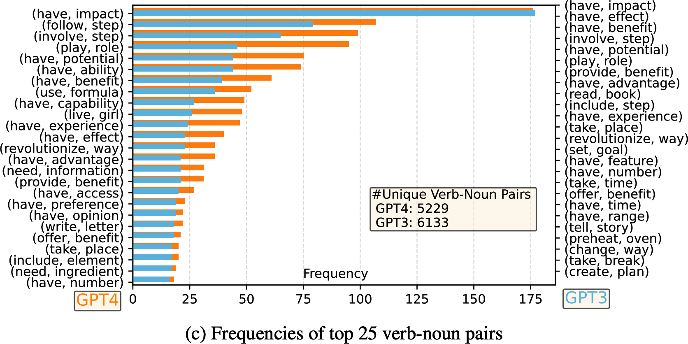
<br/>
<em>Figure 8-5. A seed task and generated task used to train Alpaca</em>
</div>


**The UltraChat Approach.** UltraChat took a more structured approach to instruction synthesis. Rather than generating instructions in a single shot, it decomposed the process into a hierarchy. First, select a broad topic. Then, generate subtopics within that topic. Then, generate specific instructions for each subtopic. Finally, generate responses for each instruction. This hierarchical approach produced more diverse and well-distributed instruction sets than the single-shot Alpaca method.

**The Reverse Instruction Approach.** Instead of generating a response for a given instruction, the reverse approach starts with high-quality existing content (articles, documentation, code) and generates instructions that the content could serve as a response to. This is particularly powerful because the internet is full of high-quality content that lacks corresponding instructions.

> The reverse instruction approach flips the typical synthesis pipeline. Rather than generating responses (which is hard to do well), it generates instructions for existing high-quality content (which is much easier). The content already exists and is already good. The model only needs to imagine what question it answers.

**Long-context finetuning with synthetic data.** For training models on long-context tasks, synthetic data is especially valuable because long, high-quality documents with corresponding instructions are rare. Teams have synthesized long-context training data by concatenating related documents, generating summaries and questions that span the full context and creating multi-hop reasoning chains.

**Llama 3 Coding Data Synthesis Pipeline.** The Llama 3 team developed an elaborate six-step pipeline for generating high-quality coding training data. This pipeline is one of the most detailed publicly documented data synthesis workflows.

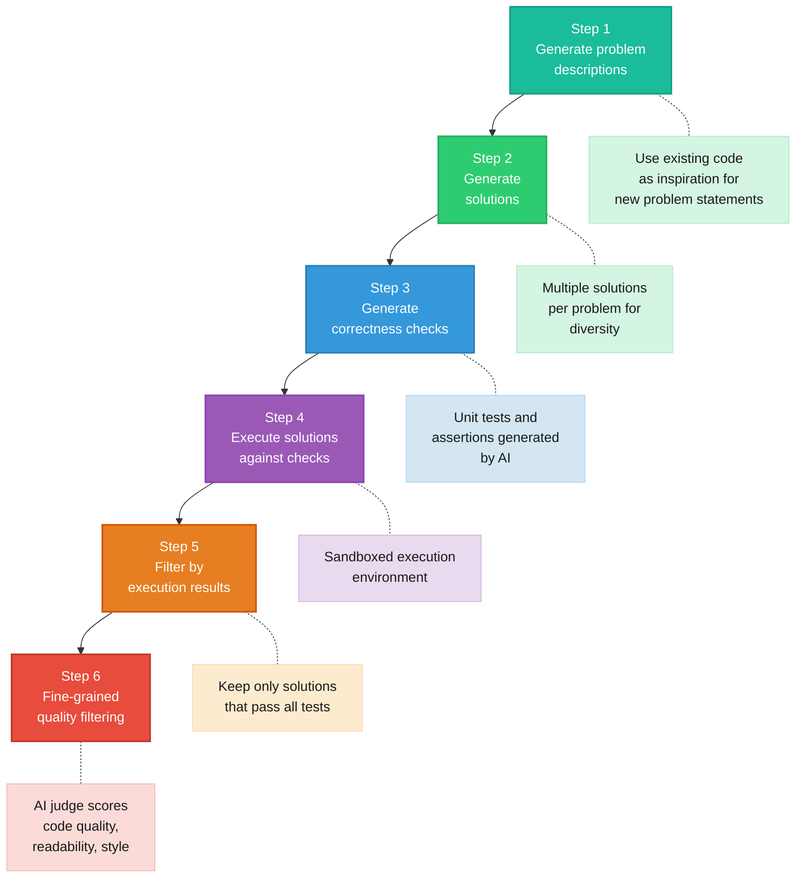

The six steps in detail.

1. **Generate problem descriptions.** Starting from existing open-source code, the team used a language model to generate novel problem descriptions inspired by real code patterns but sufficiently different to avoid duplication.

2. **Generate solutions.** For each problem description, multiple candidate solutions were generated. Producing multiple solutions per problem increased diversity and provided material for preference data.

3. **Generate correctness checks.** For each problem, the model generated unit tests and assertions that a correct solution should pass. These serve as automated verification criteria.

4. **Execute solutions against checks.** Each candidate solution was run in a sandboxed execution environment against the generated tests. This step provides ground-truth verification that no amount of AI judging can replace.

5. **Filter by execution results.** Only solutions that passed all generated tests were retained. This is a powerful quality gate because functional correctness is an objective, verifiable criterion.

6. **Fine-grained quality filtering.** The surviving solutions were further filtered by an AI judge that evaluated code quality, readability, style and efficiency. This final step ensured that the retained examples were not only correct but also exemplary.

> [!IMPORTANT]
> The Llama 3 coding pipeline illustrates a crucial principle. The best synthetic data pipelines combine AI generation with objective verification. Generation is cheap and fast. Verification is what separates good synthetic data from noise.

### Data Verification

After synthetic data is generated, it must be verified before use in training. Verification is the quality gate that prevents synthetic noise from contaminating the training set.

| Verification Approach | Mechanism | Best For | Limitations |
|---|---|---|---|
| **Functional correctness** | Execute code, run unit tests, check mathematical proofs | Code, math, logic tasks | Only works for verifiable domains |
| **AI verifiers and judges** | Use a strong model to score or rank outputs | Open-ended text, style, helpfulness | Biased toward the verifier's style |
| **Heuristic filtering** | Apply rules (length, format, keyword, perplexity) | Bulk filtering of obvious garbage | Cannot catch subtle quality issues |
| **Human spot-checking** | Random sample reviewed by humans | Final quality assurance | Does not scale, expensive |
| **Cross-validation** | Compare outputs from multiple generation runs | Consistency checking | Systematic errors shared across runs go undetected |

#### Functional Correctness

For domains where correctness can be objectively verified, automated execution is the gold standard. Code can be compiled and tested. Math solutions can be checked against known answers. Logical proofs can be verified by proof checkers. This approach provides the strongest quality signal but is limited to verifiable domains.

#### AI Verifiers and Judges

When functional verification is not possible (for example, for creative writing, summarization or general question-answering), a strong AI model can serve as a judge. The judge model evaluates each synthetic example on dimensions like accuracy, helpfulness, clarity and relevance. This approach is scalable and often surprisingly effective, but it inherits the biases and limitations of the judge model.

#### Heuristic Filtering

Simple rule-based filters can catch obvious problems. Removing responses that are too short, too long, contain formatting errors, repeat themselves excessively or contain known low-quality patterns. Heuristic filters are fast and cheap but catch only surface-level issues.

> [!TIP]
> A robust verification pipeline should combine multiple approaches. Use heuristic filters to remove obvious garbage, AI judges to score the remaining examples, functional verification where applicable and human spot-checking on a random sample to calibrate the entire pipeline.

### Limitations of AI-Generated Data

Despite its power, AI-generated synthetic data has important limitations that practitioners must understand.

| Limitation | Description | Mitigation |
|---|---|---|
| **Quality control** | Synthetic data can contain subtle errors that are hard to detect at scale | Multi-stage verification, human spot-checking |
| **Superficial imitation** | Student models may copy surface patterns without learning deep capabilities | Diverse training sources, evaluation on held-out tasks |
| **Model collapse** | Recursive training on AI-generated data degrades model quality | Maintain access to human-generated data, limit recursion depth |
| **Obscured data lineage** | Difficult to trace the provenance and licensing of AI-generated data | Document generation pipelines, track seed data sources |

#### Quality Control

> "Garbage in, garbage out" applies with particular force to synthetic data. If the generation model is flawed, its flaws propagate into the training data and then into the student model.

Subtle factual errors, hallucinations and reasoning mistakes in synthetic data are difficult to detect at scale. A response that *sounds* correct and well-structured may contain a factual error that only a domain expert would catch. When thousands of such examples enter the training set, the model learns to produce confident-sounding but incorrect outputs.

#### Superficial Imitation

The paper "The False Promise of Imitating Proprietary LLMs" demonstrated that models trained on synthetic data from a stronger model often learn to *imitate the style* of the teacher without acquiring its *capabilities*. The student model produces outputs that sound like GPT-4 but fail on rigorous benchmarks. The surface form is copied, the underlying reasoning is not.

<div align="center">
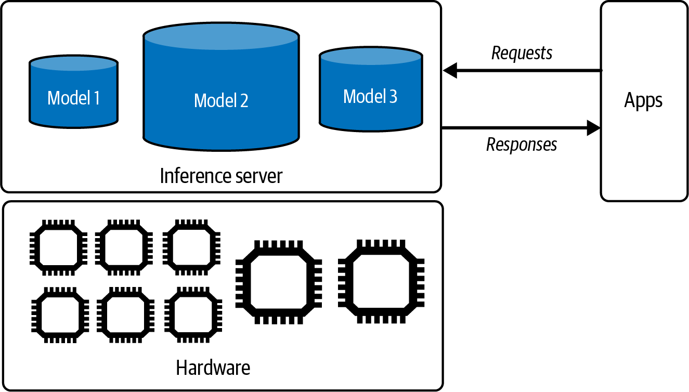
<br/>
<em>Figure 8-7. Distribution of response length for GPT-4 and GPT-3</em>
</div>

This happens because instruction data primarily teaches the model *how to format and present* responses, not *what to know*. Knowledge comes from pretraining. Finetuning on synthetic data adjusts the presentation layer, which creates an illusion of capability that evaporates under closer scrutiny.

#### Model Collapse

Shumailov et al. demonstrated that **recursively using AI-generated data in training causes irreversible defects in the resulting models**. When a model is trained on data generated by a previous version of itself, and this process is repeated over multiple generations, the model's output distribution progressively degenerates. Rare but important features of the original data distribution are gradually lost, and the model converges to a narrow, impoverished output space.

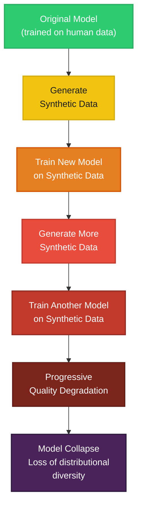

> [!WARNING]
> Model collapse is an existential risk for the AI ecosystem as a whole. As AI-generated content proliferates on the internet, future models trained on web-scraped data will inevitably consume AI-generated text, potentially triggering collapse dynamics even without deliberate recursive training.

#### Obscured Data Lineage

> "AI generation obscures data lineage." When a model generates synthetic data, it becomes nearly impossible to trace which original training examples contributed to a particular synthetic output.

This creates legal, ethical and practical challenges. If the original training data contained copyrighted material, does the synthetic data derived from it inherit that copyright? If the original data contained biases, do they propagate through the synthetic generation process? Without clear data lineage, these questions become very difficult to answer.

## Model Distillation

### What Is Distillation

Model distillation is the process of transferring knowledge from a large, capable **teacher model** to a smaller, more efficient **student model**. The teacher generates training data (or soft probability distributions) that the student learns from. The goal is to produce a student model that retains much of the teacher's capability while being cheaper and faster to run in production.

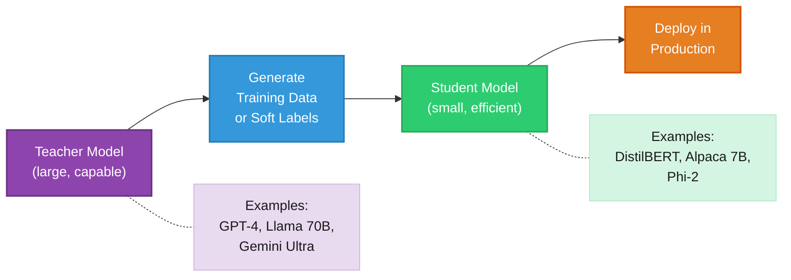

### Distillation in Practice

**DistilBERT** was one of the earliest and most successful distillation projects. By distilling BERT into a model 40% smaller, DistilBERT retained 97% of BERT's language understanding capabilities while being 60% faster. The key innovation was training the student on the teacher's soft probability distributions (the full output distribution over the vocabulary) rather than just the hard labels. Soft labels contain richer information because they encode the teacher's uncertainty and the relative plausibility of different outputs.

**Alpaca** is another prominent distillation example, though it uses a different mechanism. Instead of soft labels, Alpaca distills GPT-3's capabilities by generating instruction/response pairs and using them as standard supervised training data for LLaMA 7B. This approach is sometimes called "black-box distillation" because it only requires API access to the teacher, not access to its internal weights or probability distributions.

**BuzzFeed** used a creative adaptation of distillation. They generated synthetic data using a large model, then finetuned a smaller model with adapters (LoRA) on that data. This combination of synthetic data generation with parameter-efficient finetuning proved cost-effective for production deployment.

**NVIDIA Nemotron-4** demonstrated a remarkable outcome. The student model trained on synthetic data generated by the teacher actually *outperformed the teacher* on several benchmarks. This happens because the distillation process, combined with careful data curation and verification, can produce a more focused and efficient student than the generalist teacher.

> [!NOTE]
> Distillation is not always a one-way transfer. In some cases, the student can outperform the teacher. This typically happens when the distillation pipeline includes strong verification, and the student benefits from a more focused, higher-quality training set than the teacher originally had.

### Model Bootstrapping

Model bootstrapping uses the reverse instruction approach in a distillation context. Start with a base model and a corpus of high-quality text. Use the model to generate instructions for the existing text. Finetune the model on these (instruction, text) pairs. Then repeat. Each iteration produces a slightly more capable model that can generate better instructions in the next round.

This self-improving loop is limited by the risks of model collapse discussed earlier, but when applied carefully over a small number of iterations with strong verification, it can bootstrap a base model into a reasonably capable instruction-following model without any external teacher.

## Data Processing

Once data has been collected, augmented and verified, it must be processed into a format suitable for training. Data processing involves four main stages.

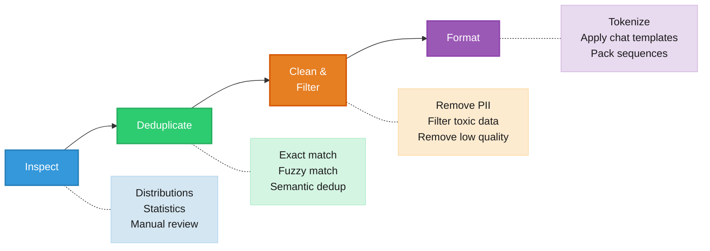

### Inspect Data

Before doing anything else, inspect the data thoroughly.

**Distribution analysis.** Look at the distribution of response lengths, instruction types, task categories and language. Skewed distributions lead to biased models. If 80% of your data is question-answering and only 2% is creative writing, the model's creative writing ability will suffer.

**Basic statistics.** Compute summary statistics for numerical properties. Token counts, unique instruction counts, response length distributions, vocabulary diversity. Outliers in these statistics often point to data quality issues.

**Manual inspection.** Read examples. This cannot be overstated.

> "Manual inspection of data has probably the highest value-to-prestige ratio of any activity in machine learning."
> Greg Brockman

Read at least 100 random examples from your dataset. Read examples from the tails of the distribution (shortest responses, longest responses, most unusual instructions). Read examples that an AI judge scored highly and examples it scored poorly. This manual review will reveal problems that no automated metric can catch. Formatting inconsistencies, cultural biases, factual errors, instruction ambiguities and response quality issues all become visible through careful reading.

> [!TIP]
> Create a systematic inspection checklist. For each example you review, check for factual accuracy, instruction clarity, response completeness, formatting consistency and appropriateness. Track the frequency of different issue types to prioritize your data cleaning efforts.

### Deduplicate Data

Duplicate data causes models to memorize specific examples rather than learning general patterns. It also wastes training compute on redundant information. Deduplication should be performed at multiple levels.

| Method | Mechanism | Pros | Cons |
|---|---|---|---|
| **Exact deduplication** | Hash each example and remove exact matches | Fast, simple, no false positives | Misses near-duplicates |
| **Fuzzy deduplication (MinHash/LSH)** | Compute similarity signatures and cluster similar examples | Catches near-duplicates, scalable | Requires tuning similarity thresholds |
| **N-gram overlap** | Compare n-gram overlap between example pairs | Intuitive, catches paraphrases | Quadratic complexity without optimization |
| **Embedding-based deduplication** | Compute embeddings and cluster by cosine similarity | Catches semantic duplicates | Expensive to compute, threshold-sensitive |
| **Suffix array deduplication** | Find repeated substrings across the dataset | Catches shared passages within longer texts | Complex implementation |

**Exact deduplication** is the simplest approach. Compute a hash (MD5, SHA-256) of each example and remove duplicates. This catches verbatim copies but misses examples that differ by whitespace, punctuation or trivial formatting changes.

**Fuzzy deduplication** using MinHash and Locality-Sensitive Hashing (LSH) catches near-duplicates efficiently. Each document is represented as a set of n-grams, and MinHash computes a compact signature that approximates the Jaccard similarity between sets. LSH then efficiently groups documents with similar signatures. This approach scales to millions of documents and catches most practical duplicates.

**Embedding-based deduplication** computes dense vector representations of each example and identifies clusters of semantically similar examples. This catches cases where the same content is expressed in completely different words. The downside is computational cost. Computing embeddings for millions of examples requires significant GPU resources.

### Clean and Filter Data

Data cleaning removes or corrects problematic examples. This stage involves several distinct operations.

**Remove formatting artifacts.** Training data scraped from the web or extracted from documents often contains HTML tags, markdown artifacts, special tokens from other systems or encoding errors. These should be cleaned or removed.

**Remove personally identifiable information (PII).** Email addresses, phone numbers, physical addresses, social security numbers and other PII should be identified and removed or anonymized. This is both a legal requirement under regulations like GDPR and an ethical imperative. Tools like Microsoft Presidio and custom regex patterns can automate PII detection.

**Filter toxic and harmful content.** Training data may contain hate speech, explicit content, personal attacks or other harmful material. Classification models trained on labeled toxicity datasets can flag problematic examples. The threshold for filtering depends on the intended use case. A model intended for children's education should be filtered more aggressively than a general-purpose assistant.

**Remove low-quality examples.** Examples with very short responses, responses that do not address the instruction, responses that are clearly wrong or responses that are incoherent should be removed. Perplexity scoring (using a reference language model) can identify examples that are statistically unusual, which often correlates with low quality. AI judges can provide more nuanced quality scores.

> [!WARNING]
> Be careful not to over-filter. Aggressive filtering can inadvertently remove examples from underrepresented groups, topics or styles, reducing the diversity of the training set. Always monitor the demographic and topical distribution before and after filtering.

### Format Data

The final processing step converts cleaned data into the format expected by the training pipeline.

**Tokenization.** The text must be tokenized using the same tokenizer that the model was pretrained with. Using a different tokenizer, or even a different version of the same tokenizer, will produce incorrect token IDs and degrade performance. Always verify that the tokenizer version matches the model exactly.

**Chat templates.** Modern instruction-tuned models use specific chat template formats that define how system messages, user messages and assistant messages are structured. Common formats include ChatML, Llama's format and Mistral's format. Each uses different special tokens to delineate turns and roles.

For example, a ChatML-formatted example looks like this.

```
<|im_start|>system
You are a helpful assistant.<|im_end|>
<|im_start|>user
What is photosynthesis?<|im_end|>
<|im_start|>assistant
Photosynthesis is the process by which plants convert sunlight...<|im_end|>
```

The exact template must match the model's expected format. Using the wrong template is a common and costly mistake that leads to degraded performance or training instabilities.

**Sequence packing.** To maximize GPU utilization, multiple short examples can be packed into a single training sequence up to the model's maximum context length. Attention masks must be set correctly to prevent cross-contamination between packed examples. This is a technical detail but an important one for training efficiency.

> [!IMPORTANT]
> Always validate a small batch of formatted examples before launching a training run. Decode the token IDs back to text and verify that the special tokens, turn boundaries and content are all correct. A formatting bug can waste days of GPU time.

## Summary

Dataset engineering is the foundation on which successful post-training is built. The key takeaways from this chapter are as follows.

**Data types.** Post-training requires instruction data (for SFT) and preference data (for RLHF/DPO). Each has distinct formats, quality requirements and collection challenges.

**Quality dimensions.** Training data quality depends on quantity, coverage and quality. Beyond a certain quantity threshold, improving coverage and quality yields greater returns than simply adding more data.

**Data synthesis is transformative.** AI-powered data synthesis, especially when combined with rigorous verification, can produce training datasets that rival or exceed human-annotated ones in effectiveness. The Llama 3 coding pipeline exemplifies the sophisticated, multi-stage approach that leading teams use.

**Verification is essential.** Synthetic data without verification is noise. The strongest verification combines functional correctness checks (where applicable), AI judges, heuristic filters and human spot-checking.

**Distillation works.** Transferring knowledge from a large teacher to a small student via synthetic data is a proven, practical technique. In some cases, the student can even outperform the teacher.

**Data processing matters.** Inspection, deduplication, cleaning and formatting are not glamorous but they are essential. Manual data inspection, in particular, has an outsized impact on final model quality.

**Beware of limitations.** Superficial imitation, model collapse, quality control and obscured data lineage are real risks of AI-generated data. These risks can be mitigated but not eliminated.

> Data is the most undervalued ingredient in AI engineering. The teams that invest most heavily in data quality, diversity and verification consistently produce the best models, regardless of the architecture or training algorithm they use.

[Previous: Chapter 7 - Finetuning](07-finetuning.md) | [Next: Chapter 9 - Inference Optimization](09-inference-optimization.md)
