# Chapter 9. Inference Optimization

[Previous: Chapter 8 - Dataset Engineering](08-dataset-engineering.md) | [Next: Chapter 10 - AI Engineering Architecture and User Feedback](10-ai-engineering-architecture-and-user-feedback.md)

> "Inference can exceed the cost of training in commonly used systems, and inference accounts for up to 90% of the machine learning costs for deployed AI systems."
> Chip Huyen

Inference optimization is the discipline of making AI models run faster, cheaper and more efficiently in production. While training a model happens once (or a few times), inference happens millions or billions of times over the lifetime of a deployed system. This chapter provides a comprehensive guide to the techniques, hardware considerations and system level strategies that make inference practical at scale. From numerical precision and GPU memory hierarchies to speculative decoding and continuous batching, every layer of the inference stack offers opportunities for dramatic improvement.

<div align="center">
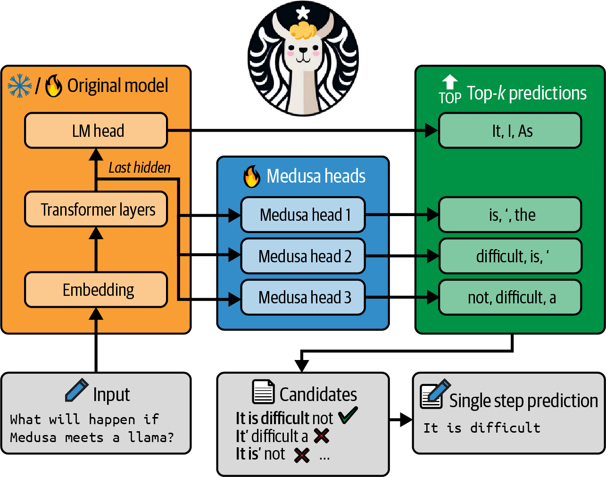
<br/>
<em>Figure 9-1. A simple inference service</em>
</div>

## Table of Contents

- [Understanding Inference Optimization](#understanding-inference-optimization)
  - [Inference Metrics](#inference-metrics)
  - [Prefill vs Decode Phases](#prefill-vs-decode-phases)
  - [Compute Bound vs Memory Bandwidth Bound](#compute-bound-vs-memory-bandwidth-bound)
  - [Model FLOP/s Utilization](#model-flops-utilization)
  - [Numerical Representations](#numerical-representations)
  - [Hardware Foundations](#hardware-foundations)
  - [Selecting Accelerators](#selecting-accelerators)
- [Model Optimization](#model-optimization)
  - [Model Compression](#model-compression)
  - [Overcoming the Autoregressive Decoding Bottleneck](#overcoming-the-autoregressive-decoding-bottleneck)
  - [Attention Mechanism Optimization](#attention-mechanism-optimization)
  - [Kernels and Compilers](#kernels-and-compilers)
- [Inference Service Optimization](#inference-service-optimization)
  - [Batching Strategies](#batching-strategies)
  - [Decoupling Prefill and Decode](#decoupling-prefill-and-decode)
  - [Prompt Caching](#prompt-caching)
  - [Parallelism Strategies](#parallelism-strategies)
- [Summary](#summary)
- [Practitioner Checklist](#practitioner-checklist)

## Understanding Inference Optimization

Before diving into specific optimization techniques, it is essential to understand the metrics that define inference performance, the phases of text generation, the hardware that powers it all and the numerical formats that govern precision and speed tradeoffs.

```mermaid
graph TD
    A["Inference Optimization"] --> B["Model Level"]
    A --> C["Hardware Level"]
    A --> D["Service Level"]

    B --> B1["Compression<br/>(Quantization, Distillation, Pruning)"]
    B --> B2["Decoding Strategies<br/>(Speculative, Parallel)"]
    B --> B3["Attention Optimization<br/>(KV Cache, FlashAttention)"]
    B --> B4["Kernels and Compilers"]

    C --> C1["GPU Architecture"]
    C --> C2["Memory Hierarchy"]
    C --> C3["Specialized AI Chips"]
    C --> C4["Numerical Precision"]

    D --> D1["Batching<br/>(Static, Dynamic, Continuous)"]
    D --> D2["Prompt Caching"]
    D --> D3["Parallelism<br/>(Replica, Tensor, Pipeline)"]
    D --> D4["Prefill/Decode<br/>Decoupling"]

    style A fill:#1a1a2e,stroke:#e94560,color:#ffffff
    style B fill:#16213e,stroke:#0f3460,color:#ffffff
    style C fill:#16213e,stroke:#0f3460,color:#ffffff
    style D fill:#16213e,stroke:#0f3460,color:#ffffff
    style B1 fill:#0f3460,stroke:#533483,color:#ffffff
    style B2 fill:#0f3460,stroke:#533483,color:#ffffff
    style B3 fill:#0f3460,stroke:#533483,color:#ffffff
    style B4 fill:#0f3460,stroke:#533483,color:#ffffff
    style C1 fill:#0f3460,stroke:#533483,color:#ffffff
    style C2 fill:#0f3460,stroke:#533483,color:#ffffff
    style C3 fill:#0f3460,stroke:#533483,color:#ffffff
    style C4 fill:#0f3460,stroke:#533483,color:#ffffff
    style D1 fill:#0f3460,stroke:#533483,color:#ffffff
    style D2 fill:#0f3460,stroke:#533483,color:#ffffff
    style D3 fill:#0f3460,stroke:#533483,color:#ffffff
    style D4 fill:#0f3460,stroke:#533483,color:#ffffff
```

### Inference Metrics

Inference performance is measured across two primary dimensions. **Latency** captures how quickly an individual request is served. **Throughput** captures how many requests or tokens a system can handle over time. Understanding these metrics is the foundation for every optimization decision.

There is a fundamental tension between latency and throughput. Techniques that maximize throughput (like large batch sizes) often increase individual request latency. Conversely, optimizing for minimum latency (processing one request at a time) wastes hardware capacity. Production systems must carefully balance these competing objectives based on application requirements.

| Metric | Full Name | Definition | Optimizing For |
|--------|-----------|------------|----------------|
| **TTFT** | Time to First Token | Time from when a request is sent until the first token is generated | Interactive applications, chat UIs, streaming |
| **TPOT** | Time Per Output Token | Average time to generate each subsequent token after the first | Smooth streaming experience |
| **Total Latency** | End to End Latency | Total time from request to final token. Equals TTFT + (TPOT x number of output tokens) | Batch processing, non interactive workloads |
| **TPS** | Tokens Per Second | Number of tokens generated per second across all requests | System capacity planning |
| **RPS** | Requests Per Second | Number of complete requests handled per second | API throughput and scaling |

> [!IMPORTANT]
> TTFT and TPOT often have **opposing optimization strategies**. Reducing TTFT may require prioritizing prefill computation, while reducing TPOT requires optimizing the decode phase. System designers must decide which metric matters most for their use case.

**Latency** is what individual users feel. A chatbot needs low TTFT so users see a response starting quickly, and low TPOT so the streaming text appears fluid. **Throughput** is what system operators care about. Higher throughput means more users served per GPU, which directly translates to lower cost per request.

### Prefill vs Decode Phases

Autoregressive text generation happens in two distinct phases, each with fundamentally different computational characteristics.

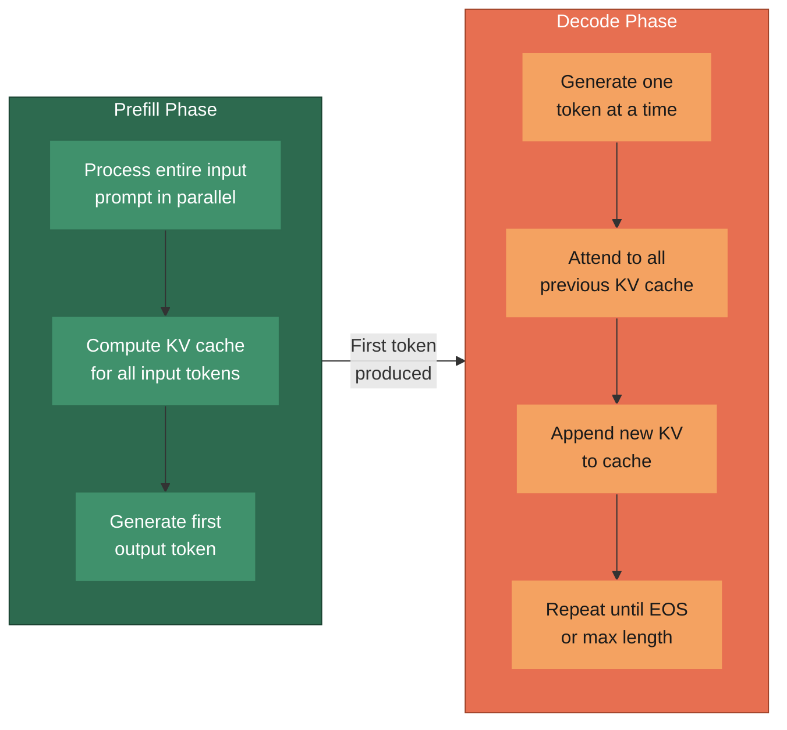

**Prefill phase.** The entire input prompt is processed in parallel. All input tokens are fed through the model simultaneously, and the key value (KV) pairs for each token at each layer are computed and stored. This phase is **compute bound** because the GPU is performing a large number of floating point operations on the full prompt. The duration of the prefill phase determines **TTFT**.

**Decode phase.** Tokens are generated one at a time, autoregressively. Each new token requires attending to all previously generated KV pairs. This phase is **memory bandwidth bound** because at each step, only a single token is processed, but the entire KV cache must be read from GPU memory. The GPU's arithmetic units are underutilized while waiting for memory reads to complete. The speed of the decode phase determines **TPOT**.

<div align="center">
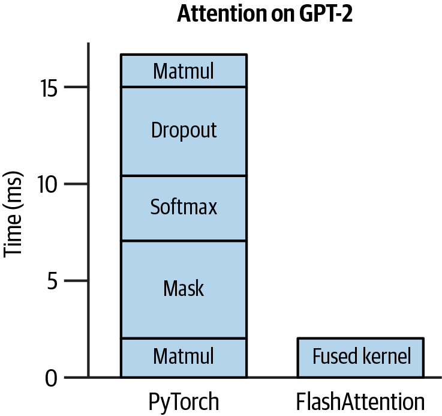
<br/>
<em>Figure 9-3. Prefilling and decoding phases</em>
</div>

> [!NOTE]
> The distinction between prefill and decode is critical for understanding why different optimization techniques target different phases. Techniques like prompt caching and FlashAttention primarily help the prefill phase, while speculative decoding and KV cache optimization primarily help the decode phase.

### Compute Bound vs Memory Bandwidth Bound

An operation is **compute bound** when the bottleneck is the number of floating point operations the hardware can perform. An operation is **memory bandwidth bound** when the bottleneck is how quickly data can be moved from memory to the compute units. This distinction is captured by the concept of **arithmetic intensity**, which is the ratio of floating point operations to bytes accessed from memory.

If the arithmetic intensity of an operation exceeds the hardware's **ops:byte ratio** (the ratio of peak FLOP/s to peak memory bandwidth), the operation is compute bound. Otherwise, it is memory bandwidth bound.

<div align="center">
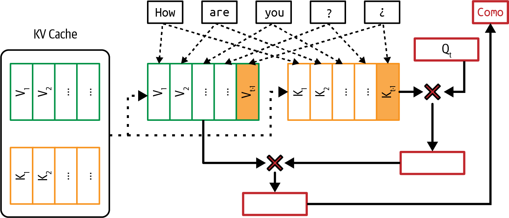
<br/>
<em>Figure 9-2. Roofline chart for analyzing compute vs memory bottlenecks</em>
</div>

For transformer inference:
- **Prefill** with large batch sizes or long prompts tends to be **compute bound**. There are many tokens to process, and the matrix multiplications have high arithmetic intensity.
- **Decode** with small batch sizes tends to be **memory bandwidth bound**. Processing a single token requires reading the full model weights and the entire KV cache from memory, but performs relatively few operations per byte read.

### Model FLOP/s Utilization

**MFU (Model FLOP/s Utilization)** measures how efficiently the hardware is being used. It is the ratio of the actual FLOP/s achieved during model execution to the theoretical peak FLOP/s of the hardware.

```
MFU = (Actual Model FLOP/s) / (Hardware Peak FLOP/s)
```

In practice, MFU is often surprisingly low. Achieving 30 to 50% MFU during training is considered good. During inference, MFU can be even lower, especially during the memory bandwidth bound decode phase. Low MFU during decode is not necessarily a sign of poor engineering. It reflects the fundamental nature of autoregressive generation, where the bottleneck is moving data rather than computing on it.

A useful related concept is **MBU (Model Bandwidth Utilization)**, which measures how efficiently memory bandwidth is being used during memory bandwidth bound operations. For the decode phase, MBU is often a more meaningful metric than MFU. If MBU is high but MFU is low, the system is efficiently using its memory bandwidth but simply cannot compute faster because it is waiting for data. Optimizing further requires either reducing the amount of data that needs to be read (through quantization or smaller KV caches) or using hardware with higher memory bandwidth.

### Numerical Representations

The choice of numerical precision directly impacts model size, memory usage, computation speed and model quality. Lower precision formats use fewer bits per number, enabling faster computation and smaller memory footprints at the cost of reduced numerical range and precision.

| Format | Bits | Exponent Bits | Mantissa Bits | Approximate Range | Primary Use Case |
|--------|------|---------------|---------------|-------------------|-----------------|
| **FP32** | 32 | 8 | 23 | ±3.4 x 10^38 | Training (traditional default), master weights |
| **TF32** | 19 | 8 | 10 | ±3.4 x 10^38 | Training on NVIDIA Ampere+, drop in FP32 replacement |
| **FP16** | 16 | 5 | 10 | ±65,504 | Mixed precision training, inference |
| **BF16** | 16 | 8 | 7 | ±3.4 x 10^38 | Training and inference on modern GPUs, preferred for LLMs |
| **INT8** | 8 | N/A | N/A | -128 to 127 | Post training quantization, inference |
| **FP8 (E4M3)** | 8 | 4 | 3 | ±448 | Training and inference on Hopper+ GPUs |
| **FP8 (E5M2)** | 8 | 5 | 2 | ±57,344 | Gradient representation during training |
| **FP4** | 4 | 2 | 1 | Limited | Aggressive inference quantization |
| **INT4** | 4 | N/A | N/A | -8 to 7 | Weight only quantization for inference |

> [!TIP]
> **BF16** has become the preferred format for large language model training and inference. It offers the same dynamic range as FP32 (thanks to its 8 exponent bits) while using half the memory. This means fewer overflow/underflow issues compared to FP16, at the cost of slightly less precision in the mantissa.

The relationship between precision and model quality is not always linear. Many models can be quantized to INT8 or even INT4 with minimal quality degradation when proper quantization techniques are applied (covered in Chapter 7). The key insight is that not all parameters need the same precision, and weights tend to be more tolerant of lower precision than activations.

### Hardware Foundations

Understanding the hardware that powers inference is essential for making informed optimization decisions. The architecture of the accelerator determines which operations are fast, which are slow and where the bottlenecks lie.

#### CPU vs GPU Architecture

**CPUs** are designed for sequential, complex tasks. They have a small number of powerful cores (typically 8 to 128), large caches, and sophisticated branch prediction and out of order execution capabilities. CPUs excel at tasks with complex control flow but are poorly suited for the massively parallel matrix operations that dominate neural network inference.

**GPUs** are designed for massive parallelism. A modern GPU like the NVIDIA H100 has thousands of simpler cores organized into streaming multiprocessors (SMs). These cores can perform thousands of floating point operations simultaneously, making GPUs ideal for the matrix multiplications that are the core computation in transformer models.

The fundamental difference comes down to how transistors are allocated. CPUs devote the majority of their transistor budget to control logic, caches and branch predictors, giving each core the ability to handle complex, unpredictable workloads efficiently. GPUs instead devote most transistors to arithmetic logic units (ALUs), trading single threaded performance for raw parallel throughput. A single CPU core might be 10x faster than a single GPU core for sequential tasks, but a GPU with thousands of cores delivers 100x or more aggregate throughput for parallel workloads like matrix multiplication.

#### Specialized AI Chips

The demand for AI compute has spawned a diverse ecosystem of specialized accelerators.

- **NVIDIA GPUs (A100, H100, B200).** The dominant platform for AI training and inference. NVIDIA's CUDA ecosystem provides a massive software advantage.
- **Google TPUs (Tensor Processing Units).** Custom ASICs designed specifically for neural network workloads. TPUs use a systolic array architecture optimized for matrix multiplications and are tightly integrated with Google Cloud and JAX/TensorFlow.
- **Intel Gaudi.** Designed as a cost effective alternative to NVIDIA GPUs for training and inference.
- **Groq LPU (Language Processing Unit).** An inference focused chip using a deterministic architecture that avoids the memory bandwidth bottleneck by using large on chip SRAM instead of external HBM.
- **AWS Inferentia and Trainium.** Amazon's custom chips for inference and training respectively, optimized for cost efficiency on AWS.

> [!NOTE]
> The distinction between **training chips** and **inference chips** is important. Training requires high precision (FP32/BF16), large memory for optimizer states and fast chip to chip communication for distributed training. Inference can often use lower precision (INT8/INT4), needs less memory per model, but must optimize for latency and throughput per dollar.

#### Computational Capabilities

The NVIDIA H100 SXM demonstrates how computational throughput scales with reduced precision.

| Precision | Peak FLOP/s (H100 SXM) | Relative to FP32 |
|-----------|------------------------|-------------------|
| **FP64** | 34 TFLOP/s | 0.5x |
| **FP32** | 67 TFLOP/s | 1x |
| **TF32** | 989 TFLOP/s | ~15x |
| **BF16 / FP16** | 1,979 TFLOP/s | ~30x |
| **FP8** | 3,958 TFLOP/s | ~59x |
| **INT8** | 3,958 TOPS | ~59x |

The massive throughput gains from lower precision formats explain why quantization is one of the most impactful optimization techniques. Moving from FP32 to FP8 provides nearly a 60x increase in peak computational throughput.

<div align="center">
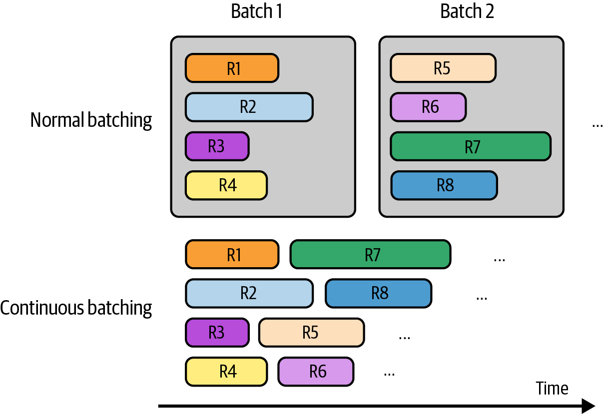
<br/>
<em>Figure 9-6. Different compute primitives</em>
</div>

#### Memory Hierarchy

Understanding the memory hierarchy is critical for inference optimization because the decode phase is memory bandwidth bound. Data must travel through multiple levels of memory, each with dramatically different capacity and bandwidth characteristics.

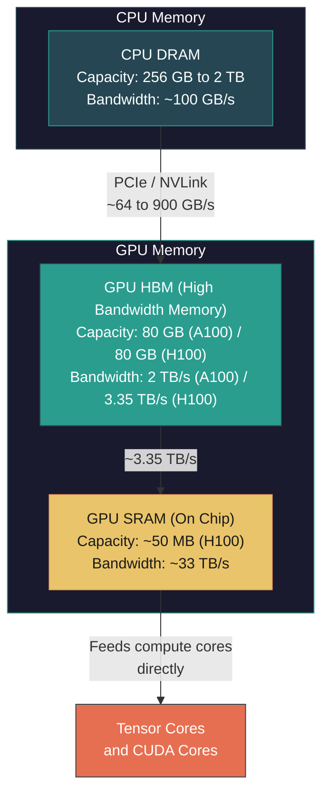

The key insight is the enormous gap between HBM bandwidth and SRAM bandwidth. **FlashAttention** exploits this gap by restructuring the attention computation to minimize HBM reads and maximize work done in SRAM.

#### Memory Bandwidth and Power Consumption

> "Electricity is a bottleneck to scaling up compute."
> Chip Huyen

Memory bandwidth is often the true bottleneck for inference. During the decode phase, generating each token requires reading the entire model weights from HBM. For a 70B parameter model in FP16, that means reading 140 GB of data per token. Even with HBM3 bandwidth of 3.35 TB/s on an H100, this limits generation speed fundamentally.

<div align="center">
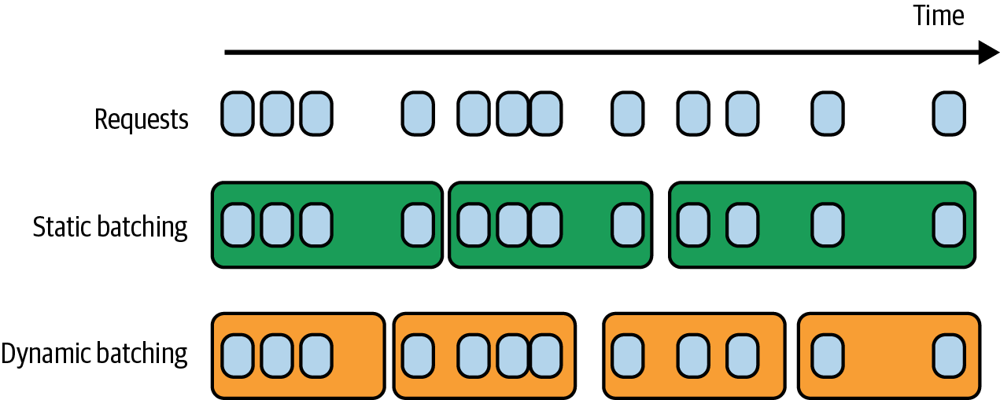
<br/>
<em>Figure 9-5. Bandwidth utilization for Llama 2-70B across different chips</em>
</div>

Power consumption is an increasingly important consideration. A single NVIDIA H100 SXM draws up to 700W. A cluster of thousands of GPUs consumes megawatts of power, requiring massive cooling infrastructure. The environmental impact of large scale AI inference is significant and growing. Data center operators report that power availability is now the primary constraint on building new AI compute capacity, ahead of capital cost or chip supply. This has driven interest in more power efficient inference chips and techniques like quantization that reduce the total computation (and therefore energy) required per token.

### Selecting Accelerators

Choosing the right accelerator involves balancing multiple factors.

- **Workload characteristics.** Is the workload compute bound (large batch inference, long prompts) or memory bandwidth bound (single request, short prompts with long outputs)?
- **Model size.** Does the model fit in a single GPU's memory, or does it require model parallelism across multiple devices?
- **Precision requirements.** Can the model be quantized to INT8 or INT4, or does it require BF16/FP16?
- **Cost.** What is the total cost of ownership including hardware, power, cooling and software engineering effort?
- **Software ecosystem.** NVIDIA's CUDA ecosystem is the most mature, with the broadest library and tool support. Alternative chips may offer better price/performance but require more engineering effort.
- **Latency vs throughput.** Some accelerators (like Groq's LPU) are optimized for ultra low latency at the cost of throughput. Others optimize for throughput at the cost of latency.
- **Availability and supply.** GPU supply constraints have been a real bottleneck for many organizations. Cloud availability, lead times for hardware procurement and the ability to scale up or down should factor into accelerator decisions.
- **Future proofing.** Consider whether the accelerator supports emerging precision formats (FP8, INT4), upcoming model architectures and growing context lengths that demand more memory capacity and bandwidth.

> [!WARNING]
> Do not select hardware based solely on peak FLOP/s. Real world performance depends on memory bandwidth, software support and how well the workload maps to the hardware architecture. A chip with lower peak FLOP/s but higher memory bandwidth may outperform a "faster" chip for memory bandwidth bound inference workloads.

## Model Optimization

Model optimization techniques modify the model itself to make it faster or smaller. These range from compression methods that reduce model size to architectural changes that fundamentally alter how inference is performed. The techniques in this section can be applied regardless of the serving infrastructure being used, making them portable across deployment environments.

The following diagram summarizes the relationship between model optimization techniques and the bottlenecks they address.

<div align="center">
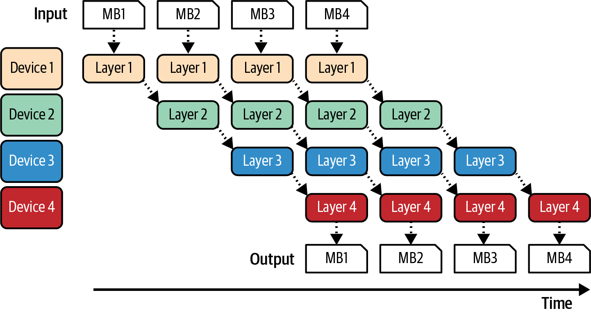
<br/>
<em>Figure 9-8. Inference optimization techniques overview</em>
</div>

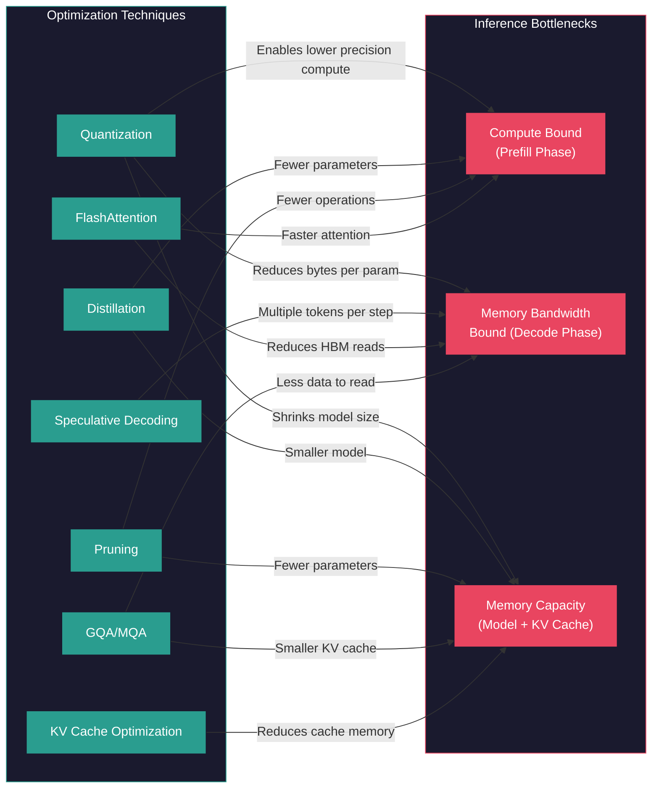

### Model Compression

Model compression reduces the size and computational cost of a model while attempting to preserve its quality. Three primary techniques are used.

| Technique | How It Works | Quality Impact | Speed Impact | When to Use |
|-----------|-------------|----------------|-------------|-------------|
| **Quantization** | Reduces numerical precision of weights and/or activations (e.g., FP16 to INT8) | Minimal with proper calibration | 2 to 4x speedup typical | Almost always. First optimization to try |
| **Distillation** | Trains a smaller "student" model to mimic a larger "teacher" model | Moderate. Student is smaller but learns from teacher's distribution | Proportional to student size reduction | When you can afford the training cost and need a fundamentally smaller model |
| **Pruning** | Removes individual weights (unstructured) or entire neurons/heads (structured) | Varies. Structured pruning has more impact | Depends on sparsity level and hardware support | When hardware supports sparse computation efficiently |

#### Quantization

Quantization is covered in depth in Chapter 7. The key points for inference optimization are that quantization reduces memory footprint (enabling larger batch sizes and fitting bigger models on fewer GPUs), reduces memory bandwidth requirements (critical for the memory bandwidth bound decode phase) and can leverage lower precision tensor cores for faster computation.

#### Distillation

Knowledge distillation is covered in Chapter 8. For inference optimization, distillation produces a fundamentally smaller model that runs faster at every level of the stack, not just because of reduced precision, but because there are fewer parameters, fewer layers and fewer operations per forward pass.

#### Pruning

Pruning removes parameters from a model to make it smaller and faster. There are two primary approaches.

**Unstructured pruning** sets individual weights to zero, creating a sparse weight matrix. While this can achieve high sparsity ratios (90%+ of weights set to zero), current GPU hardware does not efficiently support sparse matrix operations, limiting the practical speedup. The NVIDIA A100 introduced 2:4 structured sparsity support, which requires exactly 2 out of every 4 elements to be zero. This provides up to 2x speedup with hardware support.

**Structured pruning** removes entire neurons, attention heads or layers from the model. This produces a genuinely smaller dense model that runs faster on standard hardware without requiring specialized sparse computation support. However, structured pruning typically has a larger impact on model quality.

The practical reality is that pruning is less widely adopted than quantization or distillation for LLM inference optimization. The hardware ecosystem has not yet caught up to make sparse computation efficient enough to justify the engineering investment in most cases. However, as sparsity aware hardware matures (NVIDIA's structured sparsity support, Cerebras' wafer scale engine with native sparsity), pruning may become more attractive.

**Combining compression techniques** is common and effective. A typical pipeline might distill a large model into a smaller one, then quantize the distilled model to INT8 or INT4. Some practitioners also apply pruning to the distilled model before quantization, achieving triple compression. The order of operations matters. Distillation is usually done first (since it produces a new model from scratch), followed by pruning (which removes structure), followed by quantization (which reduces precision of the remaining parameters).

### Overcoming the Autoregressive Decoding Bottleneck

The fundamental bottleneck in autoregressive generation is that tokens are produced one at a time. Each token generation step requires a full forward pass through the model, but only produces a single token. Several techniques attempt to overcome this limitation.

#### Speculative Decoding

> Speculative decoding is "relatively easy to implement and doesn't change a model's quality."
> Chip Huyen

Speculative decoding uses a small, fast **draft model** to generate candidate tokens, which are then verified in parallel by the larger **target model**. Because the target model can verify multiple tokens in a single forward pass (similar to prefill), this approach can generate multiple tokens per forward pass of the target model.

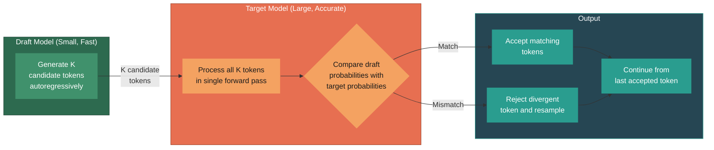

The draft model can be a smaller version of the same model family (e.g., Llama 7B as draft for Llama 70B), a separately trained lightweight model or even an n-gram model for simple tasks. Some systems use the model's own earlier layers as a draft predictor (self speculative decoding), eliminating the need for a separate draft model entirely.

**How it works in detail:**

1. The draft model generates K tokens autoregressively (this is fast because the draft model is small).
2. The target model processes all K tokens in a single forward pass, computing the probability distribution at each position.
3. At each position, the target model's distribution is compared to the draft model's distribution. If the draft token is consistent with what the target model would have generated, it is **accepted**. If not, the token is **rejected**, a new token is sampled from the target model's distribution, and generation continues from that point.
4. The process guarantees that the final output distribution is identical to what the target model would have produced on its own. Speculative decoding does not change model quality.

The speedup depends on the **acceptance rate**, which is how often the draft model's tokens are accepted by the target model. A well chosen draft model that closely matches the target model's distribution can achieve acceptance rates of 70 to 90%, resulting in 2 to 3x speedup.

#### Inference with Reference

When the output is expected to contain large portions of the input (as in summarization, editing or code refactoring), tokens can be **copied** from the input rather than generated. This avoids the slow autoregressive decode for tokens that already exist in the context. This technique is sometimes called **prompt lookup decoding** or **input reuse**.

#### Parallel Decoding

Several approaches attempt to generate multiple tokens simultaneously rather than one at a time.

**Jacobi decoding (Lookahead decoding).** Instead of generating tokens left to right, multiple token positions are initialized with guesses and iteratively refined in parallel until convergence. This is based on the mathematical framework of Jacobi iteration for solving systems of equations. The key insight is that if the initial guesses are close to the correct tokens, convergence happens in very few iterations, effectively generating multiple tokens in the time it would normally take to generate one or two.

**Medusa.** Adds multiple prediction heads to the model, each trained to predict a token at a different future position. During inference, all heads produce predictions simultaneously, and the outputs are verified using a tree attention mechanism. This can generate 2 to 3 tokens per forward pass with minimal overhead after fine tuning the extra heads. The additional heads are lightweight (typically single linear layers) and add negligible memory overhead compared to the base model.

Both Jacobi decoding and Medusa represent active research frontiers. Their adoption in production systems is growing but less widespread than speculative decoding, which has the advantage of not requiring any model modifications.

### Attention Mechanism Optimization

The attention mechanism is both the source of transformer models' power and their primary computational and memory bottleneck during inference. Optimizing attention is one of the most impactful areas of inference optimization.

#### KV Cache

The **KV cache** stores the key and value projections for all previously processed tokens, so they do not need to be recomputed at each generation step. Without the KV cache, generating the Nth token would require reprocessing all N-1 previous tokens, making generation quadratically expensive.

```mermaid
graph TD
    subgraph Step1["Step 1: Prefill"]
        I1["Input tokens:<br/>'The cat sat'"]
        K1["Compute K,V for<br/>all input tokens"]
        KV1["KV Cache:<br/>K_the, V_the<br/>K_cat, V_cat<br/>K_sat, V_sat"]
        O1["Output: 'on'"]
    end

    subgraph Step2["Step 2: Decode"]
        I2["New token: 'on'"]
        K2["Compute K,V for<br/>'on' only"]
        KV2["KV Cache:<br/>K_the, V_the<br/>K_cat, V_cat<br/>K_sat, V_sat<br/>K_on, V_on"]
        O2["Attend to full cache<br/>Output: 'the'"]
    end

    subgraph Step3["Step 3: Decode"]
        I3["New token: 'the'"]
        K3["Compute K,V for<br/>'the' only"]
        KV3["KV Cache:<br/>grows by one<br/>entry per step"]
        O3["Attend to full cache<br/>Output: 'mat'"]
    end

    Step1 --> Step2 --> Step3

    style Step1 fill:#1a1a2e,stroke:#e94560,color:#ffffff
    style Step2 fill:#1a1a2e,stroke:#0f3460,color:#ffffff
    style Step3 fill:#1a1a2e,stroke:#533483,color:#ffffff
    style I1 fill:#e94560,stroke:#1a1a2e,color:#ffffff
    style K1 fill:#e94560,stroke:#1a1a2e,color:#ffffff
    style KV1 fill:#e94560,stroke:#1a1a2e,color:#ffffff
    style O1 fill:#e94560,stroke:#1a1a2e,color:#ffffff
    style I2 fill:#0f3460,stroke:#1a1a2e,color:#ffffff
    style K2 fill:#0f3460,stroke:#1a1a2e,color:#ffffff
    style KV2 fill:#0f3460,stroke:#1a1a2e,color:#ffffff
    style O2 fill:#0f3460,stroke:#1a1a2e,color:#ffffff
    style I3 fill:#533483,stroke:#1a1a2e,color:#ffffff
    style K3 fill:#533483,stroke:#1a1a2e,color:#ffffff
    style KV3 fill:#533483,stroke:#1a1a2e,color:#ffffff
    style O3 fill:#533483,stroke:#1a1a2e,color:#ffffff
```

**KV Cache Size Calculation:**

The KV cache size for a single request can be calculated as follows.

| Parameter | Symbol | Description |
|-----------|--------|-------------|
| Number of layers | L | Transformer layers in the model |
| Number of KV heads | H_kv | Number of key/value attention heads (may differ from query heads in GQA) |
| Head dimension | D_h | Dimensionality of each attention head |
| Sequence length | S | Total number of tokens (input + generated) |
| Bytes per parameter | B | Depends on precision (2 for FP16/BF16, 1 for INT8) |

```
KV Cache Size = 2 x L x H_kv x D_h x S x B
```

The factor of 2 accounts for both the key and value tensors.

**Example calculation for Llama 2 70B in FP16 with a 4,096 token sequence:**
- L = 80 layers
- H_kv = 8 (grouped query attention)
- D_h = 128
- S = 4,096 tokens
- B = 2 bytes (FP16)

```
KV Cache = 2 x 80 x 8 x 128 x 4,096 x 2 = 1.34 GB per request
```

For a model serving 100 concurrent requests, this becomes **134 GB** just for KV caches, which would not even fit on two H100 GPUs (80 GB each). This illustrates why KV cache management is critical for inference at scale.

> [!WARNING]
> KV cache memory grows **linearly** with sequence length and batch size. As context windows grow to 128K, 1M or beyond, KV cache management becomes the dominant memory challenge, often exceeding the memory required for the model weights themselves.

#### Redesigning Attention

Several architectural modifications reduce the size and cost of the attention mechanism.

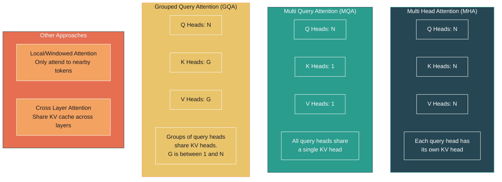

**Multi Query Attention (MQA).** All query heads share a single set of key and value heads. This reduces the KV cache size by a factor of N (the number of query heads), dramatically reducing memory and bandwidth requirements. The quality impact is small for many tasks.

**Grouped Query Attention (GQA).** A middle ground between MHA and MQA. Query heads are divided into G groups, and each group shares one set of KV heads. Llama 2 70B uses GQA with 8 KV heads and 64 query heads, reducing the KV cache by 8x compared to full MHA while maintaining quality closer to MHA than MQA.

**Local/Windowed Attention.** Instead of attending to all previous tokens, each token only attends to a fixed window of nearby tokens. This reduces the cost from O(n^2) to O(n x w) where w is the window size. Models like Mistral use sliding window attention in some layers combined with full attention in others.

**Cross Layer Attention.** KV pairs from certain layers are reused in subsequent layers, reducing the total KV cache size. This is an active research area.

> Character.AI shared that attention mechanism design choices helped them "reduce KV cache by over 20 times."
> Chip Huyen

#### Optimizing KV Cache Size

Beyond architectural changes, several techniques optimize KV cache management at the system level.

**PagedAttention (vLLM).** Inspired by virtual memory in operating systems, PagedAttention allocates KV cache in fixed size blocks (pages) rather than contiguous memory. This eliminates internal fragmentation (wasted memory from pre allocating maximum sequence length) and external fragmentation (gaps between allocated sequences). vLLM, which implements PagedAttention, has become one of the most popular open source inference engines.

**KV cache quantization.** The KV cache can be quantized to INT8 or even INT4 independently of the model weights, reducing memory requirements by 2 to 4x. Research shows that KV cache quantization often has less quality impact than weight quantization because KV values tend to have a more uniform distribution.

**KV cache compression.** Techniques like token eviction (removing KV entries for less important tokens), token merging (combining similar KV entries) and attention sink methods (always keeping the first few tokens' KV entries) reduce cache size for long sequences. The attention sink observation is particularly interesting. Research has shown that the first few tokens in a sequence receive disproportionately high attention scores regardless of their semantic content. Keeping these "sink" tokens' KV entries while evicting middle tokens preserves model quality much better than naive eviction strategies.

#### Writing Kernels for Attention. FlashAttention

**FlashAttention** is a custom CUDA kernel that restructures the attention computation to minimize reads and writes to GPU HBM. Standard attention computes the full attention matrix in HBM, which requires O(n^2) memory. FlashAttention uses a **tiling** approach to compute attention in blocks that fit in SRAM, fusing the softmax and attention computation so that intermediate results never need to be written to HBM.

The result is both faster computation (2 to 4x speedup) and reduced memory usage (from O(n^2) to O(n) in attention memory). FlashAttention has become a standard component in modern inference engines.

**FlashAttention 2** improved upon the original by better partitioning work across GPU thread blocks and warps, achieving closer to theoretical peak throughput. **FlashAttention 3** takes advantage of features specific to the NVIDIA Hopper architecture (H100), including asynchronous memory copies and the Tensor Memory Accelerator (TMA), pushing performance even further. The evolution of FlashAttention illustrates how kernel optimization is hardware specific. Each new GPU generation introduces new capabilities that kernel developers can exploit for additional performance.

> [!TIP]
> FlashAttention is not a new attention mechanism. It computes **exactly the same result** as standard scaled dot product attention. The innovation is purely in how the computation is scheduled on the hardware to minimize memory bottlenecks. This is a powerful example of how kernel level optimization can provide dramatic speedups without any change to model architecture or quality.

### Kernels and Compilers

#### What Are Kernels?

A **kernel** in the GPU computing context is a function that runs on the GPU. Every operation in a neural network (matrix multiplication, layer normalization, activation functions, etc.) is executed by one or more kernels. The efficiency of these kernels determines how effectively the hardware is utilized.

Writing efficient GPU kernels requires deep understanding of GPU architecture, including thread hierarchies, memory coalescing, bank conflicts, warp scheduling and occupancy. Most practitioners rely on optimized kernel libraries (cuBLAS, cuDNN) or compiler generated kernels rather than writing them from scratch.

#### Kernel Optimization Techniques

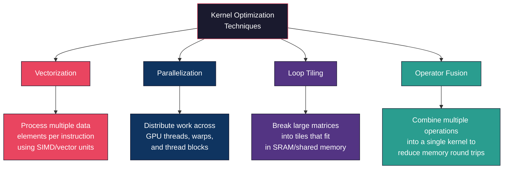

**Vectorization.** Uses SIMD (Single Instruction Multiple Data) capabilities to process multiple data elements with a single instruction. Modern GPUs support vector load/store operations that can move 128 bits at a time.

**Parallelization.** Distributes computation across the GPU's thousands of threads. Effective parallelization requires balancing work across threads and minimizing synchronization overhead.

**Loop tiling.** Breaks large matrix operations into smaller tiles that fit in fast on chip SRAM. This maximizes data reuse in the memory hierarchy, reducing the number of slow HBM accesses. FlashAttention is a prime example of loop tiling applied to attention.

**Operator fusion.** Combines multiple sequential operations into a single kernel. Without fusion, each operation reads its input from HBM, computes and writes its output back to HBM. With fusion, intermediate results stay in registers or SRAM, eliminating redundant memory round trips. For example, fusing a matrix multiplication with a bias addition and a ReLU activation can be 2 to 3x faster than executing them as separate kernels.

#### Compilers

AI compilers automatically optimize and generate kernels from high level model descriptions.

- **torch.compile (PyTorch 2.0+).** Captures the computation graph and applies optimizations including operator fusion, memory planning and kernel selection. Often provides 10 to 30% speedup with minimal code changes. The key advantage of torch.compile is its ease of adoption. In many cases, adding a single line of code (`model = torch.compile(model)`) is sufficient to gain significant speedup.
- **XLA (Accelerated Linear Algebra).** Google's compiler for JAX and TensorFlow. Performs whole graph optimization, aggressive operator fusion and generates efficient code for TPUs and GPUs. XLA's whole program compilation approach can find optimization opportunities that are invisible to per operator optimizers.
- **TensorRT (NVIDIA).** NVIDIA's inference optimization SDK. Applies layer fusion, precision calibration, kernel autotuning and other optimizations to produce highly optimized inference engines for NVIDIA GPUs. TensorRT typically delivers the best absolute performance on NVIDIA hardware but requires an explicit export and compilation step.
- **TVM (Apache).** An open source compiler framework that generates optimized kernels for diverse hardware backends through autotuning. TVM can target CPUs, GPUs and specialized accelerators, making it useful for deployment across heterogeneous environments.

#### PyTorch Optimization Case Study

> The PyTorch team demonstrated progressive optimization techniques that compound to achieve dramatic throughput improvements.
> Chip Huyen

A revealing case study from the PyTorch team shows how different optimization techniques compound.

| Optimization Step | Technique Applied | Cumulative Speedup |
|------------------|-------------------|-------------------|
| Baseline | Standard PyTorch eager mode | 1x |
| + torch.compile | Graph capture and kernel fusion | ~1.3x |
| + INT8 weight quantization | Reduce weight precision to INT8 | ~2.5x |
| + INT4 weight quantization | Reduce weight precision to INT4 | ~3.5x |
| + Speculative decoding | Draft model with parallel verification | ~5x+ |

> [!IMPORTANT]
> These optimizations are **complementary**, not competing. Each technique addresses a different bottleneck. torch.compile reduces kernel launch overhead and fuses operations. Quantization reduces memory bandwidth requirements. Speculative decoding amortizes per token overhead by generating multiple tokens per forward pass. The best inference systems apply **all** of these techniques simultaneously.

<div align="center">
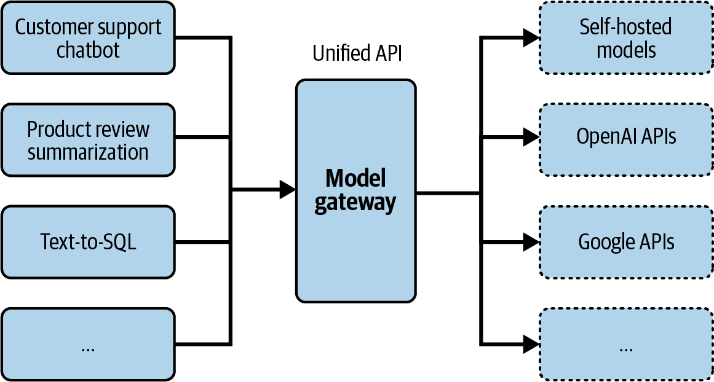
<br/>
<em>Figure 9-14. Throughput improvement by different optimization techniques</em>
</div>

## Inference Service Optimization

Beyond optimizing the model itself, the inference **serving system** offers additional optimization opportunities. These techniques determine how requests are scheduled, batched and distributed across hardware. Service level optimizations are particularly impactful because they improve throughput and utilization without changing the model at all, meaning they preserve model quality by definition.

The key insight behind service level optimization is that individual inference requests typically do not fully utilize the GPU. During the decode phase, a single request uses only a fraction of the GPU's compute capacity while being bottlenecked by memory bandwidth. Service level optimizations pack more useful work onto the GPU, improving the cost per token.

### Batching Strategies

Batching is the practice of grouping multiple requests together to process them simultaneously, improving hardware utilization and throughput. Without batching, each request would be processed individually, leaving most of the GPU's compute capacity idle during the memory bandwidth bound decode phase. Batching amortizes the cost of reading model weights from memory across multiple requests, dramatically improving the compute to memory ratio.


| Strategy | How It Works | Pros | Cons |
|----------|-------------|------|------|
| **Static Batching** | Fixed batch size. Wait until batch is full, then process | Simple to implement | High latency for early arrivals. GPU idles while waiting for batch to fill |
| **Dynamic Batching** | Collect requests within a time window, form variable size batch | Better latency than static | Still wastes GPU cycles when short requests finish before long ones |
| **Continuous Batching** | Requests enter and leave the batch independently at each decode step | Maximum GPU utilization. No idle time waiting | More complex to implement. Requires iteration level scheduling |

**Continuous batching** (also called **in flight batching**) is the most impactful serving optimization. In traditional batching, when one request in a batch finishes generating tokens, the GPU slot sits idle until all other requests in the batch complete. With continuous batching, completed requests are immediately replaced with new ones. This can increase throughput by 2x to 20x depending on the variance in output lengths.

The improvement from continuous batching is most dramatic when output lengths vary significantly across requests. If one request generates 10 tokens and another generates 500 tokens, static batching wastes 490 decode steps of GPU capacity on the short request's slot. Continuous batching fills that slot with a new request as soon as the short one completes. In workloads with high variance in output length (which is typical for most real world applications), continuous batching can increase throughput by 10x or more compared to static batching.

<div align="center">
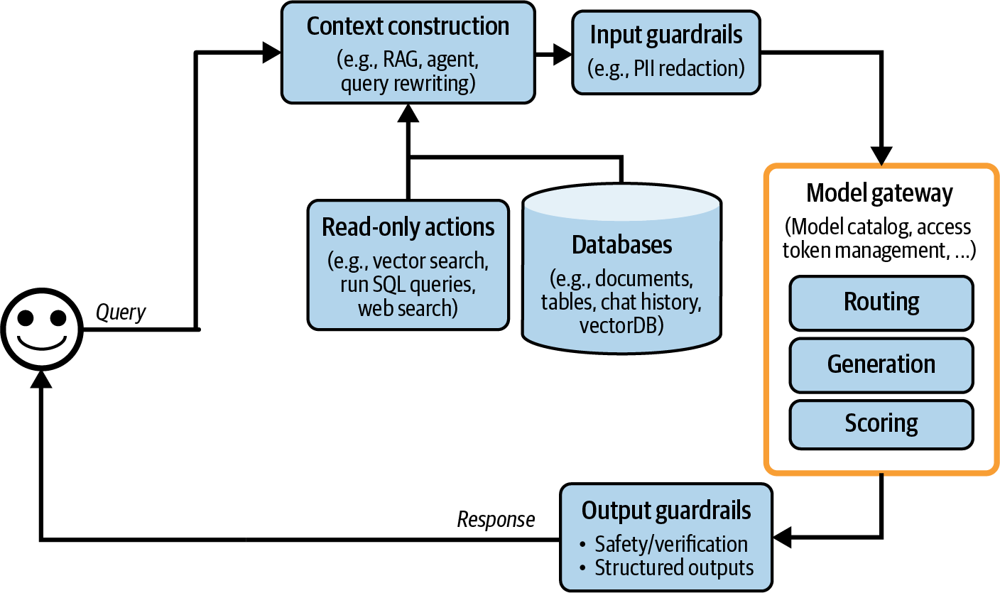
<br/>
<em>Figure 9-15. Dynamic batching keeps latency manageable</em>
</div>

> [!TIP]
> Modern inference engines like vLLM, TensorRT-LLM and TGI all implement continuous batching by default. If you are building a production inference service, using one of these engines rather than implementing batching yourself is strongly recommended.

### Decoupling Prefill and Decode

The prefill and decode phases have fundamentally different computational profiles, as discussed earlier. **Prefill is compute bound** and benefits from high arithmetic throughput. **Decode is memory bandwidth bound** and benefits from high memory bandwidth. Running both phases on the same hardware creates a conflict. Optimizing hardware for one phase means suboptimal performance for the other.

**DistServe** and similar systems decouple prefill and decode by running them on separate hardware.

- **Prefill servers** are configured with high compute GPUs and optimized for throughput. They process incoming prompts, compute the KV cache and send the KV cache to a decode server.
- **Decode servers** are configured for memory bandwidth and handle the autoregressive token generation.

This separation allows each phase to be independently scaled and optimized. Prefill servers can use larger batch sizes (since prefill is compute bound and benefits from batching), while decode servers can be provisioned based on the number of concurrent generation streams.

The communication overhead of transferring KV caches between prefill and decode servers is non trivial, especially for large models with long contexts. However, the efficiency gains from specialized hardware utilization typically outweigh this overhead. The DistServe paper reports up to 2x improvement in serving throughput at the same latency target compared to colocated serving.

This approach also enables **heterogeneous hardware** configurations. Prefill servers might use GPUs with high FLOP/s (like H100s), while decode servers might use hardware optimized for memory bandwidth or use more cost effective GPUs since the decode phase does not need peak compute throughput.

### Prompt Caching

When multiple requests share the same system prompt or common prefix, the KV cache for the shared portion can be computed once and reused across requests. This eliminates redundant computation during the prefill phase.

> Anthropic offers "up to 90% cost savings and up to 75% latency reduction" through prompt caching.
> Chip Huyen

| Use Case | Cache Write Cost | Cache Read Cost | Savings vs No Caching |
|----------|-----------------|-----------------|----------------------|
| **Book chat** (long system prompt with book content) | 1.25x base price | 0.1x base price | Up to 90% on cached tokens |
| **Many shot prompting** (many examples in prompt) | 1.25x base price | 0.1x base price | Up to 85% on cached tokens |
| **Multi turn conversation** (growing context) | 1.25x base price | 0.1x base price | Grows with conversation length |

*Data based on Anthropic's prompt caching pricing as referenced in the book.*

Prompt caching is particularly valuable in three scenarios.

1. **System prompts.** Most production applications use the same system prompt for every request. Caching the system prompt's KV entries means they are computed once and reused thousands of times.
2. **Multi turn conversations.** In a conversation with N turns, the first N-1 turns are identical between consecutive requests. Caching means only the latest user message requires new prefill computation.
3. **Many shot prompting.** When using dozens of examples in the prompt, the examples portion can be cached and reused across all requests.

The implementation of prompt caching requires careful management of the cache itself. Decisions about cache eviction policies (LRU, frequency based), cache size limits and handling of partial prefix matches all affect the real world performance gain. Some systems hash the prompt prefix to quickly identify cache hits, while others use trie based data structures for efficient prefix matching.

Google also offers prompt caching (called "context caching") with similar economics, where the cached portion of prompts is charged at a significantly reduced rate.

<div align="center">
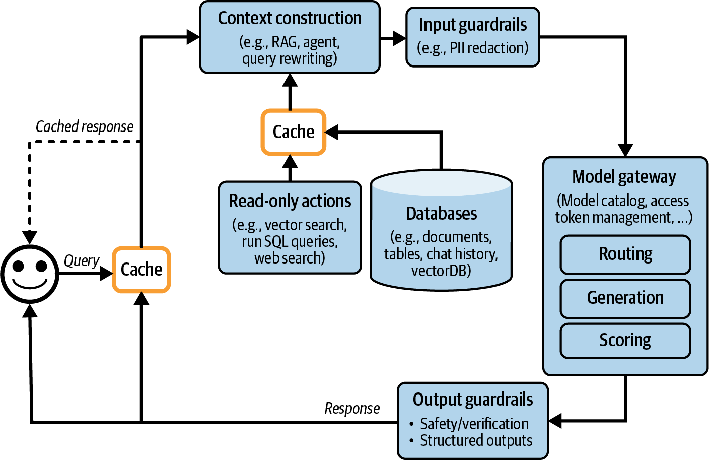
<br/>
<em>Figure 9-17. Prompt cache for overlapping segments</em>
</div>

> [!NOTE]
> Prompt caching can be **automatic** (the system detects shared prefixes and caches them transparently) or **explicit** (the developer marks which portions of the prompt should be cached). Anthropic uses an explicit approach where developers mark cache breakpoints. Some inference engines like vLLM implement automatic prefix caching.

### Parallelism Strategies

When a model is too large to fit on a single GPU, or when more throughput is needed, parallelism strategies distribute the work across multiple devices.

```mermaid
graph TD
    subgraph RP["Replica Parallelism"]
        RP1["Full model copy<br/>on GPU 0"]
        RP2["Full model copy<br/>on GPU 1"]
        RP3["Full model copy<br/>on GPU 2"]
        RP_LB["Load Balancer"]
        RP_LB --> RP1
        RP_LB --> RP2
        RP_LB --> RP3
    end

    subgraph TP["Tensor Parallelism"]
        TP1["Layer split across GPUs"]
        TP_G0["GPU 0: Left half<br/>of weight matrix"]
        TP_G1["GPU 1: Right half<br/>of weight matrix"]
        TP1 --> TP_G0
        TP1 --> TP_G1
        TP_Sync["All reduce sync<br/>after each layer"]
        TP_G0 --> TP_Sync
        TP_G1 --> TP_Sync
    end

    subgraph PP["Pipeline Parallelism"]
        PP1["GPU 0:<br/>Layers 0 to 19"]
        PP2["GPU 1:<br/>Layers 20 to 39"]
        PP3["GPU 2:<br/>Layers 40 to 59"]
        PP4["GPU 3:<br/>Layers 60 to 79"]
        PP1 -->|"Activations"| PP2
        PP2 -->|"Activations"| PP3
        PP3 -->|"Activations"| PP4
    end

    style RP fill:#264653,stroke:#2a9d8f,color:#ffffff
    style TP fill:#2a9d8f,stroke:#264653,color:#ffffff
    style PP fill:#e76f51,stroke:#264653,color:#ffffff
    style RP1 fill:#264653,stroke:#ffffff,color:#ffffff
    style RP2 fill:#264653,stroke:#ffffff,color:#ffffff
    style RP3 fill:#264653,stroke:#ffffff,color:#ffffff
    style RP_LB fill:#264653,stroke:#ffffff,color:#ffffff
    style TP1 fill:#2a9d8f,stroke:#ffffff,color:#ffffff
    style TP_G0 fill:#2a9d8f,stroke:#ffffff,color:#ffffff
    style TP_G1 fill:#2a9d8f,stroke:#ffffff,color:#ffffff
    style TP_Sync fill:#2a9d8f,stroke:#ffffff,color:#ffffff
    style PP1 fill:#e76f51,stroke:#ffffff,color:#ffffff
    style PP2 fill:#e76f51,stroke:#ffffff,color:#ffffff
    style PP3 fill:#e76f51,stroke:#ffffff,color:#ffffff
    style PP4 fill:#e76f51,stroke:#ffffff,color:#ffffff
```

#### Replica Parallelism

The simplest form of parallelism. Multiple complete copies of the model run on separate GPUs (or sets of GPUs), and a load balancer distributes incoming requests across replicas. Each replica handles requests independently.

- **Pros.** Simple to implement. Linear throughput scaling. No inter GPU communication during inference.
- **Cons.** Each replica requires enough memory for the full model. Does not help when a single model does not fit on one GPU.

Replica parallelism is the most common scaling strategy for models that fit on a single GPU (or a single node with tensor parallelism). Autoscaling frameworks can dynamically adjust the number of replicas based on traffic patterns, scaling up during peak hours and scaling down during quiet periods to optimize cost.

#### Model Parallelism

When a model is too large to fit on a single GPU, it must be split across multiple GPUs. There are two primary approaches.

**Tensor parallelism.** Individual layers are split across multiple GPUs. For example, a weight matrix of size [4096, 4096] can be split column wise across 4 GPUs, with each GPU holding a [4096, 1024] slice. Each GPU computes a partial result, and an **all reduce** communication step combines the results. Tensor parallelism requires **fast inter GPU communication** (NVLink) because synchronization happens at every layer. The communication volume is proportional to the hidden size and batch size, making it practical only within nodes connected by high bandwidth NVLink (900 GB/s on H100 NVLink) rather than across nodes connected by InfiniBand or Ethernet.

**Pipeline parallelism.** Different layers are assigned to different GPUs. GPU 0 processes layers 0 to 19, GPU 1 processes layers 20 to 39, and so on. Data flows sequentially through the pipeline. Pipeline parallelism requires less communication bandwidth than tensor parallelism (only activations are sent between stages, once per forward pass), but introduces **pipeline bubbles** where some GPUs are idle while waiting for data. Micro batching techniques can reduce bubble overhead by splitting a batch into smaller micro batches that flow through the pipeline in a staggered fashion, keeping more stages busy simultaneously.

<div align="center">
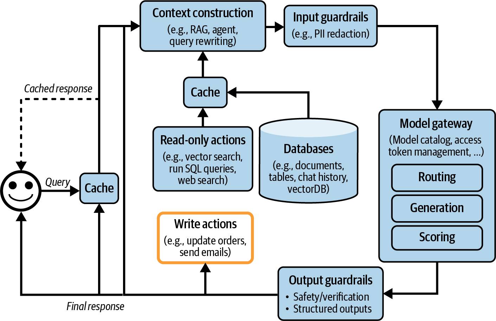
<br/>
<em>Figure 9-19. Pipeline parallelism enables model splits to execute in parallel</em>
</div>

#### Context/Sequence Parallelism

For very long sequences, the input can be split across multiple GPUs along the sequence dimension. Each GPU processes a portion of the sequence, with communication needed for the attention mechanism (since each token potentially attends to all other tokens). Techniques like **ring attention** minimize this communication overhead by overlapping computation with communication.

Context parallelism is particularly important for long context inference (128K+ tokens) where the attention computation and KV cache become bottlenecks even within a single layer. As context windows continue to grow (with some models supporting 1M+ tokens), sequence parallelism will become increasingly essential.

> [!IMPORTANT]
> In practice, production inference systems often combine multiple parallelism strategies. A common configuration for large models is **tensor parallelism within a node** (using fast NVLink connections) combined with **pipeline parallelism across nodes** (using slower inter node links), with **replica parallelism** for additional throughput scaling.

The choice between parallelism strategies depends on several factors. Tensor parallelism reduces per request latency (since each layer completes faster when split across GPUs) but requires high bandwidth interconnects like NVLink. Pipeline parallelism is more bandwidth efficient but introduces pipeline bubbles that reduce utilization. For latency sensitive applications, tensor parallelism is generally preferred. For throughput oriented workloads, pipeline parallelism may be more cost effective. The optimal configuration depends on the specific model, hardware and workload characteristics.

## Summary

Inference optimization is a multi layered discipline that spans hardware, numerical representation, model architecture, kernel engineering and serving system design. As models grow larger and are deployed to serve more users, the techniques covered in this chapter become not just performance improvements but economic necessities. The difference between an optimized and unoptimized inference setup can easily be 10x or more in cost per token, which at scale translates to millions of dollars.

The key principles to remember are the following.

**Understand your bottleneck.** The prefill phase is compute bound and benefits from higher FLOP/s. The decode phase is memory bandwidth bound and benefits from reduced memory access. Different optimizations target different bottlenecks.

**Quantization is almost always the first step.** Reducing precision from FP16 to INT8 or INT4 reduces memory footprint, increases throughput and is supported by mature tooling with minimal quality impact.

**KV cache management is critical at scale.** The KV cache grows linearly with sequence length and batch size. Architectural innovations (GQA), system innovations (PagedAttention) and operational techniques (prompt caching) all help manage this challenge.

**Speculative decoding is free quality.** It provides speedup without changing the model's output distribution, making it one of the most appealing optimizations available.

**Continuous batching unlocks throughput.** Moving from static or dynamic batching to continuous batching can increase throughput by an order of magnitude with no quality impact.

**Optimizations compound.** As the PyTorch case study demonstrates, applying torch.compile, quantization and speculative decoding together yields multiplicative improvements. The best inference systems apply techniques from every layer of the stack simultaneously.

The inference optimization landscape is evolving rapidly. New hardware generations, novel attention mechanisms, advanced compilation techniques and improved serving frameworks are continuously pushing the frontier. Practitioners who invest in understanding the fundamentals covered in this chapter will be well equipped to evaluate and adopt new techniques as they emerge.

> [!TIP]
> Start with the highest impact, lowest effort optimizations first. Use a pre built inference engine (vLLM, TensorRT-LLM, TGI). Apply quantization. Enable prompt caching. Use continuous batching. Only invest in custom kernel development, hardware selection or architectural changes when these baseline optimizations are not sufficient.

## Practitioner Checklist

The following decision framework can help prioritize which optimizations to apply first based on your constraints and objectives.

```mermaid
graph TD
    Start["Start: Inference<br/>Too Slow or Expensive"] --> Q1{"Does model fit<br/>on one GPU?"}
    Q1 -->|No| MP["Apply Model Parallelism<br/>(TP within node, PP across)"]
    Q1 -->|Yes| Q2{"Is latency<br/>the problem?"}
    MP --> Q2
    Q2 -->|Yes| Q3{"Which phase<br/>is slow?"}
    Q2 -->|No, throughput| Batch["Enable Continuous<br/>Batching"]
    Q3 -->|Prefill (TTFT)| Cache["Enable Prompt Caching<br/>+ FlashAttention"]
    Q3 -->|Decode (TPOT)| Quant["Apply Quantization<br/>(INT8 then INT4)"]
    Quant --> Spec["Add Speculative<br/>Decoding"]
    Batch --> Replica["Scale with<br/>Replica Parallelism"]
    Cache --> Quant
    Spec --> Compile["Apply torch.compile<br/>or TensorRT"]

    style Start fill:#1a1a2e,stroke:#e94560,color:#ffffff
    style Q1 fill:#264653,stroke:#2a9d8f,color:#ffffff
    style Q2 fill:#264653,stroke:#2a9d8f,color:#ffffff
    style Q3 fill:#264653,stroke:#2a9d8f,color:#ffffff
    style MP fill:#e76f51,stroke:#264653,color:#ffffff
    style Batch fill:#2a9d8f,stroke:#264653,color:#ffffff
    style Cache fill:#2a9d8f,stroke:#264653,color:#ffffff
    style Quant fill:#e9c46a,stroke:#f4a261,color:#1a1a1a
    style Spec fill:#e9c46a,stroke:#f4a261,color:#1a1a1a
    style Replica fill:#2a9d8f,stroke:#264653,color:#ffffff
    style Compile fill:#e9c46a,stroke:#f4a261,color:#1a1a1a
```

- [ ] **Identify your primary metric.** Is TTFT, TPOT, total latency or throughput most important for your use case?
- [ ] **Profile before optimizing.** Determine whether your workload is compute bound or memory bandwidth bound before selecting optimization strategies.
- [ ] **Apply quantization.** Start with INT8 weight quantization and measure quality impact. Move to INT4 if quality holds.
- [ ] **Use a production inference engine.** vLLM, TensorRT-LLM or TGI provide continuous batching, PagedAttention and other optimizations out of the box.
- [ ] **Enable prompt caching.** If using a hosted API, leverage prompt caching for system prompts and multi turn conversations. If self hosting, use prefix caching in vLLM.
- [ ] **Right size your hardware.** Match accelerator choice to workload characteristics. Consider memory bandwidth for decode heavy workloads.
- [ ] **Consider speculative decoding.** If you have a suitable draft model and latency is critical, speculative decoding provides speedup with no quality tradeoff.
- [ ] **Monitor KV cache memory.** Track KV cache usage as a key metric, especially as sequence lengths and concurrency grow.
- [ ] **Evaluate model parallelism needs.** If the model does not fit on a single GPU, choose between tensor parallelism (lower latency, requires NVLink) and pipeline parallelism (higher throughput, works across nodes).
- [ ] **Layer optimizations progressively.** Apply compiler optimizations (torch.compile), then quantization, then serving optimizations, measuring impact at each step.

[Previous: Chapter 8 - Dataset Engineering](08-dataset-engineering.md) | [Next: Chapter 10 - AI Engineering Architecture and User Feedback](10-ai-engineering-architecture-and-user-feedback.md)
