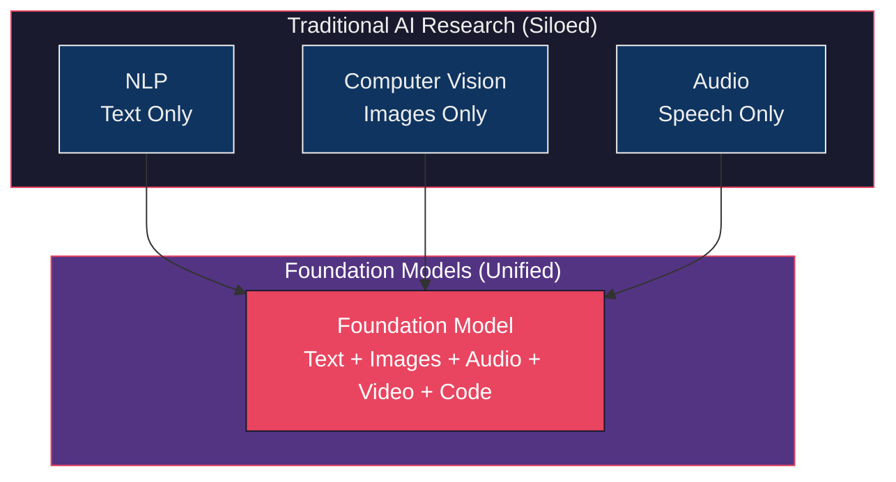
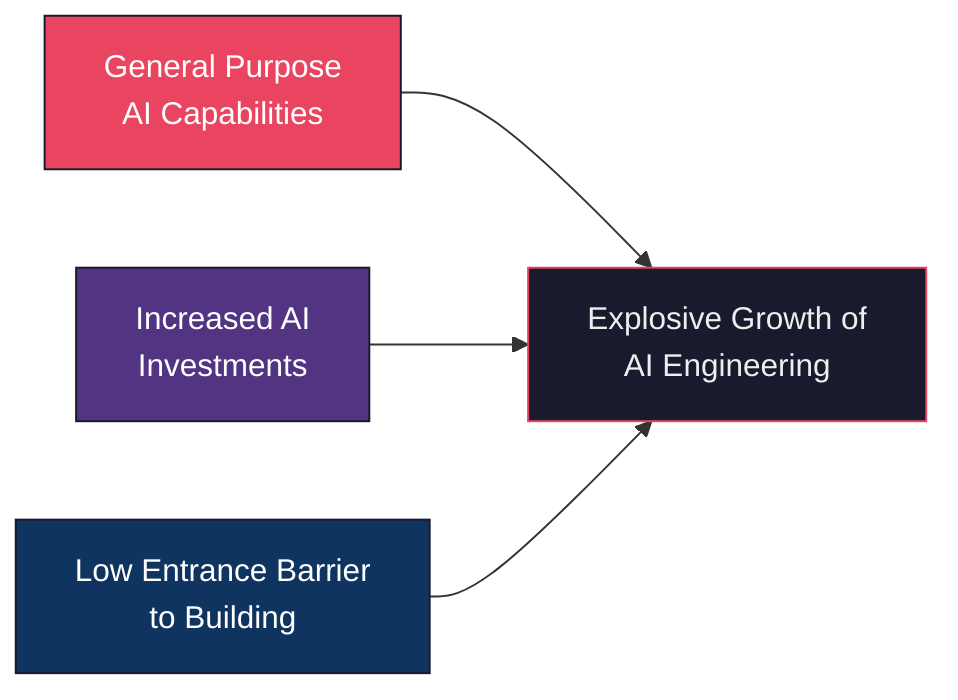
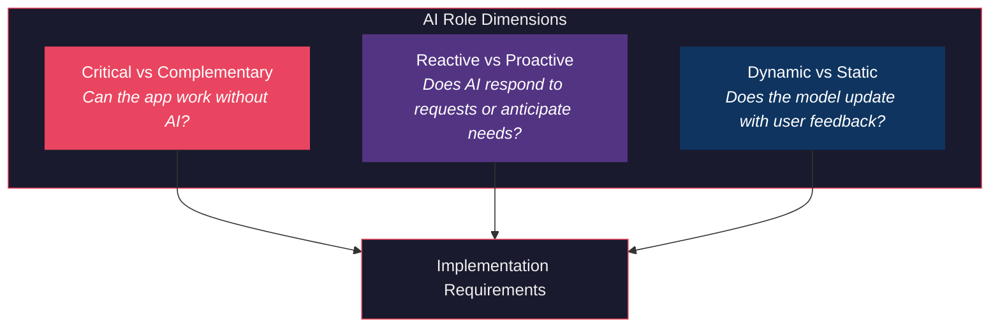
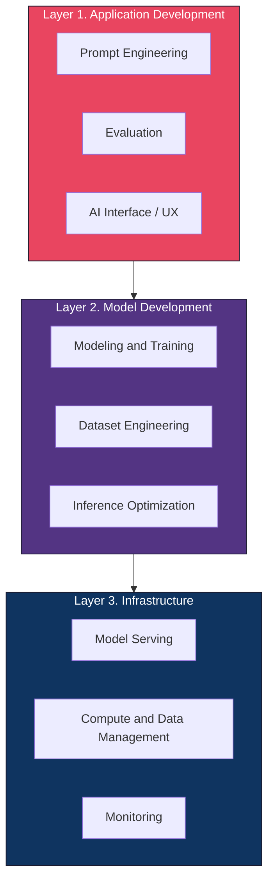
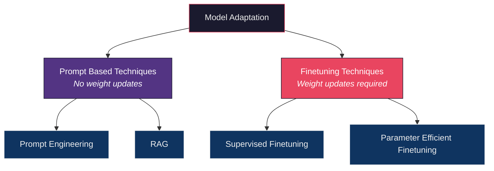

# Chapter 1. Introduction to Building AI Applications with Foundation Models

> "If I could use only one word to describe AI post 2020, it would be *scale*."
> Chip Huyen

This chapter lays the groundwork for everything that follows. It answers three fundamental questions. What is AI engineering? Why has it exploded in the last two years? And what can you actually build with it? If you are already building AI applications, this chapter will sharpen your understanding of the landscape. If you are evaluating whether to start, it will give you the strategic framework to make that decision.

## Table of Contents

- [The Rise of AI Engineering](#the-rise-of-ai-engineering)
  - [From Language Models to Large Language Models](#from-language-models-to-large-language-models)
  - [From Large Language Models to Foundation Models](#from-large-language-models-to-foundation-models)
  - [From Foundation Models to AI Engineering](#from-foundation-models-to-ai-engineering)
- [Foundation Model Use Cases](#foundation-model-use-cases)
  - [Coding](#coding)
  - [Image and Video Production](#image-and-video-production)
  - [Writing](#writing)
  - [Education](#education)
  - [Conversational Bots](#conversational-bots)
  - [Information Aggregation](#information-aggregation)
  - [Data Organization](#data-organization)
  - [Workflow Automation](#workflow-automation)
- [Planning AI Applications](#planning-ai-applications)
  - [Use Case Evaluation](#use-case-evaluation)
  - [Setting Expectations](#setting-expectations)
  - [Milestone Planning](#milestone-planning)
  - [Maintenance](#maintenance)
- [The AI Engineering Stack](#the-ai-engineering-stack)
  - [Three Layers of the AI Stack](#three-layers-of-the-ai-stack)
  - [AI Engineering Versus ML Engineering](#ai-engineering-versus-ml-engineering)
  - [AI Engineering Versus Full Stack Engineering](#ai-engineering-versus-full-stack-engineering)
- [Key Takeaways](#key-takeaways)
- [Practitioner Checklist](#practitioner-checklist)

## The Rise of AI Engineering

The scaling up of AI models has two major consequences. First, AI models are becoming more powerful and capable of more tasks, enabling more applications. Second, training large language models requires data, compute resources and specialized talent that only a few organizations can afford. This has led to the emergence of **model as a service**. Models developed by these few organizations are made available for others to use as a service.

!!! important "Important"
    The demand for AI applications has increased while the barrier to entry for building AI applications has decreased. This has turned AI engineering into one of the fastest growing engineering disciplines.

**AI engineering** is the process of building applications on top of readily available models. It differs from traditional ML engineering in a critical way. Instead of developing your own models, you leverage existing foundation models and adapt them to your needs.

### From Language Models to Large Language Models

A **language model** encodes statistical information about one or more languages. Intuitively, this information tells us how likely a word is to appear in a given context. Given "My favorite color is __", a language model that encodes English should predict "blue" more often than "car".

The basic unit of a language model is a **token**. A token can be a character, a word or a part of a word (like *tion*), depending on the model. GPT-4 breaks the phrase "I can't wait to build AI applications" into nine tokens. The word "can't" is broken into two tokens. *can* and *'t*.

{ width="700" }

Figure 1-1. An example of how GPT-4 tokenizes a phrase

!!! tip "Tip"
    For GPT-4, an average token is approximately three quarters the length of a word. So 100 tokens are approximately 75 words. The set of all tokens a model can work with is the model's **vocabulary**. Mixtral 8x7B has a vocabulary size of 32,000. GPT-4's vocabulary size is 100,256.

**Why tokens instead of words or characters?** Three reasons.

1. Compared to characters, tokens allow the model to break words into meaningful components. "cooking" becomes "cook" and "ing", both carrying some meaning.
2. Because there are fewer unique tokens than unique words, this reduces the model's vocabulary size, making the model more efficient.
3. Tokens help the model process unknown words. A made up word like "chatgpting" could be split into "chatgpt" and "ing", helping the model understand its structure.

**Two types of language models.**

| Type | How It Predicts | Example | Common Use |
|------|----------------|---------|------------|
| **Masked Language Model** | Predicts missing tokens anywhere in a sequence, using context from both before and after | BERT | Sentiment analysis, text classification, code debugging |
| **Autoregressive Language Model** | Predicts the next token using only preceding tokens | GPT-4, Claude, Gemini | Text generation, all generative tasks |

{ width="700" }

Figure 1-2. Autoregressive language model and masked language model

!!! note "Note"
    In this book, unless explicitly stated, *language model* refers to an autoregressive model.

You can think of a language model as a **completion machine**. Given a text (prompt), it tries to complete that text. As simple as it sounds, completion is incredibly powerful. Many tasks, including translation, summarization, coding and solving math problems, can be framed as completion tasks.

**The key breakthrough. Self supervision.** Language models can be trained using self supervision, while many other models require supervision. Supervision refers to training ML algorithms using labeled data, which can be expensive and slow to obtain. Self supervision helps overcome this data labeling bottleneck.

With self supervision, instead of requiring explicit labels, the model infers labels from the input data. The sentence "I love street food." gives six training samples automatically.

| Input (Context) | Output (Next Token) |
|-----------------|---------------------|
| \<BOS\> | I |
| \<BOS\>, I | love |
| \<BOS\>, I, love | street |
| \<BOS\>, I, love, street | food |
| \<BOS\>, I, love, street, food | . |
| \<BOS\>, I, love, street, food, . | \<EOS\> |

!!! important "Important"
    Self supervised learning means that language models can learn from text sequences without requiring any labeling. Because text sequences are everywhere, in books, blog posts, articles and Reddit comments, it is possible to construct a massive amount of training data, allowing language models to scale up to become LLMs.

**How large is large?** When OpenAI's first GPT model came out in June 2018, its 117 million parameters were considered large. By February 2019, GPT-2 had 1.5 billion parameters, making 117 million look small. As of the writing of the book, a model with 100 billion parameters is considered large. Perhaps one day, this size will be considered small.

### From Large Language Models to Foundation Models

Language models are limited to text. As humans, we perceive the world not just via language but also through vision, hearing, touch and more. For this reason, language models are being extended to incorporate more data modalities. GPT-4V and Claude 3 can understand images and texts. Some models even understand videos, 3D assets and protein structures.

{ width="700" }

Figure 1-3. A multimodal model can generate the next token using information from multiple modalities

{ width="700" }

Figure 1-4. Tasks used by the Super-NaturalInstructions benchmark

The term **foundation model** signifies both the importance of these models in AI applications and the fact that they can be built upon for different needs. Foundation models mark two major transitions.

1. **From siloed research to unified models.** For a long time, AI research was divided by data modalities. NLP dealt only with text. Computer vision dealt only with images. Foundation models unify these.
2. **From task specific to general purpose.** Previously, models were developed for specific tasks. A model trained for sentiment analysis would not be able to do translation. Foundation models, thanks to their scale, are capable of a wide range of tasks out of the box.

!!! note "Note"
    A model that can work with more than one data modality is also called a **multimodal model**. This book uses the term *foundation models* to refer to both large language models and large multimodal models.

**Three common techniques to adapt a foundation model to your needs.**

| Technique | What It Does | Data Required | Effort |
|-----------|-------------|---------------|--------|
| **Prompt Engineering** | Craft instructions and examples to guide the model | Minimal | Low |
| **RAG** | Connect the model to an external knowledge base | Moderate | Medium |
| **Finetuning** | Further train the model on task specific data | Significant | High |

> "Adapting an existing powerful model to your task is generally a lot easier than building a model for your task from scratch. For example, ten examples and one weekend versus one million examples and six months."
> Chip Huyen

### From Foundation Models to AI Engineering

The availability and accessibility of powerful foundation models create three factors that, together, produce ideal conditions for the rapid growth of AI engineering.

**Factor 1. General purpose AI capabilities.** Foundation models can do more tasks than any previous AI. Applications previously thought impossible are now possible. AI can write, code, translate, create images and reason. This vastly increases both the user base and the demand for AI applications.

**Factor 2. Increased AI investments.** Goldman Sachs Research estimated that AI investment could approach $100 billion in the US and $200 billion globally by 2025. FactSet found that one in three S&P 500 companies mentioned AI in their earnings calls for Q2 2023. That is three times more than the year before.

{ width="700" }

Figure 1-5. The number of S&P 500 companies that mention AI in their earnings calls

**Factor 3. Low entrance barrier.** The model as a service approach makes it easier to leverage AI. APIs give you access to powerful models via single API calls. AI also makes it possible to build applications with minimal coding. First, AI can write code for you. Second, you can work with models in plain English instead of a programming language.

!!! tip "Tip"
    Within just two years, four open source AI engineering tools (AutoGPT, Stable Diffusion Web UI, LangChain, Ollama) had already garnered more stars on GitHub than Bitcoin. They are on track to surpass even the most popular web development frameworks, including React and Vue.

{ width="700" }

Figure 1-6. Star history of popular AI engineering repositories

## Foundation Model Use Cases

The number of potential applications you could build with foundation models seems endless. The author examined 205 open source AI applications with at least 500 stars on GitHub and interviewed 50 companies on their AI strategies. The use cases fall into eight major categories.

{ width="700" }

Figure 1-7. Distribution of use cases among open source AI applications

| Category | Consumer Examples | Enterprise Examples |
|----------|------------------|---------------------|
| **Coding** | Code completion, code generation | Code review, test generation, documentation |
| **Image and Video** | Photo editing, design, video generation | Ad generation, presentations, marketing |
| **Writing** | Email, social media, blog posts | Copywriting, SEO, reports, memos |
| **Education** | Tutoring, essay grading | Employee onboarding, upskill training |
| **Conversational Bots** | General chatbot, AI companion | Customer support, product copilots |
| **Information Aggregation** | Summarization, talk to your docs | Market research, competitive intelligence |
| **Data Organization** | Image search, personal knowledge base | Document processing, data extraction |
| **Workflow Automation** | Travel planning, event planning | Lead generation, invoicing, data entry |

{ width="700" }

Figure 1-8. Companies are more willing to deploy internal-facing applications

### Coding

Coding is hands down the most popular use case across multiple generative AI surveys. GitHub Copilot's annual recurring revenue crossed $100 million only two years after its launch.

**Specialized coding tasks powered by AI.**
- Extracting structured data from web pages and PDFs
- Converting natural language to code (SQL, pandas)
- Screenshot to code generation
- Language and framework migration
- Automated documentation
- Test generation
- Commit message generation

McKinsey researchers found that AI can help developers be **twice as productive** for documentation, and **25 to 50% more productive** for code generation and code refactoring. Minimal productivity improvement was observed for highly complex tasks.

{ width="700" }

Figure 1-9. AI can help developers be significantly more productive

!!! warning "Warning"
    AI is much better at frontend development than backend development, according to developers of AI coding tools. The productivity gains are real but uneven across task complexity.

### Image and Video Production

AI is great for creative tasks thanks to its probabilistic nature. Midjourney generated $200 million in annual recurring revenue at just one and a half years old. As of December 2023, among the top 10 free apps for Graphics and Design on the Apple App Store, half had AI in their names.

Enterprise use cases include ad generation, promotional images and videos, marketing material variations by season and location and rapid A/B testing of creative assets.

### Writing

An MIT study (Noy and Zhang, 2023) assigned writing tasks to 453 college educated professionals and randomly exposed half to ChatGPT. Results showed that average time taken **decreased by 40%** and output quality **rose by 18%**. ChatGPT helped close the gap in output quality between workers, meaning it was more helpful to those with less inclination for writing.

!!! warning "Warning"
    AI's strength in SEO has enabled a new generation of content farms. These farms produce AI generated junk content to game search rankings and sell advertising. One such website produced 1,200 articles a day. In June 2023, NewsGuard identified almost 400 ads from 141 popular brands on junk AI generated websites.

### Education

AI is especially helpful for language learning and personalized tutoring. Duolingo found that out of four stages of course creation, **lesson personalization** is the stage that benefits the most from AI. Khan Academy offers AI powered teaching assistants to students and course assistants to teachers.

{ width="700" }

Figure 1-10. Four stages of Duolingo course creation and AI impact

> "If the risk is that AI can replace many skills, the opportunity is that AI can be used as a tutor to learn any skill."
> Chip Huyen

### Conversational Bots

For enterprises, the most popular bots are **customer support bots**. They help companies save costs while improving customer experience because they can respond to users sooner than human agents. AI can also be product copilots that guide customers through painful tasks such as filing insurance claims, doing taxes or looking up corporate policies.

Beyond text, conversational interfaces include voice assistants (Google Assistant, Siri, Alexa) and 3D conversational bots that are gaining traction in gaming (smart NPCs), retail and marketing.

### Information Aggregation

According to Salesforce's 2023 Generative AI Snapshot Research, **74% of generative AI users** use it to distill complex ideas and summarize information. When Instacart launched an internal prompt marketplace, one of the most popular templates was "Fast Breakdown", which summarizes meeting notes, emails and Slack conversations with facts, open questions and action items.

### Data Organization

AI can automatically generate text descriptions about images and videos, or help match text queries with visuals. It can extract structured information from unstructured data. Simple use cases include extracting data from credit cards, receipts and tickets. More complex use cases include contracts, reports and charts. The intelligent data processing (IDP) industry is estimated to reach **$12.81 billion by 2030**, growing 32.9% each year.

### Workflow Automation

AI agents that can plan and use tools represent one of the most exciting frontiers. Agents are AI systems that can access external tools to accomplish tasks. To book a restaurant, an agent might search for the restaurant's number, make a call and add an appointment to your calendar.

> "AI agents have the potential to make every person vastly more productive and generate vastly more economic value."
> Chip Huyen

## Planning AI Applications

!!! important "Important"
    It is easy to build a cool demo with foundation models. It is hard to create a profitable product. If you are doing this for a living, take a step back and consider *why* you are building this and *how* you should go about it.

### Use Case Evaluation

The first question to ask is **why** you want to build this application. Here are three levels of risk, from high to low.

1. **Existential threat.** If you do not do this, competitors with AI can make you obsolete. Common for businesses involving document processing, information aggregation, financial analysis, insurance and creative work.
2. **Missed opportunity.** If you do not do this, you will miss opportunities to boost profits and productivity. AI can make user acquisition cheaper, increase retention and improve internal operations.
3. **Strategic hedging.** You are unsure where AI fits yet, but you do not want to be left behind. Many companies have failed by waiting too long to take the leap.

**The role of AI and humans.** Three dimensions to consider.

| Dimension | Implication |
|-----------|------------|
| **Critical** AI | Must be highly accurate and reliable |
| **Complementary** AI | Users are more accepting of mistakes |
| **Reactive** features | Usually need to be fast (low latency) |
| **Proactive** features | Can be precomputed, but need higher quality bar since users did not ask for them |
| **Dynamic** features | Each user may need their own model or personalization mechanism |
| **Static** features | One model serves a group of users, updated only periodically |

**Microsoft's Crawl Walk Run Framework for AI Automation.**

1. **Crawl.** Human involvement is mandatory.
2. **Walk.** AI can directly interact with internal employees.
3. **Run.** Increased automation, potentially including direct AI interactions with external users.

!!! tip "Tip"
    The role of humans can change over time as the quality of the AI system improves. Start with AI generating suggestions for human agents. If the acceptance rate is high (for example, 95% of responses used verbatim for simple requests), you can let customers interact with AI directly for those simple requests.

**AI product defensibility.** In AI, there are generally three types of competitive advantages. **Technology**, **data** and **distribution**. With foundation models, core technologies will be similar across companies. Distribution advantage likely belongs to big companies. The data advantage is more nuanced. If a startup can get to market first and gather sufficient usage data to continually improve their products, data will be their moat.

### Setting Expectations

Once you have decided to build, figure out what success looks like. The most important metric is how this will impact your business. For a customer support chatbot, business metrics might include.

- What percentage of customer messages the chatbot should automate
- How many more messages it should allow you to process
- How much quicker you can respond
- How much human labor the chatbot can save

**Usefulness threshold.** How good does it have to be before it is useful? Metrics to track.

| Metric Group | Examples |
|-------------|----------|
| **Quality** | Response accuracy, relevance, coherence |
| **Latency** | TTFT (time to first token), TPOT (time per output token), total latency |
| **Cost** | Cost per inference request |
| **Other** | Interpretability, fairness, safety |

{ width="700" }

Figure 1-11. The cost of AI reasoning rapidly drops over time

### Milestone Planning

!!! warning "Warning"
    **The last mile problem.** Initial success with foundation models can be misleading. It might take a weekend to build a demo but months, even years, to build a product. LinkedIn reported that it took one month to achieve 80% of the desired experience. The initial success made them grossly underestimate how much time it would take to improve the product. It took four more months to surpass 95%.

> "The journey from 0 to 60 is easy, whereas progressing from 60 to 100 becomes exceedingly challenging."
> Ding et al., UltraChat (2023)

### Maintenance

Product planning does not stop at achieving its goals. You need to think about how this product might change over time. The AI space has been moving incredibly fast. Building on top of foundation models today means committing to riding this bullet train.

**Changes to plan for.**

| Change Type | Example | Difficulty |
|------------|---------|------------|
| **Good but disruptive** | Models get cheaper, context lengths grow, outputs improve | Easy to moderate |
| **Vendor risk** | Provider goes out of business, pricing changes dramatically | Moderate |
| **Regulatory** | New laws around IP, data privacy, compute restrictions (e.g., GDPR, US export controls) | Hard |
| **Fatal** | IP regulations change, model trained on others' data creates legal liability | Potentially fatal |

!!! warning "Warning"
    The best option today might turn into the worst option tomorrow. You may decide to build a model in house because it seems cheaper than paying for model providers, only to find out after three months that providers have dropped their prices in half.

## The AI Engineering Stack

### Three Layers of the AI Stack

!!! tip "Tip"
    In 2023, the categories that saw the highest growth in open source tooling were applications and application development. The infrastructure layer saw much less growth. This is expected. Even though models and applications have changed, the core infrastructural needs (resource management, serving, monitoring) remain the same.

{ width="700" }

Figure 1-14. Three layers of the AI engineering stack

{ width="700" }

Figure 1-15. Cumulative count of repositories by category over time

### AI Engineering Versus ML Engineering

At a high level, building applications using foundation models differs from traditional ML engineering in three major ways.

| Dimension | Traditional ML Engineering | AI Engineering |
|-----------|--------------------------|----------------|
| **Model Source** | You train your own models | You use models someone else trained |
| **Compute Pressure** | Moderate | High. Models are bigger, need more GPUs, incur higher latency |
| **Output Type** | Close ended (e.g., fraud or not fraud) | Open ended. Infinite possible outputs, much harder to evaluate |

**Model adaptation techniques fall into two categories.**

**Prompt based techniques** adapt a model without updating the model weights. You adapt a model by giving it instructions and context instead of changing the model itself. Easier to get started, requires less data. Many successful applications have been built with just prompt engineering.

**Finetuning** requires updating model weights. You adapt a model by making changes to the model itself. More complicated, requires more data, but can improve quality, latency and cost significantly. Many things are not possible without changing model weights.

**How model development responsibilities change with AI engineering.**

| Category | Traditional ML | AI Engineering |
|----------|---------------|----------------|
| **Modeling and Training** | ML knowledge required for training from scratch | ML knowledge is nice to have, not a must have |
| **Dataset Engineering** | Feature engineering with tabular data | Deduplication, tokenization, context retrieval, quality control |
| **Inference Optimization** | Important | Even more important due to model scale |

**On the differences among training, pre training, finetuning and post training.**

| Term | Meaning | Who Does It | Resource Intensity |
|------|---------|-------------|-------------------|
| **Pre training** | Training a model from scratch with randomly initialized weights | Model developers | Extremely high (up to 98% of total compute) |
| **Post training** | Further training after pre training to improve instruction following | Model developers | Moderate |
| **Finetuning** | Continuing to train a previously trained model for your specific task | Application developers | Low to moderate |

{ width="700" }

Figure 1-12. Many companies put AI engineering and ML engineering under the same umbrella

{ width="700" }

Figure 1-13. AI engineering job listings

!!! note "Note"
    Pre training and post training make up a spectrum. Their processes and toolings are very similar. Some people use *post training* when it is done by model developers and *finetuning* when it is done by application developers, but conceptually they are the same.

### AI Engineering Versus Full Stack Engineering

AI engineers and full stack engineers share significant overlap. Both need to build interfaces, handle APIs, manage data and deploy to production. The key difference is that AI engineers must also understand model behavior, evaluation methodology and the unique challenges of working with probabilistic systems.

{ width="700" }

Figure 1-16. The new AI engineering workflow rewards those who can iterate fast

Many companies are finding that the best AI engineers are those who combine strong software engineering skills with an understanding of ML fundamentals. The ideal profile is not a pure ML researcher or a pure frontend developer, but someone who can operate across the full stack while understanding the nuances of working with foundation models.

## Key Takeaways

1. **AI engineering** is the process of building applications on top of readily available foundation models. It differs from traditional ML engineering primarily in that you adapt existing models rather than build your own.

2. **Self supervision** is the key breakthrough that enabled language models to scale. By inferring labels from input data, models can learn from virtually unlimited text without expensive manual labeling.

3. **Foundation models** unify previously siloed AI disciplines (NLP, computer vision, audio) into general purpose models that work across data modalities.

4. **Three factors** drive the explosion of AI engineering. General purpose capabilities, increased investment and low barriers to entry.

5. **Eight major use case categories** cover the landscape. Coding, image and video, writing, education, conversational bots, information aggregation, data organization and workflow automation. Coding is the most popular by a wide margin.

6. **Planning matters.** Evaluate whether your use case is driven by existential threat, opportunity or strategic hedging. Set measurable business metrics. Plan for the last mile problem where going from 80% to 95% quality takes far longer than going from 0% to 80%.

7. **Three layers** make up the AI stack. Application development (where most action is), model development and infrastructure.

8. **Two adaptation approaches** define how you customize a model. Prompt based techniques (no weight changes, easier) and finetuning (weight changes, harder but more powerful).

## Practitioner Checklist

Use this checklist before moving to Chapter 2.

- [ ] Identified whether your use case is driven by existential threat, missed opportunity or strategic hedging
- [ ] Determined whether AI is critical or complementary to your application
- [ ] Clarified the role of humans. Will AI provide suggestions, handle simple cases or operate fully autonomously?
- [ ] Defined measurable business metrics for success (messages automated, response time reduction, cost savings)
- [ ] Set a usefulness threshold with quality, latency and cost metrics
- [ ] Considered the last mile problem in your project timeline
- [ ] Evaluated whether to build or buy
- [ ] Assessed product defensibility. What is your moat? Technology, data or distribution?
- [ ] Planned for maintenance and the rapid pace of change in the AI space
- [ ] Decided which layer of the AI stack you will start at (most should start at application development)

