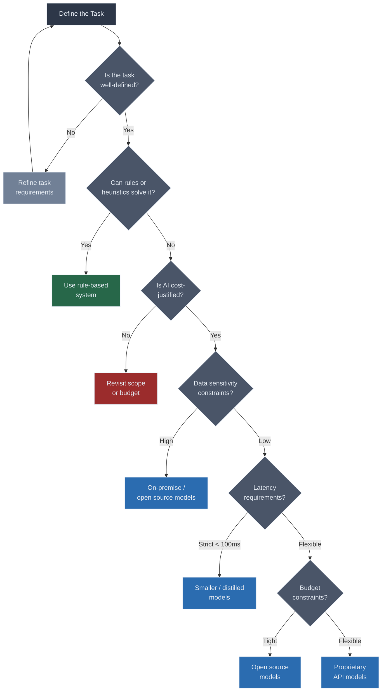
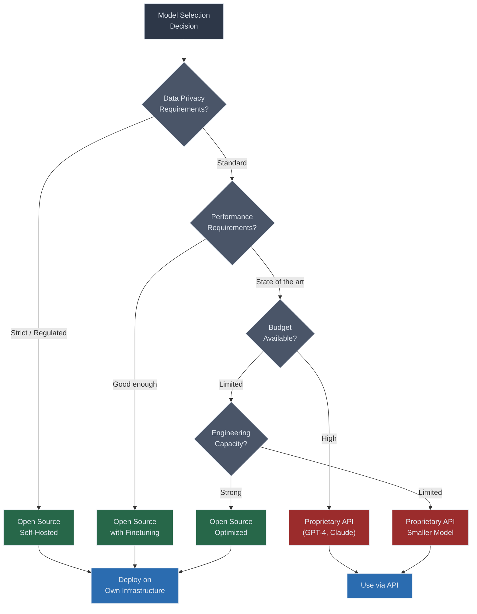
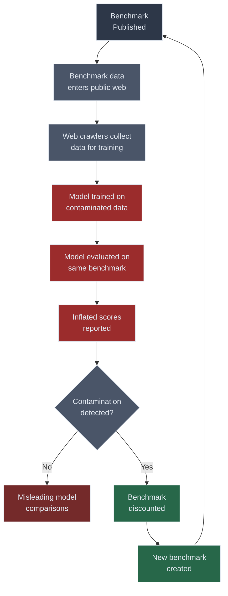
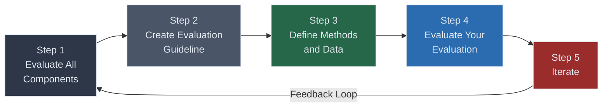
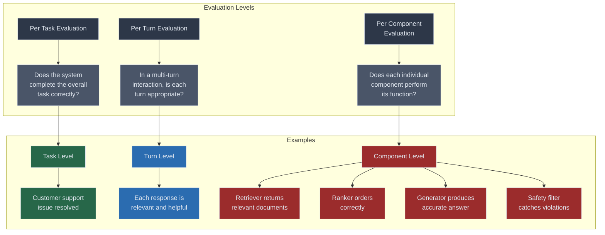
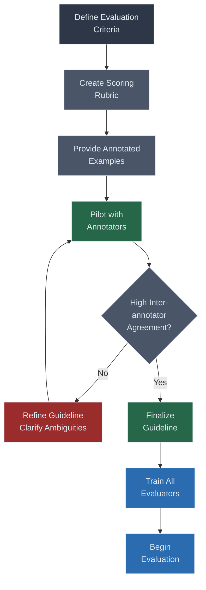

# Chapter 4. Evaluate AI Systems

> "Not having a reliable evaluation pipeline is one of the biggest blocks to AI adoption."
> Chip Huyen

Evaluation is the backbone of every successful AI application. Without it, you are flying blind. This chapter covers the full arc of evaluating AI systems, from selecting the right model for your use case, to navigating the minefield of public benchmarks, to designing a rigorous evaluation pipeline that ties model performance to business outcomes. If Chapter 3 gave you the conceptual vocabulary of evaluation, this chapter gives you the operational playbook.

## Table of Contents

- [Model Selection](#model-selection)
  - [When to Use AI](#when-to-use-ai)
  - [Criteria for Model Selection](#criteria-for-model-selection)
  - [Domain Specific Capabilities](#domain-specific-capabilities)
  - [Generation Capabilities](#generation-capabilities)
  - [Latency and Cost](#latency-and-cost)
  - [Model Size and Hardware Requirements](#model-size-and-hardware-requirements)
  - [Privacy and Legal Considerations](#privacy-and-legal-considerations)
  - [Open Source vs Proprietary Models](#open-source-vs-proprietary-models)
- [Navigate Public Benchmarks](#navigate-public-benchmarks)
  - [Benchmark Selection and Aggregation](#benchmark-selection-and-aggregation)
  - [Public Leaderboards](#public-leaderboards)
  - [Custom Leaderboards with Public Benchmarks](#custom-leaderboards-with-public-benchmarks)
  - [Are OpenAI Models Getting Worse](#are-openai-models-getting-worse)
  - [Data Contamination with Public Benchmarks](#data-contamination-with-public-benchmarks)
- [Design Your Evaluation Pipeline](#design-your-evaluation-pipeline)
  - [Step 1. Evaluate All Components in a System](#step-1-evaluate-all-components-in-a-system)
  - [Step 2. Create an Evaluation Guideline](#step-2-create-an-evaluation-guideline)
  - [Step 3. Define Evaluation Methods and Data](#step-3-define-evaluation-methods-and-data)
  - [Step 4. Evaluate Your Evaluation Pipeline](#step-4-evaluate-your-evaluation-pipeline)
  - [Step 5. Iterate](#step-5-iterate)
- [Summary](#summary)
- [Practitioner Checklist](#practitioner-checklist)

## Model Selection

Choosing the right model is one of the most consequential decisions in an AI project. It determines your cost structure, your latency profile, your deployment options and ultimately the quality of the experience you deliver to users. There is no universally best model. The best model is the one that satisfies your constraints while maximizing your objectives.

### When to Use AI

Before selecting a model, you should ask whether AI is the right tool for the problem at all. AI is not a universal hammer. It is a powerful tool with specific strengths and weaknesses.

**AI is a strong fit when the task involves.**

- Natural language understanding or generation
- Pattern recognition across unstructured data
- Tasks that are difficult to encode with deterministic rules
- Situations where approximate answers provide significant value
- Processes that currently require expensive human judgment at scale

**AI may be a poor fit when.**

- Exact, deterministic outputs are required (e.g. financial calculations)
- The cost of errors is catastrophic and unrecoverable
- The data is too scarce or too sensitive to use
- A simple heuristic or rule-based system achieves acceptable performance
- Regulatory constraints make AI adoption impractical

!!! important "Important"
    The decision to use AI should always start with a cost-benefit analysis. What is the cost of building, deploying and maintaining an AI solution compared to the value it delivers? What is the cost of errors, and how will you mitigate them?

### Criteria for Model Selection

Model selection is a multi-dimensional optimization problem. You are not just optimizing for quality. You are simultaneously balancing quality, cost, latency, privacy and operational complexity. The table below summarizes the key criteria.

| **Criterion** | **What It Measures** | **Why It Matters** | **Key Tradeoffs** |
|---|---|---|---|
| **Model Quality** | Accuracy, relevance and correctness of outputs | Directly impacts user experience and trust | Higher quality often means larger, slower, costlier models |
| **Latency** | Time from request to response | User experience degrades rapidly with latency above 2 seconds | Lower latency requires smaller models or specialized hardware |
| **Cost** | Per-token or per-request pricing | Determines unit economics and scalability | Cheaper models may sacrifice quality or capability |
| **Model Size** | Number of parameters, memory footprint | Determines hardware requirements and deployment options | Larger models are more capable but harder to deploy |
| **Privacy** | Data handling, residency and compliance | Regulatory requirements and user trust | Privacy constraints may limit model choices |
| **Legal** | Licensing, IP, liability | Determines commercial viability | Open source licensing varies widely in restrictions |
| **Functionality** | API features like logprobs, finetuning, streaming | Enables or blocks specific use cases | Proprietary APIs may offer features unavailable in open source |

### Domain Specific Capabilities

Not all models are created equal across domains. A model that excels at general knowledge may struggle with medical terminology, legal reasoning or code generation. When evaluating domain specific capabilities, consider.

**Specialized knowledge depth.** Does the model have sufficient knowledge of your domain? A model trained primarily on web text may lack depth in specialized fields like chemistry, law or clinical medicine. You can test this by prompting the model with domain specific questions that require expert-level reasoning.

**Technical vocabulary.** Can the model correctly use and understand the jargon of your domain? Misuse of technical terms is a clear signal that the model lacks domain depth.

**Reasoning patterns.** Different domains require different reasoning patterns. Legal reasoning involves precedent analysis and statutory interpretation. Medical reasoning involves differential diagnosis. Mathematical reasoning involves symbolic manipulation. Test whether the model can follow the reasoning patterns specific to your domain.

**Cultural and contextual awareness.** For applications serving specific regions or communities, the model must understand cultural context. This includes language variations, local conventions and domain-specific norms.

!!! tip "Tip"
    When evaluating domain specific capabilities, create a small test set of 50 to 100 examples that represent the hardest cases in your domain. These are the cases that differentiate good models from great ones. Easy cases rarely help you make a selection decision.

### Generation Capabilities

Beyond domain knowledge, you need to evaluate the model's generation capabilities across several dimensions.

**Factual consistency.** Does the model generate outputs that are consistent with known facts? Factual inconsistency, often called hallucination, is one of the most dangerous failure modes in production systems. A model that confidently states incorrect facts can erode user trust and cause real harm.

**Toxicity.** Does the model generate harmful, offensive or inappropriate content? Even if your application does not deal with sensitive topics, adversarial users may try to elicit toxic outputs. You need to evaluate the model's robustness against such attacks.

**Fairness.** Does the model exhibit systematic biases across demographic groups? Bias in AI outputs can have legal consequences and reputational damage. Evaluate the model's outputs across different demographic dimensions relevant to your application.

{ width="700" }

Figure 4-3. Political and economic leanings of different foundation models

**Instruction following.** Can the model reliably follow complex, multi-step instructions? Many production applications require the model to follow specific output formats, adhere to constraints or execute multi-step workflows. Poor instruction following leads to brittle systems.

{ width="700" }

Figure 4-4. Top 10 most common instruction types in LMSYS conversations

**Length and format control.** Can the model generate outputs of the requested length and in the requested format? If your application requires JSON output, does the model reliably produce valid JSON? If you need concise answers, does the model avoid unnecessary verbosity?

!!! note "Note"
    Generation capabilities are not fixed properties of a model. They can be significantly improved through prompt engineering, finetuning and system design. A model that struggles with instruction following out of the box may perform well with a carefully crafted system prompt.

### Latency and Cost

Latency and cost are often the binding constraints in production systems. The most capable model is useless if it is too slow or too expensive for your use case.

**Latency considerations.**

- **Time to first token (TTFT).** How quickly does the model start generating output? This is critical for streaming applications where perceived responsiveness matters.
- **Tokens per second (TPS).** How fast does the model generate output once it starts? This determines how long users wait for complete responses.
- **End-to-end latency.** The total time from request to complete response, including network overhead, preprocessing and postprocessing.

{ width="700" }

Figure 4-6. An inference service provides an interface for users to query models

**Cost considerations.**

- **Per-token pricing.** Most API providers charge per input and output token. Output tokens are typically 3 to 4 times more expensive than input tokens.
- **Fixed infrastructure costs.** Self-hosted models require GPU infrastructure. The cost is fixed regardless of usage, making it more economical at high volumes.
- **Engineering cost.** Open source models require engineering effort for deployment, optimization and maintenance. This cost is often underestimated.

!!! warning "Warning"
    Do not optimize for latency or cost prematurely. Start with the most capable model, validate that it meets your quality requirements, and then explore cheaper or faster alternatives. Optimizing for cost before validating quality often leads to wasted effort.

### Model Size and Hardware Requirements

Model size directly determines your deployment options. A 70 billion parameter model requires significant GPU infrastructure, while a 7 billion parameter model can run on a single consumer GPU with quantization.

**Key relationships to understand.**

- A model with *N* billion parameters requires approximately *2N* GB of memory in full precision (FP16). A 70B model needs roughly 140 GB of GPU memory.
- Quantization can reduce memory requirements by 2x to 4x with minimal quality degradation. A 70B model quantized to 4-bit precision needs roughly 35 GB.
- Batch size and context length also affect memory requirements. Longer contexts require more memory for the key-value cache.

### Privacy and Legal Considerations

Privacy is not just a compliance checkbox. It is a fundamental design constraint that can determine which models you can use and how you can use them.

**Data residency.** Some industries and regions require data to remain within specific geographic boundaries. If your data cannot leave your infrastructure, you need self-hosted models.

**Data retention.** API providers may retain your data for model improvement or safety monitoring. Review the provider's data retention policies and opt out if necessary.

**Licensing.** Open source models come with various licenses. Some are truly permissive (Apache 2.0, MIT). Others have restrictions on commercial use, model size or redistribution. Read the license carefully before building on any model.

**Liability.** Who is responsible when the model produces harmful or incorrect output? API providers typically disclaim liability for model outputs. When self-hosting, the liability falls entirely on you.

### Open Source vs Proprietary Models

One of the most consequential decisions is whether to use open source or proprietary models. This is not a binary choice. Many organizations use a mix of both, routing different tasks to different models based on their requirements.

**Data privacy.** With open source models, your data never leaves your infrastructure. With proprietary APIs, your data is sent to a third party. For regulated industries like healthcare and finance, this can be a dealbreaker. Even in less regulated industries, many organizations prefer to keep sensitive data in-house.

**Performance.** Proprietary models from frontier labs (OpenAI, Anthropic, Google) tend to lead on the hardest benchmarks. However, the gap between open source and proprietary models has been narrowing rapidly. For many practical tasks, open source models achieve competitive or even superior performance, especially after domain-specific finetuning.

**Functionality.** Proprietary APIs often provide features that are harder to replicate with open source models, such as logprobs, function calling, structured output guarantees and built-in safety filters. On the other hand, open source models give you full access to model weights, enabling finetuning, distillation and architectural modifications that are impossible with closed APIs.

**Cost structure.** Proprietary models charge per token. This is simple and requires no infrastructure management, but costs scale linearly with usage. Open source models require upfront investment in infrastructure and engineering, but marginal costs are much lower at high volumes. The crossover point depends on your usage volume and engineering capacity.

**Control and transparency.** With open source models, you can inspect the weights, understand the training data (sometimes) and modify the model to suit your needs. With proprietary models, the model is a black box. You cannot see what data it was trained on, how it handles edge cases or why it produces specific outputs.

**On-device deployment.** If your application needs to run on user devices (phones, laptops, edge devices), open source models are your only option. Proprietary models require an internet connection and API access.

{ width="700" }

Figure 4-8. Why enterprises care about open source models

| **Dimension** | **Open Source** | **Proprietary** |
|---|---|---|
| **Data Privacy** | Data stays on your infrastructure | Data sent to third party |
| **Performance** | Competitive, improving rapidly | Leading on hardest benchmarks |
| **Finetuning** | Full control over weights | Limited or no finetuning options |
| **Logprobs** | Available with full access | Available via some APIs |
| **Cost at Low Volume** | Higher (infrastructure + engineering) | Lower (pay per token) |
| **Cost at High Volume** | Lower (fixed infrastructure) | Higher (linear scaling) |
| **Latency Control** | Full control over optimization | Limited to provider's infrastructure |
| **Transparency** | Weights and often training data visible | Black box |
| **On-device** | Possible with quantization | Not possible |
| **Maintenance** | Your responsibility | Provider's responsibility |
| **Time to Production** | Longer (deployment, optimization) | Shorter (API integration) |

!!! tip "Tip"
    A common production pattern is to use a proprietary model during prototyping and early development for speed, then migrate to an open source model once you have established quality baselines and accumulated enough data for finetuning. This gives you the best of both worlds.

## Navigate Public Benchmarks

Public benchmarks are the most common way to compare models. They provide standardized tasks and metrics that allow apples-to-apples comparisons. However, they are also deeply flawed. Understanding both their value and their limitations is essential for making good model selection decisions.

{ width="700" }

Figure 4-1. Benchmark overview

### Benchmark Selection and Aggregation

No single benchmark captures everything you care about. A model that scores highest on MMLU (Massive Multitask Language Understanding) might underperform on code generation or instruction following. The challenge is selecting the right set of benchmarks and aggregating them meaningfully.

```mermaid
graph LR
    subgraph "Public Benchmark Landscape"
        direction TB
        A["Leaderboards"] --> A1["Hugging Face<br/>Open LLM"]
        A --> A2["HELM<br/>(Stanford)"]
        A --> A3["Chatbot Arena<br/>(LMSYS)"]
        
        B["Benchmarks"] --> B1["Knowledge<br/>MMLU, ARC"]
        B --> B2["Reasoning<br/>HellaSwag, WinoGrande"]
        B --> B3["Math<br/>GSM-8K, MATH"]
        B --> B4["Truthfulness<br/>TruthfulQA"]
        B --> B5["Code<br/>HumanEval, MBPP"]
        
        C["Evaluation<br/>Harnesses"] --> C1["lm-evaluation-harness<br/>(EleutherAI)"]
        C --> C2["HELM<br/>(Stanford)"]
        C --> C3["bigcode-evaluation<br/>(BigCode)"]
    end

    style A fill:#2D3748,stroke:#E2E8F0,color:#E2E8F0
    style B fill:#2D3748,stroke:#E2E8F0,color:#E2E8F0
    style C fill:#2D3748,stroke:#E2E8F0,color:#E2E8F0
    style A1 fill:#4A5568,stroke:#E2E8F0,color:#E2E8F0
    style A2 fill:#4A5568,stroke:#E2E8F0,color:#E2E8F0
    style A3 fill:#4A5568,stroke:#E2E8F0,color:#E2E8F0
    style B1 fill:#276749,stroke:#E2E8F0,color:#E2E8F0
    style B2 fill:#276749,stroke:#E2E8F0,color:#E2E8F0
    style B3 fill:#276749,stroke:#E2E8F0,color:#E2E8F0
    style B4 fill:#276749,stroke:#E2E8F0,color:#E2E8F0
    style B5 fill:#276749,stroke:#E2E8F0,color:#E2E8F0
    style C1 fill:#2B6CB0,stroke:#E2E8F0,color:#E2E8F0
    style C2 fill:#2B6CB0,stroke:#E2E8F0,color:#E2E8F0
    style C3 fill:#2B6CB0,stroke:#E2E8F0,color:#E2E8F0
```

### Public Leaderboards

The most widely referenced leaderboard is the **Hugging Face Open LLM Leaderboard**, which evaluates models across six benchmarks using EleutherAI's lm-evaluation-harness.

| **Benchmark** | **What It Measures** | **Format** | **Size** | **Key Notes** |
|---|---|---|---|---|
| **ARC-C** (AI2 Reasoning Challenge, Challenge Set) | Science knowledge and reasoning | Multiple choice | 1,172 questions | Grade-school level science questions |
| **MMLU** (Massive Multitask Language Understanding) | Knowledge across 57 subjects | Multiple choice | 14,042 questions | Covers STEM, humanities, social sciences |
| **HellaSwag** | Commonsense reasoning about situations | Sentence completion | 10,042 questions | Tests understanding of everyday scenarios |
| **TruthfulQA** | Tendency to generate truthful answers | Multiple choice / generation | 817 questions | Tests resistance to common misconceptions |
| **WinoGrande** | Commonsense reasoning (coreference) | Fill in the blank | 1,267 questions | Pronoun resolution requiring world knowledge |
| **GSM-8K** | Mathematical reasoning | Open ended | 8,500 questions | Grade-school math word problems |

**Benchmark correlation.** An important insight from the leaderboard is that some benchmarks are highly correlated while others are not. This means that scoring high on one benchmark may or may not predict performance on another.

{ width="700" }

Figure 4-2. Performance of several models on benchmarks

| | **ARC-C** | **MMLU** | **HellaSwag** | **TruthfulQA** | **WinoGrande** | **GSM-8K** |
|---|---|---|---|---|---|---|
| **ARC-C** | 1.00 | 0.89 | 0.91 | 0.42 | 0.85 | 0.71 |
| **MMLU** | 0.89 | 1.00 | 0.88 | 0.38 | 0.83 | 0.78 |
| **HellaSwag** | 0.91 | 0.88 | 1.00 | 0.35 | 0.87 | 0.68 |
| **TruthfulQA** | 0.42 | 0.38 | 0.35 | 1.00 | 0.40 | 0.33 |
| **WinoGrande** | 0.85 | 0.83 | 0.87 | 0.40 | 1.00 | 0.65 |
| **GSM-8K** | 0.71 | 0.78 | 0.68 | 0.33 | 0.65 | 1.00 |

!!! note "Note"
    TruthfulQA has notably low correlation with other benchmarks. This means that models that excel on knowledge and reasoning tasks are not necessarily more truthful. This is an important insight for applications where factual accuracy is critical.

**Aggregation methods.** Leaderboards typically aggregate benchmark scores into a single number. The two most common methods are.

1. **Simple averaging.** Take the mean of all benchmark scores. This is easy to understand but gives equal weight to all benchmarks regardless of their difficulty or relevance.
2. **Mean win rate.** For each pair of models, determine which wins on each benchmark, then compute the average win rate across all pairs. This is more robust to outliers and scale differences between benchmarks but is harder to interpret.

### Custom Leaderboards with Public Benchmarks

Rather than relying on a single public leaderboard, you can create a custom leaderboard tailored to your needs. Select the benchmarks that most closely align with your use case, assign weights based on importance and rank models accordingly.

For example, if you are building a medical Q&A system, you might weight MMLU heavily (particularly the medical subsets), add a domain-specific benchmark like MedQA, and give lower weight to code-related benchmarks. This gives you a ranking that is far more relevant to your specific needs than any generic leaderboard.

### Are OpenAI Models Getting Worse

> "Every time OpenAI updates its models, people complain that their models seem to be getting worse."
> Chip Huyen

This is a fascinating case study in the difficulty of evaluation. In mid-2023, researchers from Stanford and Berkeley published a study suggesting that GPT-4's performance on certain tasks had degraded significantly between March and June 2023. The study showed that GPT-4's accuracy on identifying prime numbers dropped from 97.6% to 2.4%.

The reality is more nuanced. Model providers like OpenAI continuously update their models. These updates may improve performance on some dimensions while degrading performance on others. This is called **model drift**, and it is a real challenge for production systems. If you are building on top of a proprietary API, your system's behavior can change without any changes to your own code.

This phenomenon illustrates a broader point. Evaluation is not a one-time activity. It must be continuous. You need to monitor model performance over time and detect regressions early.

{ width="700" }

Figure 4-9. Changes in GPT-3.5 and GPT-4 performance from March to June 2023

!!! warning "Warning"
    If you are using proprietary API models, implement continuous evaluation. Set up automated tests that run against your evaluation set periodically. This is the only way to detect model drift before your users do.

### Data Contamination with Public Benchmarks

> "A benchmark stops being useful as soon as it becomes public."
> Chip Huyen

Data contamination occurs when a model has seen benchmark data during training. This inflates the model's scores without reflecting genuine capability improvement. It is one of the most insidious problems in AI evaluation.

**How contamination happens.** When a benchmark is published, its questions and answers become part of the public web. Web crawls used for training data collection inevitably pick up this data. Even if model developers try to filter out benchmark data, some contamination is nearly impossible to prevent. Some cases are more egregious, where models are intentionally trained on benchmark data to game leaderboard rankings.

**Detection methods.**

1. **N-gram overlapping.** Check whether sequences of tokens from the benchmark appear verbatim in the training data. If a model can reproduce a benchmark question word for word, it has likely memorized it.
 2. **Perplexity analysis.** If a model assigns unusually low perplexity to benchmark examples (meaning it finds them highly predictable), this may indicate that it has seen them during training. Compare the perplexity on benchmark examples to the perplexity on similar but novel examples.

{ width="700" }

Figure 4-10. Relative difference in GPT-3 performance when evaluating using only the first choices

**Handling contamination.** There is no perfect solution, but several strategies help.

- **Use private benchmarks.** Create evaluation sets that are never published. This eliminates contamination risk entirely.
- **Use dynamic benchmarks.** Some benchmarks regenerate questions from templates, making it harder for models to memorize specific examples.
- **Cross-reference with private evaluations.** Use public benchmarks for initial screening but validate with your own private evaluation data before making final decisions.
- **Monitor for suspiciously high scores.** If a model's public benchmark scores seem too good compared to its real-world performance, contamination may be the cause.

## Design Your Evaluation Pipeline

Designing a robust evaluation pipeline is a multi-step process. It requires careful thought about what to evaluate, how to evaluate it and how to validate the evaluation itself. The five steps below provide a systematic framework.

{ width="700" }

Figure 4-5. Overview of the evaluation workflow for your application

### Step 1. Evaluate All Components in a System

AI systems are rarely a single model call. They typically involve multiple components. A retrieval step, a ranking step, one or more model calls, postprocessing and safety filters. Each component can fail independently, and end-to-end evaluation alone cannot tell you *where* things went wrong.

You need to evaluate at three levels.

**Per task evaluation.** This is the highest level. Does the system accomplish the user's goal? For a customer support bot, did the customer's issue get resolved? For a code generation tool, does the generated code compile and pass tests? Task-level evaluation tells you whether the system is useful, but it does not tell you why it fails when it does.

**Per turn evaluation.** In multi-turn interactions (chatbots, agents), each turn must be evaluated independently. A conversation can fail at any point. The model might provide a great first response but go off track in subsequent turns. Per-turn evaluation helps you identify where conversations break down.

**Per component evaluation.** This is the most granular level. For a RAG (Retrieval-Augmented Generation) system, you would evaluate the retriever separately from the generator. If the retriever returns irrelevant documents, the generator cannot produce a good answer regardless of its capabilities. Component-level evaluation isolates failures and tells you exactly where to focus your improvement efforts.

!!! important "Important"
    Start with component-level evaluation and build up. If your retriever is returning irrelevant documents 30% of the time, no amount of prompt engineering on the generator will fix that. Fix components from the bottom up.

### Step 2. Create an Evaluation Guideline

> LinkedIn shared that "the first hurdle was in creating an evaluation guideline."
> Chip Huyen

An evaluation guideline is a document that specifies exactly how to evaluate model outputs. It defines the criteria, the scoring rubric and provides examples of good and bad outputs at each score level. Without a guideline, different evaluators (human or AI) will interpret evaluation criteria differently, leading to unreliable results.

**Define evaluation criteria.** Start by listing every dimension of quality that matters for your application. Common criteria include.

- **Correctness.** Is the output factually accurate?
- **Relevance.** Does the output address the user's question or need?
- **Completeness.** Does the output cover all important aspects?
- **Conciseness.** Is the output free of unnecessary information?
- **Tone.** Does the output match the desired voice and style?
- **Safety.** Is the output free of harmful, biased or inappropriate content?

**Create scoring rubrics with examples.** For each criterion, define a clear scoring scale and provide annotated examples. A rubric without examples is open to interpretation. Here is an example for a 5-point correctness rubric.

| **Score** | **Label** | **Description** | **Example** |
|---|---|---|---|
| 5 | Completely correct | All facts accurate, no errors | (Provide a specific example from your domain) |
| 4 | Mostly correct | Minor inaccuracies that do not affect usefulness | (Provide a specific example) |
| 3 | Partially correct | Mix of correct and incorrect information | (Provide a specific example) |
| 2 | Mostly incorrect | Significant errors that mislead the user | (Provide a specific example) |
| 1 | Completely incorrect | Factually wrong or entirely irrelevant | (Provide a specific example) |

**Tie evaluation metrics to business metrics.** This is where evaluation meets reality. A model might score 4.2 out of 5 on correctness, but what does that mean for your business?

> Understanding the impact of evaluation metrics on business metrics is helpful for planning.
> Chip Huyen

Map your evaluation scores to business outcomes whenever possible. If improving correctness from 4.0 to 4.5 reduces customer support escalations by 20%, that gives you a concrete target and a clear justification for the investment.

### Step 3. Define Evaluation Methods and Data

**Select evaluation methods.** The three main evaluation methods are.

1. **Human evaluation.** The gold standard for subjective quality assessment. Expensive, slow, but necessary for establishing ground truth.
2. **AI evaluation (LLM as judge).** Using a strong model to evaluate a weaker model's outputs. Faster and cheaper than human evaluation, but introduces its own biases (position bias, verbosity bias, self-preference).
3. **Automatic metrics.** Computational metrics like BLEU, ROUGE, exact match or code execution pass rate. Fast and cheap, but often correlate poorly with human judgment for open-ended tasks.

The best evaluation pipelines use a combination of all three. Automatic metrics for fast, cheap filtering. AI evaluation for scalable quality assessment. Human evaluation for calibration and edge cases.

**Annotate evaluation data.** Your evaluation data should be representative of real production traffic. If your model handles customer support queries, your evaluation set should include the full distribution of query types, difficulty levels and edge cases.

**Data slicing for fine-grained understanding.** Aggregate metrics can be misleading. A model might achieve 90% accuracy overall while performing terribly on a specific subset of users or query types. This is where data slicing becomes essential.

> "If you care about something, put a test set on it."
> Chip Huyen

Slice your evaluation data along every dimension that matters. User type, query category, input length, language, demographic group, time of day. Look for disparities. A model that performs well on average but poorly for a specific group may have a fairness problem.

**Simpson's paradox.** Data slicing also protects against Simpson's paradox, where a trend that appears in aggregate data reverses when the data is broken into groups. This can lead to dangerously wrong conclusions if you only look at aggregate metrics.

| **Category** | **Model A Accuracy** | **Model A Volume** | **Model B Accuracy** | **Model B Volume** |
|---|---|---|---|---|
| Easy queries | 95% | 900 | 98% | 100 |
| Hard queries | 60% | 100 | 65% | 900 |
| **Overall** | **91.5%** | **1000** | **68.3%** | **1000** |

In this example, Model B is better on both easy and hard queries individually, but Model A appears better overall because it handles mostly easy queries. This is Simpson's paradox in action. Without data slicing, you would choose Model A, the objectively worse model.

**Bootstrap estimation for evaluation set size.** How many examples do you need in your evaluation set? Too few and your estimates are unreliable. Too many and you waste resources on annotation.

Bootstrap estimation provides a principled answer. The idea is to resample your evaluation data with replacement, compute your metric on each resample and observe how the metric's confidence interval changes as you add more data. When the confidence interval is narrow enough for your decision-making needs, you have enough data.

| **Desired Confidence Level** | **Desired Margin of Error** | **Approximate Sample Size Needed** |
|---|---|---|
| 90% | +/- 5% | ~270 |
| 95% | +/- 5% | ~385 |
| 95% | +/- 3% | ~1,068 |
| 95% | +/- 1% | ~9,604 |
| 99% | +/- 3% | ~1,844 |
| 99% | +/- 1% | ~16,590 |

!!! note "Note"
    These are approximate numbers based on proportions and normal approximation. Your actual required sample size depends on the variance in your data and the specific metric you are estimating. Use bootstrap estimation on your actual data for a more precise answer.

**Statistical significance.** When comparing two models, ensure that the difference in their evaluation scores is statistically significant. A 1% improvement on a test set of 100 examples is likely noise, not signal. Use paired tests (like McNemar's test for classification or a paired bootstrap for general metrics) to determine whether observed differences are real.

### Step 4. Evaluate Your Evaluation Pipeline

This is the meta-evaluation step. Your evaluation pipeline is itself a system that can fail, and you need to validate that it works correctly.

**Reliability.** If you run the same evaluation twice, do you get the same results? For human evaluation, this is measured by inter-annotator agreement (Cohen's kappa, Krippendorff's alpha). For AI evaluation, this is measured by consistency across multiple runs (since LLMs are stochastic).

**Correlation with downstream outcomes.** Does your evaluation pipeline's assessment correlate with real-world outcomes? If your pipeline rates Model A higher than Model B, do users actually prefer Model A? If not, your evaluation pipeline is measuring the wrong thing.

**Cost and latency.** How much does it cost to run your evaluation pipeline, and how long does it take? If evaluation takes weeks and costs thousands of dollars, you cannot iterate quickly. Find the right balance between evaluation rigor and operational efficiency.

### Step 5. Iterate

Evaluation is never done. As your application evolves, your user base changes and the world changes, your evaluation pipeline must evolve with it.

**When to update your evaluation.**

- When you add new features or capabilities
- When you observe new failure modes in production
- When your user base or use case distribution shifts
- When new evaluation methods or benchmarks become available
- When your evaluation metrics diverge from business outcomes

**How to iterate.**

1. Analyze production failures and add representative examples to your evaluation set
2. Revisit your evaluation criteria and rubrics periodically
3. Test new evaluation methods against your existing gold standard
4. Involve domain experts in evaluation updates
5. Track the correlation between evaluation metrics and business metrics over time

## Summary

This chapter covered the three pillars of evaluating AI systems. **Model selection** requires balancing quality, cost, latency, privacy and operational complexity. There is no universally best model. The best model is the one that meets your specific constraints. **Public benchmarks** are useful for initial screening but are plagued by aggregation issues, correlation blind spots and data contamination. Never rely solely on public benchmarks for model selection. **Evaluation pipeline design** is a systematic, five-step process. Evaluate all components, create clear guidelines, define methods and data, validate the pipeline itself and iterate continuously.

The most important lesson is that evaluation is not a one-time gate. It is a continuous process that must evolve with your application.

## Practitioner Checklist

- [ ] Before selecting a model, define your constraints (latency, cost, privacy, quality thresholds)
- [ ] Evaluate domain specific capabilities with a curated test set of hard cases
- [ ] Test generation capabilities including factual consistency, toxicity and instruction following
- [ ] Assess open source vs proprietary tradeoffs based on your specific requirements
- [ ] Use public benchmarks for initial screening only, not as final selection criteria
- [ ] Check for data contamination when public benchmark scores seem unusually high
- [ ] Evaluate all components in your system independently, not just end-to-end
- [ ] Create a written evaluation guideline with scoring rubrics and examples
- [ ] Ensure inter-annotator agreement is high before scaling evaluation
- [ ] Tie evaluation metrics to business metrics
- [ ] Slice evaluation data across all dimensions you care about
- [ ] Use bootstrap estimation to determine if your evaluation set is large enough
- [ ] Validate that model comparison differences are statistically significant
- [ ] Implement continuous evaluation for production systems using proprietary APIs
- [ ] Schedule regular reviews and updates of your evaluation pipeline

