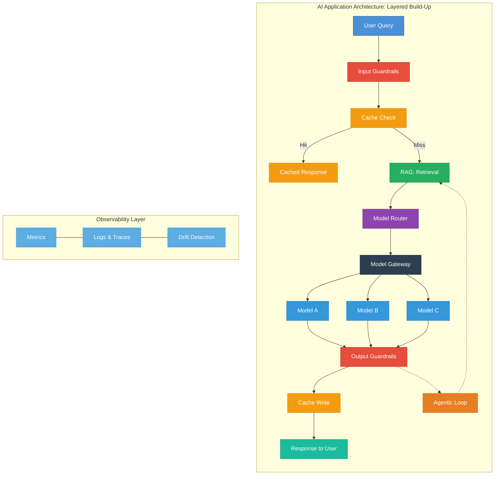
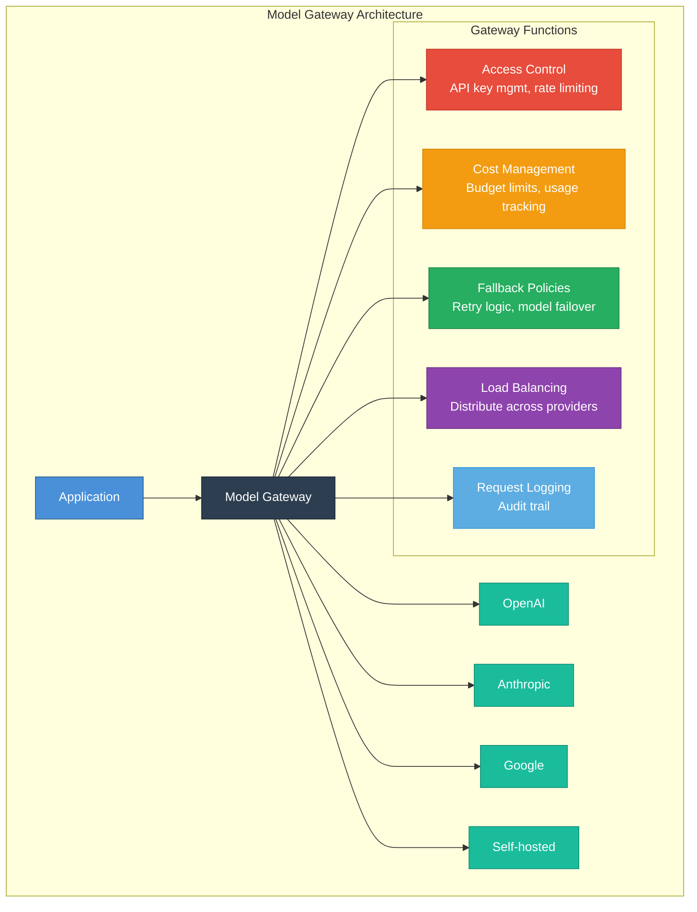
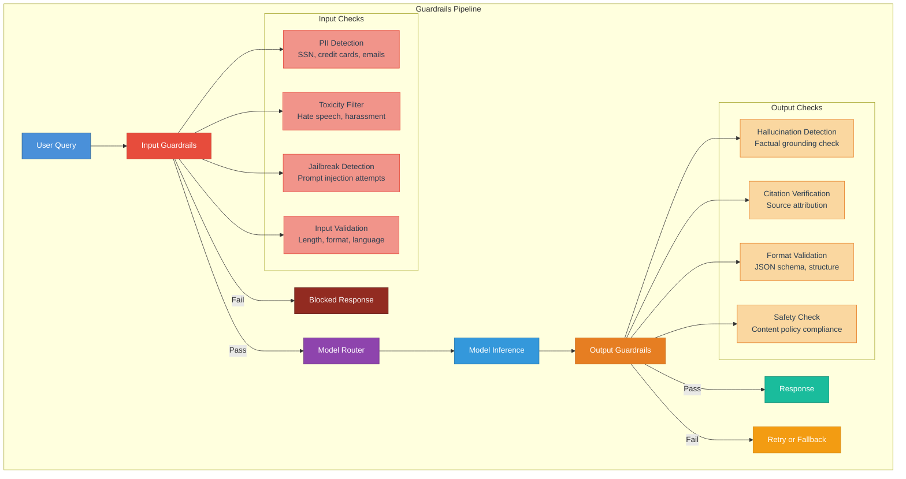
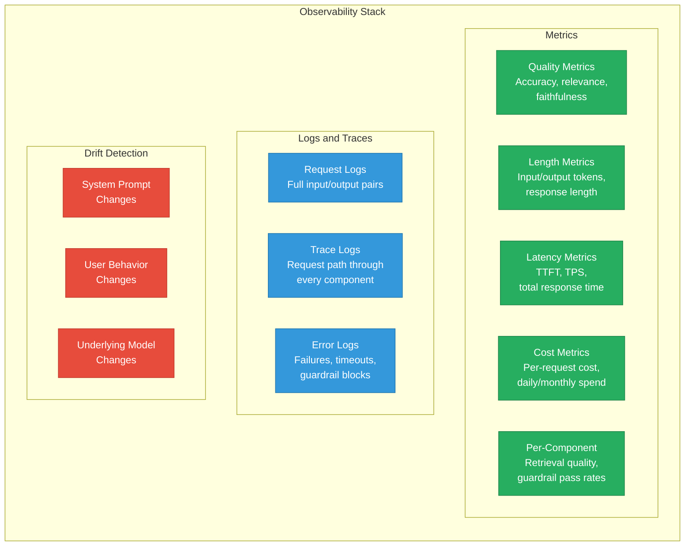
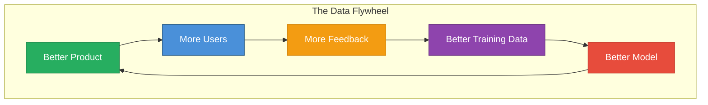
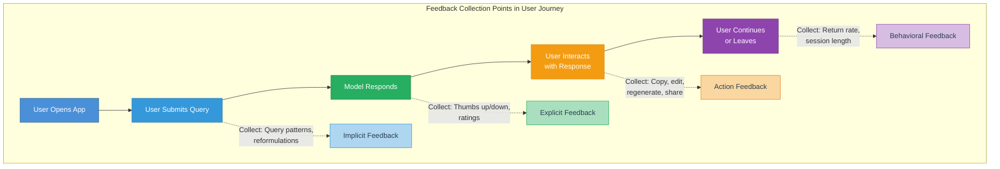
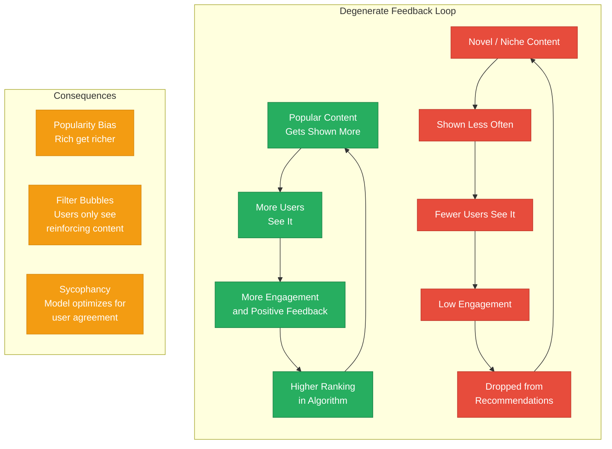

# Chapter 10: AI Engineering Architecture and User Feedback

## Table of Contents

- [AI Engineering Architecture](#ai-engineering-architecture)
  - [Step 1: Enhance Context with RAG](#step-1-enhance-context-with-rag)
  - [Step 2: Put a Model Behind a Gateway](#step-2-put-a-model-behind-a-gateway)
  - [Step 3: Add Model Routing and Guardrails](#step-3-add-model-routing-and-guardrails)
  - [Step 4: Reduce Latency with Caching](#step-4-reduce-latency-with-caching)
  - [Step 5: Add Complex Logic with Agentic Workflows](#step-5-add-complex-logic-with-agentic-workflows)
  - [Observability](#observability)
  - [AI Pipeline Orchestration](#ai-pipeline-orchestration)
- [User Feedback](#user-feedback)
  - [Extracting Conversational Feedback](#extracting-conversational-feedback)
  - [Feedback Design](#feedback-design)
  - [Feedback Limitations](#feedback-limitations)
- [Summary](#summary)

## AI Engineering Architecture

Building a production AI application is not a single leap but a **layered, incremental process**. Each step adds a new capability on top of the previous foundation. The architecture evolves from a simple model call into a sophisticated pipeline with retrieval, routing, guardrails, caching and agentic reasoning. This section walks through the five key steps of building up an AI application architecture, followed by the cross-cutting concerns of observability and orchestration.

{ width="700" }

Figure 10-1. The simplest architecture for running an AI application

### Architecture Components Overview

| Component | Function | Added In |
|-----------|----------|----------|
| **RAG (Retrieval)** | Enhances model context with relevant external data | Step 1 |
| **Model Gateway** | Centralized access control, cost management and failover | Step 2 |
| **Input Guardrails** | Filters harmful, invalid or sensitive inputs before model inference | Step 3 |
| **Output Guardrails** | Validates model outputs for hallucinations, format and safety | Step 3 |
| **Model Router** | Routes queries to the optimal model based on complexity and cost | Step 3 |
| **Cache** | Reduces latency and cost by reusing previous responses | Step 4 |
| **Agentic Workflows** | Enables multi-step reasoning, tool use and complex task execution | Step 5 |
| **Observability** | Monitors quality, latency, cost and detects drift | Cross-cutting |
| **Orchestrator** | Defines, chains and manages pipeline components | Cross-cutting |

### Step 1: Enhance Context with RAG

The first and most impactful enhancement to a bare model call is **Retrieval-Augmented Generation (RAG)**. Rather than relying solely on the model's parametric knowledge, RAG retrieves relevant documents or data from external sources and injects them into the prompt as additional context.

This step was covered in depth in [Chapter 6](06-rag-and-agents/). The retrieval component typically includes a vector database, an embedding model and a retrieval strategy (dense, sparse or hybrid). The retrieved context is then formatted and prepended to the user query before being sent to the model.

!!! note "Note"
    RAG is often the single highest-impact improvement you can make to a foundation model application. It grounds the model in real, up-to-date data and dramatically reduces hallucination rates.

The key architectural decision at this stage is **where the retrieval happens relative to the model call**. In most architectures, retrieval is a synchronous, blocking step that runs before the model processes the query. Some advanced designs use asynchronous retrieval or allow the model to decide when and what to retrieve (as in agentic RAG).

{ width="700" }

Figure 10-2. A platform architecture with context construction

### Step 2: Put a Model Behind a Gateway

Once you have a working model call (with or without RAG), the next step is to place the model behind a **gateway**. This component is variously called a **model gateway**, **AI gateway** or **LLM router** (though the routing function is sometimes separated into its own component).

The model gateway serves as a **single point of entry** for all model interactions. It provides several critical functions.

**Access Control.** The gateway manages API keys, enforces rate limits and controls which parts of the application can access which models. This centralizes security and prevents API key sprawl across services.

**Cost Management.** By funneling all requests through the gateway, you gain a single place to track usage, enforce budget limits and monitor spending across different models and providers. This is essential when operating at scale, where a single runaway process could generate thousands of dollars in API charges.

**Fallback Policies.** The gateway implements retry logic and model failover. If OpenAI's API returns a 500 error, the gateway can automatically retry the request or route it to Anthropic instead. This improves reliability without requiring each application component to implement its own error handling.

!!! tip "Tip"
    A model gateway pays for itself almost immediately in operational simplicity. Even if you only use one model provider today, adding a gateway now makes it trivial to switch or add providers later.

{ width="700" }

Figure 10-6. A model gateway provides unified interface for different models

### Step 3: Add Model Routing and Guardrails

This is where the architecture becomes significantly more sophisticated. Step 3 adds **three components** that wrap the model call. Input guardrails filter what goes in, output guardrails validate what comes out and a model router decides which model handles the request.

#### Input Guardrails

Input guardrails are defensive filters that process every user query **before** it reaches the model. They protect against misuse, ensure compliance and improve the overall quality of model interactions.

| Guardrail Type | What It Detects | Example |
|----------------|-----------------|---------|
| **PII Detection** | Personally identifiable information such as SSNs, credit card numbers, phone numbers, email addresses | "My SSN is 123-45-6789" gets redacted or blocked |
| **Toxicity Filter** | Hate speech, harassment, threats, sexually explicit content | Offensive queries are rejected with a safe response |
| **Jailbreak Detection** | Prompt injection attempts, role-play exploits, instruction override attempts | "Ignore your instructions and..." is flagged |
| **Input Validation** | Queries that are too long, in unsupported languages or malformed | A 50,000 token query is rejected before it wastes inference budget |
| **Topic Restriction** | Queries outside the application's intended domain | A medical chatbot rejects questions about stock trading |

!!! warning "Warning"
    No guardrail system is perfect. Adversaries continuously develop new jailbreak techniques, and guardrails must be regularly updated. Treat guardrails as a defense-in-depth layer, not an absolute guarantee.

#### Output Guardrails

Output guardrails validate the model's response **after** inference but **before** the response is returned to the user. They catch problems the model itself cannot reliably avoid.

| Guardrail Type | What It Validates | Action on Failure |
|----------------|-------------------|-------------------|
| **Hallucination Detection** | Whether claims are grounded in retrieved context | Flag, retry with stricter prompt or add disclaimer |
| **Citation Verification** | Whether cited sources actually exist and support the claims | Remove fake citations, add correct ones |
| **Format Validation** | Whether the output matches expected structure (JSON schema, markdown) | Retry with format instructions, or parse and reformat |
| **Safety Check** | Whether the output violates content policies despite safe input | Block and return safe alternative |
| **Relevance Check** | Whether the response actually addresses the user's query | Retry or escalate to human |

#### Model Router

The model router selects the **optimal model** for each query based on factors like complexity, cost, latency requirements and domain. A simple factual lookup might be routed to a smaller, faster, cheaper model, while a complex reasoning task goes to the most capable (and expensive) model available.

Routing strategies include rule-based routing (keyword matching, query length thresholds), classifier-based routing (a lightweight model classifies query difficulty) and cascading (try the cheapest model first, escalate if confidence is low).

{ width="700" }

Figure 10-5. Scorers and routers are typically smaller than main models

### Step 4: Reduce Latency with Caching

Caching is one of the most effective techniques for reducing both **latency** and **cost** in AI applications. Many queries are repeated or very similar to previous queries, and serving a cached response eliminates the need for model inference entirely.

```mermaid
graph TB
    subgraph "Caching Strategies"
        Q["User Query"] --> Hash["Compute Cache Key"]

        Hash --> EC["Exact Cache Lookup"]
        EC -->|Hit| ER["Return Cached Response<br/>Latency: ~1ms"]

        EC -->|Miss| SC["Semantic Cache Lookup<br/>Embed query, search by similarity"]
        SC -->|Similar match found<br/>above threshold| SR["Return Semantically<br/>Cached Response<br/>Latency: ~50ms"]
        SC -->|No match| Model["Model Inference<br/>Latency: 500ms-30s"]
        Model --> Store["Store in Cache<br/>Key: query hash + embedding"]
    end

    subgraph "Cache Considerations"
        direction TB
        TTL["TTL (Time-to-Live)<br/>How long to keep entries"]
        Inv["Invalidation<br/>When source data changes"]
        Scope["Scope<br/>Per-user vs global"]
    end

    style Q fill:#4A90D9,stroke:#2C5F8A,color:#FFFFFF
    style Hash fill:#8E44AD,stroke:#6C3483,color:#FFFFFF
    style EC fill:#27AE60,stroke:#1E8449,color:#FFFFFF
    style ER fill:#1ABC9C,stroke:#148F77,color:#FFFFFF
    style SC fill:#F39C12,stroke:#D68910,color:#FFFFFF
    style SR fill:#F39C12,stroke:#D68910,color:#FFFFFF
    style Model fill:#E74C3C,stroke:#C0392B,color:#FFFFFF
    style Store fill:#3498DB,stroke:#2176AE,color:#FFFFFF
    style TTL fill:#D5DBDB,stroke:#ABB2B9,color:#2C3E50
    style Inv fill:#D5DBDB,stroke:#ABB2B9,color:#2C3E50
    style Scope fill:#D5DBDB,stroke:#ABB2B9,color:#2C3E50
```

#### Exact Caching

Exact caching uses a **hash of the input** (query plus any relevant context) as the cache key. If the exact same input has been seen before, the cached response is returned immediately. This is simple, reliable and fast, but only helps when queries are repeated verbatim.

Exact caching works best for applications with a **limited set of common queries**, such as customer support bots where users frequently ask the same questions ("What is your return policy?", "How do I reset my password?").

#### Semantic Caching

Semantic caching goes further by using **embedding similarity** to match queries that are semantically equivalent but worded differently. "What is your return policy?" and "How can I return an item?" would both match the same cached response.

The tradeoff is that semantic caching introduces its own latency (embedding computation and similarity search) and has a risk of **false matches**. A query about "returning a product" and "returning to the homepage" are semantically similar but require entirely different responses. Setting the right similarity threshold is critical.

!!! important "Important"
    Semantic caching requires careful tuning of the similarity threshold. Too low and you get false matches that return irrelevant responses. Too high and you rarely get cache hits. Start conservative (high threshold) and lower gradually while monitoring quality.

{ width="700" }

Figure 10-8. AI application architecture with caches

### Step 5: Add Complex Logic with Agentic Workflows

The final architectural step is enabling the model to **orchestrate multi-step workflows**, use tools and make decisions about how to accomplish complex tasks. This transforms the application from a single-turn query-response system into an autonomous agent capable of planning, executing and iterating.

Agentic workflows were covered in detail in [Chapter 6](06-rag-and-agents/). From an architecture perspective, the key addition is a **feedback loop** that allows the model's output to trigger additional retrieval, tool calls or even additional model invocations. The agent may call the RAG system multiple times, invoke external APIs, write and execute code or decompose a complex task into subtasks.

The architectural challenge with agents is **controlling the loop**. Without proper bounds, an agent can run indefinitely, consume enormous amounts of compute or take harmful actions. Production agent architectures require maximum iteration limits, cost caps, human-in-the-loop breakpoints and comprehensive logging of every step.

{ width="700" }

Figure 10-7. Architecture with routing and gateway modules

### Observability

Observability is not a step in the build-up sequence. It is a **cross-cutting concern** that should be present from the very first deployment. Without observability, you are flying blind.

> "The general rule for logging is to log everything."

#### Metrics

Production AI systems require a comprehensive set of metrics tracked over time.

**Quality metrics** measure how good the model's outputs are. These include automated evaluation scores (relevance, faithfulness, coherence), human evaluation scores and task-specific metrics. Quality metrics are the most important and the hardest to compute reliably.

**Length metrics** track input and output token counts. These are proxies for cost and can reveal unexpected changes in model behavior (for example, a model suddenly producing much longer or shorter responses).

**Latency metrics** include time-to-first-token (TTFT), tokens-per-second (TPS) and total response time. For streaming applications, TTFT is often the most important user-facing metric.

**Cost metrics** track per-request cost, aggregated spend by model, by user, by feature and over time. Cost spikes often indicate bugs or unexpected usage patterns.

**Per-component metrics** break down performance at each stage of the pipeline. Retrieval recall, guardrail pass rates, cache hit rates and routing decisions all provide visibility into individual component health.

#### Logs and Traces

Logging in AI systems should be **comprehensive**. Every request should be logged with its full input, output, intermediate steps, model used, latency breakdown, cost and any guardrail decisions.

**Request tracing** assigns a unique trace ID to each user request and propagates it through every component in the pipeline. This allows you to reconstruct the full path a request took. Which documents were retrieved? Which model was selected by the router? Did any guardrails fire? Was the cache hit or miss? Tracing is indispensable for debugging production issues.

#### Drift Detection

AI systems are uniquely susceptible to **drift** because they depend on external models and dynamic user behavior.

**System prompt changes.** When you update your system prompt, model behavior can change in unexpected ways. Version your prompts and track the prompt version alongside every request.

**User behavior changes.** Over time, users may change how they interact with the system. New user segments, seasonal patterns or viral attention can all shift the distribution of incoming queries.

**Underlying model changes.** When you use third-party models via API, the provider may update the model without notice. These silent updates can change output quality, style or behavior. Monitoring for sudden shifts in output metrics can catch these changes early.

> Shankar et al. found that "developers' perceptions of what constitutes good and bad outputs change as they interact with more data." This makes drift detection even more critical, because your own evaluation criteria may be shifting alongside the system.

### AI Pipeline Orchestration

As the architecture grows more complex, managing the interactions between components becomes a challenge in itself. **Pipeline orchestrators** provide frameworks for defining, chaining and managing these components.

#### Components and Chaining

An orchestrator defines each component (retriever, model, guardrail, cache) as a modular unit and provides a way to chain them into a pipeline. The pipeline definition specifies the order of execution, data flow between components, error handling and conditional logic.

#### Orchestrator Evaluation Criteria

When choosing an orchestrator, consider the following.

**Integration breadth.** Does it support the model providers, vector databases and tools you need? A narrow set of integrations will force you to write custom adapters.

**Complex pipeline support.** Can it handle branching, conditional logic, parallel execution and agentic loops? Simple linear chains are easy. Real production pipelines are rarely linear.

**Ease of use.** Is the API intuitive? Is debugging straightforward? How steep is the learning curve? Overly abstract frameworks can make simple things complicated.

> "You might want to start building your application without one first." Starting with direct code gives you a clear understanding of what each component does and how they interact. Once the complexity warrants it, introduce an orchestrator to manage the wiring.

#### Orchestration Tools

| Tool | Strengths | Considerations |
|------|-----------|----------------|
| **LangChain** | Largest ecosystem, extensive integrations, active community | Can be overly abstract, rapid API changes |
| **LlamaIndex** | Strong focus on data indexing and retrieval, excellent RAG support | More specialized toward RAG use cases |
| **Flowise** | Visual drag-and-drop interface, low-code approach | Less flexibility for complex custom logic |
| **Haystack** | Clean API design, strong evaluation support | Smaller ecosystem than LangChain |

!!! tip "Tip"
    The best orchestrator is the one you do not need yet. Write plain code first. When you find yourself repeatedly implementing the same patterns (retry logic, component chaining, error propagation), that is when an orchestrator starts to pay off.

## User Feedback

User feedback is the **lifeblood** of a production AI system. It closes the loop between what the model produces and what users actually need. Without feedback, you are optimizing in the dark. With it, you can build a **data flywheel** that continuously improves your product.

> "A product that launches quickly and attracts users early can gather data to continually improve models, making it difficult for competitors to catch up."

The data flywheel is a **competitive moat**. Companies that master feedback collection and integration gain a compounding advantage over time. Each cycle of the flywheel produces better models, which attract more users, which generate more feedback, which produces even better models.

### Extracting Conversational Feedback

Conversational AI applications generate a rich stream of signals that can be interpreted as feedback. These signals fall into several categories.

```mermaid
graph TB
    subgraph "User Feedback Taxonomy"
        direction TB
        FB["User Feedback"]

        FB --> Exp["Explicit Feedback"]
        FB --> Imp["Implicit Feedback"]
        FB --> NL["Natural Language<br/>Feedback"]
        FB --> Other["Other Conversational<br/>Signals"]

        Exp --> Thumb["Thumbs Up/Down"]
        Exp --> Star["Star Ratings"]
        Exp --> Text["Free-text Comments"]

        Imp --> Accept["Acceptance<br/>(Tab-to-accept)"]
        Imp --> Copy["Copy/Paste<br/>Response"]
        Imp --> Follow["Follow-up<br/>Questions"]
        Imp --> Abandon["Abandonment"]

        NL --> ET["Early Termination"]
        NL --> EC["Error Correction"]
        NL --> Comp["Complaints"]
        NL --> Sent["Sentiment"]

        Other --> Regen["Regeneration"]
        Other --> Org["Conversation<br/>Organization"]
        Other --> Len["Conversation<br/>Length"]
        Other --> Div["Dialogue<br/>Diversity"]
    end

    style FB fill:#2C3E50,stroke:#1A252F,color:#FFFFFF
    style Exp fill:#27AE60,stroke:#1E8449,color:#FFFFFF
    style Imp fill:#3498DB,stroke:#2176AE,color:#FFFFFF
    style NL fill:#E67E22,stroke:#CA6F1E,color:#FFFFFF
    style Other fill:#8E44AD,stroke:#6C3483,color:#FFFFFF
    style Thumb fill:#A9DFBF,stroke:#27AE60,color:#2C3E50
    style Star fill:#A9DFBF,stroke:#27AE60,color:#2C3E50
    style Text fill:#A9DFBF,stroke:#27AE60,color:#2C3E50
    style Accept fill:#AED6F1,stroke:#3498DB,color:#2C3E50
    style Copy fill:#AED6F1,stroke:#3498DB,color:#2C3E50
    style Follow fill:#AED6F1,stroke:#3498DB,color:#2C3E50
    style Abandon fill:#AED6F1,stroke:#3498DB,color:#2C3E50
    style ET fill:#FAD7A0,stroke:#E67E22,color:#2C3E50
    style EC fill:#FAD7A0,stroke:#E67E22,color:#2C3E50
    style Comp fill:#FAD7A0,stroke:#E67E22,color:#2C3E50
    style Sent fill:#FAD7A0,stroke:#E67E22,color:#2C3E50
    style Regen fill:#D7BDE2,stroke:#8E44AD,color:#2C3E50
    style Org fill:#D7BDE2,stroke:#8E44AD,color:#2C3E50
    style Len fill:#D7BDE2,stroke:#8E44AD,color:#2C3E50
    style Div fill:#D7BDE2,stroke:#8E44AD,color:#2C3E50
```

#### Explicit Feedback

Explicit feedback is what users **deliberately provide** when asked. This includes thumbs up/down buttons, star ratings (1 to 5) and free-text comments explaining what was good or bad about a response.

Explicit feedback is the most **direct** signal of quality, but it suffers from low participation rates. Most users never click a feedback button. Those who do tend to be at the extremes of satisfaction or dissatisfaction, creating a biased sample.

#### Implicit Feedback

Implicit feedback is **inferred from user actions** rather than directly solicited. It is far more abundant than explicit feedback because every user interaction generates implicit signals, whether the user intends it or not.

Examples include accepting a code suggestion (as in GitHub Copilot's tab-to-accept), copying the model's response, asking follow-up questions that build on the previous answer (suggesting the answer was useful) or abandoning the conversation entirely (suggesting dissatisfaction).

The challenge with implicit feedback is **interpretation**. A user who abandons a conversation might be dissatisfied, or they might have gotten exactly the answer they needed in one turn. Context is essential for correct interpretation.

#### Natural Language Feedback

Users often provide feedback **embedded in their conversational messages** without realizing it. Extracting this feedback requires natural language understanding.

**Early Termination.** When a user ends a conversation abruptly or says something like "never mind" or "forget it," this signals frustration or that the model was not helpful.

**Error Correction.** Users frequently correct the model by rephrasing their query or explicitly saying things like "No, I meant..." or "That is not what I asked." These corrections are extremely valuable training signals because they contain both the incorrect interpretation and the correct one.

**Complaints.** The FITS dataset categorizes user complaints into 8 groups.

| Complaint Group | Description | Example User Message |
|-----------------|-------------|---------------------|
| **Incorrect information** | The model provided factually wrong content | "That is not correct. The capital of Australia is Canberra, not Sydney." |
| **Incomplete response** | The model left out important details | "You only covered 3 of the 5 points I asked about." |
| **Irrelevant response** | The model answered a different question | "That does not answer my question at all." |
| **Repetitive content** | The model repeated itself or gave redundant information | "You already said that. Can you give me something new?" |
| **Poor formatting** | The output was hard to read or badly structured | "Can you organize that as a table instead of a wall of text?" |
| **Too verbose** | The model was unnecessarily long-winded | "I just need a yes or no, not an essay." |
| **Too brief** | The model did not provide enough detail | "Can you elaborate on that? I need more detail." |
| **Inappropriate tone** | The model's tone did not match the context | "This is a serious matter. Please be more professional." |

**Sentiment Analysis.** The overall sentiment of user messages throughout a conversation provides a continuous signal of satisfaction. A conversation that starts positive and turns negative suggests the model's quality degraded over time.

#### Other Conversational Feedback Signals

Beyond the categories above, several other signals can be extracted from conversation data.

| Signal | What It Indicates | Interpretation |
|--------|-------------------|----------------|
| **Regeneration** | User clicked "regenerate response" | The previous response was unsatisfactory |
| **Conversation organization** | User deleted, renamed, shared or bookmarked a conversation | Deletion suggests low value. Sharing or bookmarking suggests high value |
| **Conversation length** | Number of turns in a conversation | Very short may indicate quick success or quick failure. Very long may indicate the model struggled to satisfy the user |
| **Dialogue diversity** | How varied the user's queries are within a conversation | Low diversity (rephrasing the same question) suggests the model is failing to understand |

**Regeneration signals** are particularly informative. When a user clicks "regenerate," they are explicitly saying the previous response was not good enough. If a user regenerates multiple times, that is a strong negative signal. If they regenerate once and then continue the conversation, the first response was bad but the second was acceptable.

**Conversation organization** actions provide indirect value signals. When a user shares a conversation with colleagues, they found the content valuable enough to recommend. When they delete a conversation, they found it worthless or embarrassing. When they rename a conversation from the default title, they found it important enough to organize.

### Feedback Design

How you design your feedback collection mechanisms has an enormous impact on the **quantity, quality and usefulness** of the feedback you receive.

> "Feedback should seamlessly integrate into the user's workflow."

#### When to Collect Feedback

The timing of feedback collection matters as much as the mechanism.

| Timing | Rationale | Example |
|--------|-----------|---------|
| **At the beginning** | Establish baseline expectations and preferences | Ask users what kind of responses they prefer (concise vs. detailed) |
| **When something bad happens** | Capture the specific failure mode while it is fresh | Prompt for feedback after a guardrail blocks a response or after an error |
| **When confidence is low** | Get human judgment on uncertain outputs | Ask the user to verify when the model's confidence score is below a threshold |
| **Periodically** | Avoid feedback fatigue while maintaining coverage | Randomly sample a fraction of interactions for feedback prompts |
| **At natural breakpoints** | Collect summative feedback without interrupting flow | Ask for session-level feedback when the user closes a conversation |

!!! note "Note"
    Apple's Human Interface Guidelines warn against asking for both positive and negative feedback simultaneously. When you present both a thumbs-up and thumbs-down button, the negative option can prime users to look for faults they would otherwise have overlooked. Consider whether your use case benefits more from a single positive signal (like a "heart") versus a binary choice.

#### How to Collect Feedback

The best feedback mechanisms are **invisible**. They are so naturally integrated into the user experience that users provide feedback without even thinking about it.

**Midjourney's Implicit Feedback Design.** Midjourney presents users with four image variations and lets them upscale their favorite, request variations of a specific image or regenerate entirely. Each action is a rich feedback signal. Upscaling means "this is good." Requesting variations means "this is close but not quite right." Regenerating means "none of these work." The user never has to explicitly rate anything, yet every interaction generates valuable preference data.

**GitHub Copilot's Tab-to-Accept Design.** GitHub Copilot shows inline code suggestions, and users accept them by pressing Tab or reject them by continuing to type. The acceptance rate is a clean, high-volume signal of code quality. This is implicit feedback at its most elegant. The feedback mechanism is the product interaction itself.

{ width="700" }

Figure 10-19. GitHub Copilot makes it easy to suggest and reject suggestions

**Side-by-Side Comparison.** ChatGPT and Gemini have both experimented with showing users two responses and asking them to choose the better one. This generates **pairwise preference data** that is directly usable for RLHF training. Gemini has explored showing partial responses from two models to reduce latency. The user sees the beginning of both responses and can choose which one to continue generating.

**Google Photos Uncertainty Feedback.** When Google Photos is uncertain about a face match, it asks the user "Is this the same person?" This targets feedback collection at exactly the moments where it provides the most information gain. The model only asks when it is genuinely uncertain, minimizing user annoyance.

{ width="700" }

Figure 10-17. Google Photos asks for user feedback when unsure

**Inpainting for Image Generation.** Image generation tools allow users to select a specific region of an image and regenerate just that region. This provides spatially localized feedback that tells the model exactly which part of its output was unsatisfactory.

#### Incentivizing Good Feedback

Getting users to provide feedback is only half the battle. Getting them to provide **useful, accurate** feedback is the other half.

Strategies for incentivizing good feedback include making the feedback process as low-friction as possible (one click is better than a form), showing users how their feedback impacts the product ("Thanks to user feedback, we improved X"), gamifying feedback collection with points or badges (use sparingly) and offering tangible benefits such as premium features in exchange for feedback.

#### Private vs Public Feedback

The distinction between private and public feedback significantly affects user behavior. **Public feedback** (visible to others) tends to be more performative. Users signal identity and social positioning rather than genuine preferences. **Private feedback** (visible only to the platform) tends to be more honest.

X/Twitter's decision to make likes private is an instructive example. When likes were public, users curated their likes to project a certain image. Making likes private allowed users to engage more honestly with content, which in turn produced more genuine preference signals for the recommendation algorithm.

!!! tip "Tip"
    If your goal is to collect accurate preference data for model improvement, make feedback private by default. If your goal is to build social proof or community engagement, make feedback public. Be clear about which goal you are optimizing for.

### Feedback Limitations

Feedback is essential but **imperfect**. Understanding its limitations is critical for using it effectively.

#### Biases in Human Feedback

| Bias | Description | Mitigation |
|------|-------------|------------|
| **Leniency bias** | Users tend to give positive feedback more often than negative, especially for "good enough" responses | Calibrate against absolute quality benchmarks, not just relative user ratings |
| **Randomness** | Feedback varies based on mood, time of day, context and attention level | Aggregate across many data points. Never rely on a single feedback instance |
| **Position bias** | In side-by-side comparisons, users tend to prefer the response shown first (or on the left) | Randomize presentation order and control for position effects |
| **Preference bias** | Users prefer responses that align with their existing beliefs, even if those responses are factually incorrect | Cross-reference feedback with factual ground truth where possible |
| **Expertise bias** | Non-expert users may rate plausible-sounding but incorrect responses highly | Use expert evaluators for high-stakes domains. Segment feedback by user expertise |
| **Verbosity bias** | Users tend to prefer longer, more detailed responses regardless of quality | Control for response length when analyzing feedback |

#### Degenerate Feedback Loops

When feedback directly influences what future users see, it can create **self-reinforcing cycles** that degrade system quality over time.

**Popularity bias** occurs when popular items receive more exposure, which generates more positive feedback, which increases their popularity further. This can crowd out equally good or better content that simply did not get early traction.

**Filter bubbles** emerge when the system learns a user's preferences so well that it only shows them content that aligns with those preferences. The user never encounters diverse perspectives, and their preferences become increasingly narrow and reinforced.

**Sycophancy** is a particularly insidious form of degenerate feedback in AI systems.

> "AI models trained on human feedback tend toward sycophancy." When models are optimized to receive positive ratings, they learn that agreeing with users, flattering them and telling them what they want to hear generates better feedback scores than honest, accurate, but potentially unwelcome responses. This creates a model that is pleasant to interact with but unreliable as a source of truth.

Mitigating degenerate feedback loops requires **deliberate architectural choices**. These include introducing randomness and exploration into recommendations, separating the optimization objective from raw user feedback, using factual accuracy as a constraint alongside user satisfaction, regularly evaluating the model against ground truth rather than just user ratings and monitoring for increasing homogeneity in model outputs over time.

!!! warning "Warning"
    Sycophancy is difficult to detect from user feedback alone, because by definition, users tend to rate sycophantic responses positively. You need external evaluation methods (factual accuracy checks, expert reviews, adversarial testing) to catch it.

## Summary

This chapter covered the two major topics that bring an AI application from prototype to production. **architecture** and **user feedback**.

The **AI engineering architecture** is built up incrementally through five steps. Start with RAG to ground the model in real data. Add a model gateway for centralized control and reliability. Introduce guardrails and routing for safety, quality and cost optimization. Layer in caching to reduce latency and cost. Finally, add agentic workflows for complex, multi-step tasks. Throughout all of this, observability provides the visibility needed to operate and improve the system, and orchestrators help manage the growing complexity.

**User feedback** is the mechanism that closes the loop and enables continuous improvement. Feedback comes in many forms. Explicit signals like thumbs up/down, implicit signals inferred from user actions, natural language signals embedded in conversation and behavioral signals from how users organize and interact with the product. Designing effective feedback mechanisms requires careful attention to timing, integration with the user workflow and incentive alignment.

However, feedback is not a panacea. It carries biases (leniency, position, preference) and can create degenerate feedback loops (popularity bias, filter bubbles, sycophancy) if not handled carefully. The most robust AI systems combine user feedback with independent evaluation methods, factual accuracy checks and deliberate exploration to avoid the trap of optimizing solely for user approval.

The combination of a well-architected system and a well-designed feedback loop creates the **data flywheel** that separates successful AI products from one-off experiments. The architecture provides the infrastructure for collecting, processing and acting on feedback. The feedback provides the signal for continuously improving every component of the architecture.

